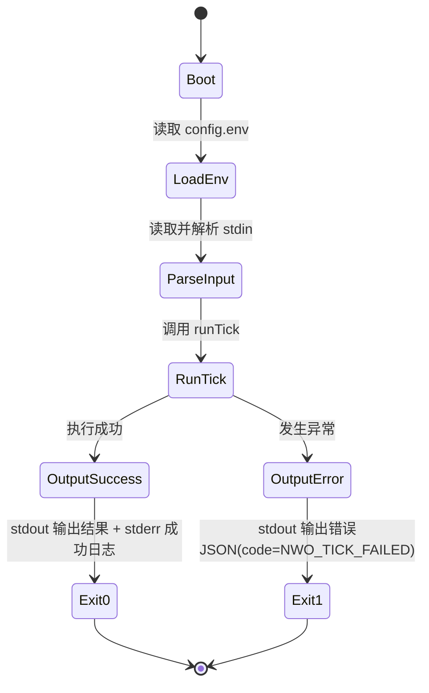
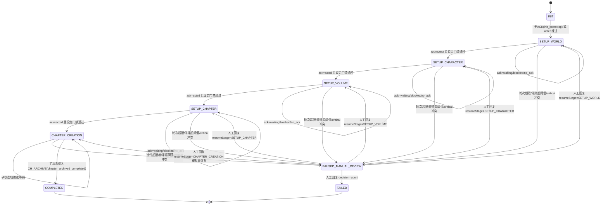
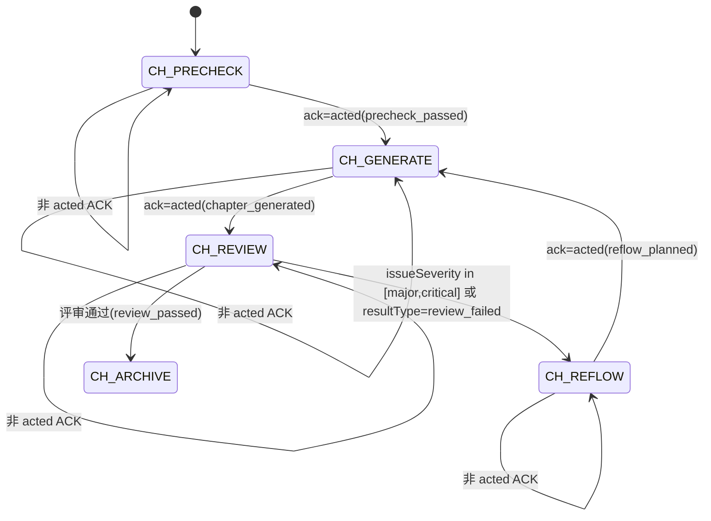

# NovelWorkflowOrchestrator

长篇小说工作流编排插件（`static + stdio`），按固定 Tick 周期驱动项目状态推进、Agent 唤醒分发、质量门禁治理与人工介入冻结/恢复，并输出可审计结果到占位符 `{{VCPNovelWorkflowTick}}`。

## 目录

- [1. 插件概览](#1-插件概览)
- [2. 运行逻辑与架构设计](#2-运行逻辑与架构设计)
  - [2.1 初始化流程](#21-初始化流程)
  - [2.2 Tick 执行主链路](#22-tick-执行主链路)
  - [2.3 异常处理机制](#23-异常处理机制)
  - [2.4 模块架构分层](#24-模块架构分层)
- [3. 状态转移图（Mermaid）](#3-状态转移图mermaid)
  - [3.1 进程生命周期图](#31-进程生命周期图)
  - [3.2 顶层工作流状态图](#32-顶层工作流状态图)
  - [3.3 章节子状态图](#33-章节子状态图)
- [4. 配置参数（ENV）完整释义](#4-配置参数env完整释义)
  - [4.1 基础调度参数](#41-基础调度参数)
  - [4.2 治理与门禁参数](#42-治理与门禁参数)
  - [4.3 阶段 Agent 映射参数](#43-阶段-agent-映射参数)
  - [4.4 参数依赖关系](#44-参数依赖关系)
- [5. 数据文件（JSON）模型完整释义](#5-数据文件json模型完整释义)
  - [5.1 输入数据模型（stdin）](#51-输入数据模型stdin)
  - [5.2 存储目录结构](#52-存储目录结构)
  - [5.3 projects/{projectId}.json](#53-projectsprojectidjson)
  - [5.4 wakeups/{wakeupId}.json](#54-wakeupswakeupidjson)
  - [5.5 counters/{projectId}.json](#55-countersprojectidjson)
  - [5.6 manual_review/{projectId}.json](#56-manual_reviewprojectidjson)
  - [5.7 checkpoints/{projectId}_{ts}.json](#57-checkpointsprojectid_tsjson)
  - [5.8 quality_reports/{projectId}_{chapterId}_{ts}.json](#58-quality_reportsprojectid_chapterid_tsjson)
  - [5.9 audit/tick_{tickId}.json](#59-audittick_tickidjson)
- [6. 典型使用场景与完整示例](#6-典型使用场景与完整示例)
  - [6.1 场景A：初始化并自动派发](#61-场景a初始化并自动派发)
  - [6.2 场景B：章节评审失败后回流](#62-场景b章节评审失败后回流)
  - [6.3 场景C：人工介入冻结与恢复](#63-场景c人工介入冻结与恢复)
- [7. 错误码对照表与故障排查指南](#7-错误码对照表与故障排查指南)
  - [7.1 错误码对照表](#71-错误码对照表)
  - [7.2 故障排查指南](#72-故障排查指南)
- [8. 开发与验证建议](#8-开发与验证建议)

## 1. 插件概览

- 插件类型：`static`
- 通信协议：`stdio`
- 入口命令：`node NovelWorkflowOrchestrator.js`
- 调度频率：`*/5 * * * *`
- 输出占位符：`{{VCPNovelWorkflowTick}}`
- 当前版本：`0.4.0`

核心能力：

1. 基于状态机推进小说从设定到章节创作闭环；
2. 按阶段映射唤醒目标 Agent，支持 `SUPERVISOR` 升级兜底；
3. 对设定评分与章节指标执行质量门禁并改写回执；
4. 支持停滞/超限/严重冲突自动转人工冻结；
5. 所有关键事件落地为 checkpoint、audit、quality report，可回放与排障。

## 2. 运行逻辑与架构设计

### 2.1 初始化流程

插件启动后按以下顺序初始化：

1. 加载环境变量：优先读取插件目录 `config.env`，再读取仓库级 `config.env`；
2. 解析运行配置：布尔、整数、浮点全部带默认值兜底；
3. 读取 stdin 输入：TTY 场景直接视为空输入，非 TTY 场景读取完整 JSON；
4. 调用 `runTick({ pluginRoot, config, input })` 执行一次完整 Tick；
5. 成功时向 stdout 输出标准结果 JSON，stderr 打印成功日志；
6. 失败时向 stdout 输出错误 JSON（含错误码），并设置非零退出码。

### 2.2 Tick 执行主链路

单次 Tick 的核心流程：

1. 创建 `stateStore` 并确保存储目录存在；
2. 若配置了 `bootstrapProjectId` 且项目不存在，自动写入默认项目状态；
3. 加载项目列表（受 `tickMaxProjects` 限制）；
4. 归一化并去重 ACK（同项目优先级：`acted > blocked > waiting`）；
5. 逐项目串行处理：
   - 处理人工回复（`manualReplies`）；
   - 应用质量门禁（可能改写 ACK）；
   - 执行状态迁移；
   - 更新停滞计数与双计数器；
   - 判断是否触发人工介入；
   - 非终态时按 Agent 映射分发唤醒任务（受 `tickMaxWakeups` 预算约束）；
   - 落盘项目状态、计数器、checkpoint，并构建 `wakeupSummary`；
6. 汇总本轮指标（推进数、阻塞数、派发数、人工介入数等）；
7. 落盘 audit 日志，返回最终结果。

### 2.3 异常处理机制

- 入口统一 `try/catch`：
  - 成功：`status=success`
  - 失败：`status=error`，`code=NWO_TICK_FAILED`，并写入 `error` 消息
- `runTick` 内部对存储/IO/锁异常不吞并，直接上抛给入口统一处理；
- `readJson` 对 `ENOENT` 返回默认值，避免“文件首次不存在”导致流程异常；
- 文件写入采用“临时文件 + rename”原子策略，降低中断导致的脏写风险；
- 文件锁采用 `open(...,'wx') + 重试 + 超时抛错` 模式，防止并发覆盖。

### 2.4 模块架构分层

| 分层 | 模块 | 主要职责 |
|---|---|---|
| 入口层 | `NovelWorkflowOrchestrator.js` | 加载 env、解析 stdin、调用 `runTick`、统一成功/失败输出 |
| 编排核心层 | `lib/core/tickRunner.js` | Tick 主循环、状态推进编排、治理触发、结果汇总 |
| 状态机层 | `lib/core/workflowStateMachine.js` + `lib/core/stateRouter.js` | 顶层状态迁移与章节子状态路由 |
| 策略管理层 | `lib/managers/*.js` | Agent 映射、上下文组装、唤醒派发、质量门禁、人工介入 |
| 存储层 | `lib/storage/stateStore.js` | 项目/任务/计数器/审计/快照 JSON 持久化 |
| 并发与序列化基础层 | `lib/storage/fileLock.js` + `lib/storage/serializers.js` | 文件锁互斥、稳定序列化、原子写入支撑 |

## 3. 状态转移图（Mermaid）

### 3.1 进程生命周期图



### 3.2 顶层工作流状态图



### 3.3 章节子状态图



## 4. 配置参数（ENV）完整释义

说明：

- “是否必填”按“是否必须显式配置”定义；当前实现均有默认值，因此全部“否”。
- “取值范围”中的“建议值”是基于当前算法行为给出的运维建议，而非硬编码限制。

### 4.1 基础调度参数

| 参数名 | 类型 | 取值范围/格式 | 默认值 | 必填 | 作用 | 依赖关系 |
|---|---|---|---|---|---|---|
| `NWO_ENABLE_AUTONOMOUS_TICK` | boolean | `true/false` | `true` | 否 | 是否启用自动派发唤醒 | `false` 时仅推进/落盘，不派发 |
| `NWO_TICK_MAX_PROJECTS` | integer | `>=0`，建议 `1~100` | `5` | 否 | 单次 Tick 扫描项目上限 | 值越小越保守，影响吞吐 |
| `NWO_TICK_MAX_WAKEUPS` | integer | `>=0`，建议 `1~200` | `20` | 否 | 单次 Tick 全局唤醒预算 | 单项目每 Tick 最多派发 1 条 |
| `NWO_STORAGE_DIR` | string | 相对或绝对路径 | `storage` | 否 | 持久化目录 | 相对路径基于插件根目录 |
| `NWO_BOOTSTRAP_PROJECT_ID` | string | 任意非空字符串/空串 | `novel_demo_project` | 否 | 首次运行自动创建项目 | 为空串则不自动创建项目 |
| `NWO_DEFAULT_STAGNANT_TICK_THRESHOLD` | integer | `>=1` 建议 `2~10` | `3` | 否 | 新建项目默认停滞阈值 | 仅影响 bootstrap 初始值 |
| `NWO_STAGNANT_TICK_THRESHOLD` | integer | `>=1` 建议 `2~10` | `3` | 否 | 运行期停滞阈值兜底 | 若项目内已有阈值，优先项目值 |
| `NWO_PAUSE_WAKEUP_WHEN_MANUAL_PENDING` | boolean | `true/false` | `true` | 否 | 人工等待期间是否冻结派发 | `true` 时 decision=manual_review_pending |

### 4.2 治理与门禁参数

| 参数名 | 类型 | 取值范围/格式 | 默认值 | 必填 | 作用 | 依赖关系 |
|---|---|---|---|---|---|---|
| `NWO_SETUP_MAX_DEBATE_ROUNDS` | integer | `>=1`，建议 `1~10` | `3` | 否 | 设定阶段最大辩论轮次 | 超限触发 `setup_debate_rounds_exceeded` |
| `NWO_CHAPTER_MAX_ITERATIONS` | integer | `>=1`，建议 `1~10` | `3` | 否 | 章节回流最大迭代次数 | 超限触发 `chapter_iterations_exceeded` |
| `NWO_SETUP_PASS_THRESHOLD` | integer | `0~100` | `85` | 否 | 设定阶段通过分数线 | 由回合状态机判定 pass/fail |
| `NWO_CHAPTER_OUTLINE_COVERAGE_MIN` | number | `0~1` | `0.9` | 否 | 章节大纲覆盖率下限 | 用于 CH_REVIEW 质量门禁 |
| `NWO_CHAPTER_POINT_COVERAGE_MIN` | number | `0~1` | `0.95` | 否 | 章节要点覆盖率下限 | 用于 CH_REVIEW 质量门禁 |
| `NWO_CHAPTER_WORDCOUNT_MIN_RATIO` | number | `>0`，建议 `0.5~1.0` | `0.9` | 否 | 字数比下限 | 用于 CH_REVIEW 质量门禁 |
| `NWO_CHAPTER_WORDCOUNT_MAX_RATIO` | number | `>0`，建议 `1.0~2.0` | `1.1` | 否 | 字数比上限 | 应大于最小比值 |
| `NWO_CRITICAL_INCONSISTENCY_ZERO_TOLERANCE` | boolean | `true/false` | `true` | 否 | 是否对关键一致性冲突零容忍 | `true` 且冲突数>0 直接判失败 |

### 4.3 阶段 Agent 映射参数

| 参数名 | 类型 | 取值范围/格式 | 默认值 | 必填 | 作用 | 依赖关系 |
|---|---|---|---|---|---|---|
| `NWO_STAGE_SETUP_WORLD_DESIGNER` | string | 单值或逗号列表 | `""` | 否 | 世界观设定设计者角色 Agent | 同阶段只取首个 |
| `NWO_STAGE_SETUP_WORLD_CRITIC` | string | 单值或逗号列表 | `""` | 否 | 世界观设定挑刺者角色 Agent | 同阶段只取首个 |
| `NWO_STAGE_SETUP_CHARACTER_DESIGNER` | string | 单值或逗号列表 | `""` | 否 | 人物设定设计者角色 Agent | 同阶段只取首个 |
| `NWO_STAGE_SETUP_CHARACTER_CRITIC` | string | 单值或逗号列表 | `""` | 否 | 人物设定挑刺者角色 Agent | 同阶段只取首个 |
| `NWO_STAGE_SETUP_VOLUME_DESIGNER` | string | 单值或逗号列表 | `""` | 否 | 分卷设定设计者角色 Agent | 同阶段只取首个 |
| `NWO_STAGE_SETUP_VOLUME_CRITIC` | string | 单值或逗号列表 | `""` | 否 | 分卷设定挑刺者角色 Agent | 同阶段只取首个 |
| `NWO_STAGE_SETUP_CHAPTER_DESIGNER` | string | 单值或逗号列表 | `""` | 否 | 章节设定设计者角色 Agent | 同阶段只取首个 |
| `NWO_STAGE_SETUP_CHAPTER_CRITIC` | string | 单值或逗号列表 | `""` | 否 | 章节设定挑刺者角色 Agent | 同阶段只取首个 |
| `NWO_STAGE_CH_PRECHECK` | string | 同上 | `""` | 否 | 章节预检子状态 Agent | 同上 |
| `NWO_STAGE_CH_GENERATE` | string | 同上 | `""` | 否 | 章节生成子状态 Agent | 同上 |
| `NWO_STAGE_CH_REVIEW` | string | 同上 | `""` | 否 | 章节评审子状态 Agent | 同上 |
| `NWO_STAGE_CH_REFLOW` | string | 同上 | `""` | 否 | 回流规划子状态 Agent | 同上 |
| `NWO_HUMAN_REVIEWER` | string | 单值或逗号列表 | `""` | 否 | 人工介入阶段映射值 | 映射到 `PAUSED_MANUAL_REVIEW` 键 |
| `NWO_STAGE_SUPERVISOR` | string | 单值或逗号列表 | `""` | 否 | 兜底监督 Agent | 阶段 Agent 缺失时升级到该角色 |

### 4.4 参数依赖关系

1. `NWO_ENABLE_AUTONOMOUS_TICK=false` 时，`NWO_STAGE_*` 配置不会触发派发行为；
2. `NWO_CHAPTER_WORDCOUNT_MIN_RATIO` 应小于等于 `NWO_CHAPTER_WORDCOUNT_MAX_RATIO`；
3. `NWO_SETUP_MAX_DEBATE_ROUNDS` 与 `NWO_CHAPTER_MAX_ITERATIONS` 共同影响人工介入触发频率；
4. `NWO_DEFAULT_STAGNANT_TICK_THRESHOLD` 只影响新建项目，运行中阈值以项目内 `stagnation.threshold` 或 `NWO_STAGNANT_TICK_THRESHOLD` 为准；
5. 任意阶段 Agent 为空时：
   - 若 `NWO_STAGE_SUPERVISOR` 非空，则升级到监督角色；
   - 否则进入阻塞决策 `blocked_missing_agents`。

## 5. 数据文件（JSON）模型完整释义

### 5.1 输入数据模型（stdin）

插件读取的 stdin JSON（可为空对象）：

```json
{
  "acks": [
    {
      "projectId": "novel_x001",
      "wakeupId": "wk_20260318160700_5d6713ca_xxxx",
      "ackStatus": "acted",
      "issueSeverity": "major",
      "resultType": "review_failed",
      "metrics": {
        "setupScore": 88,
        "outlineCoverage": 0.92,
        "pointCoverage": 0.91,
        "wordcountRatio": 1.02,
        "criticalInconsistencyCount": 0
      }
    }
  ],
  "manualReplies": [
    {
      "projectId": "novel_x001",
      "decision": "resume",
      "resumeStage": "CHAPTER_CREATION",
      "resumeSubstate": "CH_REVIEW"
    }
  ]
}
```

`acks[*]` 字段释义：

| 参数名 | 类型 | 取值范围 | 默认值 | 必填 | 说明 | 依赖关系 |
|---|---|---|---|---|---|---|
| `projectId` | string | 非空 | 无 | 是 | ACK 所属项目 | 去重主键 |
| `wakeupId` | string | 唤醒ID | `null` | 否 | 关联唤醒任务 | 有值时会回写 wakeup 记录 |
| `ackStatus` | string | `acted/waiting/blocked/其他` | 无 | 建议是 | 回执状态 | 仅当 `wakeupId==activeWakeupId` 时生效 |
| `issueSeverity` | string | `critical/major/minor/...` | 空 | 否 | 问题严重级别 | `critical` 可触发人工冻结 |
| `resultType` | string | 业务自定义 | 空 | 否 | 结果类型 | CH_REVIEW 下会被门禁改写 |
| `metrics` | object | 指标对象 | `{}` | 否 | 质量评估输入 | 各字段用于门禁计算 |

`manualReplies[*]` 字段释义：

| 参数名 | 类型 | 取值范围 | 默认值 | 必填 | 说明 | 依赖关系 |
|---|---|---|---|---|---|---|
| `projectId` | string | 非空 | 无 | 是 | 目标项目 | 仅在项目人工挂起时生效 |
| `decision` | string | `resume/abort/其他` | `resume` | 否 | 人工决策 | `abort` 直接转 FAILED |
| `resumeStage` | string | 顶层状态值 | `CHAPTER_CREATION` | 否 | 恢复目标状态 | 未给值时回退到记录值/默认值 |
| `resumeSubstate` | string/null | 子状态值 | `null` | 否 | 恢复目标子状态 | 仅对章节创作阶段有效 |

### 5.2 存储目录结构

```text
storage/
├── projects/
├── wakeups/
├── counters/
├── quality_reports/
├── manual_review/
├── checkpoints/
└── audit/
```

### 5.3 projects/{projectId}.json

作用：保存项目主状态与运行进度快照。

关键字段：

| 参数名 | 类型 | 取值范围 | 默认值 | 必填 | 说明 | 依赖关系 |
|---|---|---|---|---|---|---|
| `projectId` | string | 非空 | 无 | 是 | 项目标识 | 文件名主键 |
| `state` | string | `INIT/.../FAILED` | `INIT` | 是 | 顶层状态 | 与 `substate` 联动 |
| `substate` | string/null | 章节子状态 | `null` | 否 | 子状态 | `state=CHAPTER_CREATION` 时使用 |
| `communityId` | string | 任意 | `""` | 否 | 社区标识 | 可用于上游路由 |
| `requirements` | object | 任意 | `{}` | 否 | 需求上下文 | 提供给 Agent 上下文 |
| `qualityPolicy` | object | 见下 | 内置默认 | 是 | 项目级门禁策略 | 优先级高于 env |
| `stagnation.unchangedTicks` | integer | `>=0` | `0` | 是 | 连续未推进计数 | 达阈值触发人工 |
| `stagnation.threshold` | integer | `>=1` | `3` | 是 | 停滞阈值 | 优先级高于运行兜底 |
| `manualReview.status` | string | `none/waiting_human_reply/resolved` | `none` | 是 | 人工状态 | `waiting` 时可冻结派发 |
| `manualReview.resumeStage` | string/null | 顶层状态 | `null` | 否 | 恢复目标 | 人工回复时使用 |
| `debate.role` | string | `designer/critic` | `designer` | 是 | 当前设定回合角色 | 决定设定阶段角色映射键 |
| `debate.round` | integer | `>=0` | `0` | 是 | 当前设定回合轮次 | 达到 `maxRounds` 可触发人工 |
| `debate.maxRounds` | integer | `>=1` | `3` | 是 | 设定阶段最大回合数 | 与质量阈值共同决定流转 |
| `activeWakeupId` | string/null | 唤醒ID | `null` | 是 | 当前活跃任务绑定 | 仅匹配 ACK 可推进状态 |
| `lastProgress` | object | 运行时写入 | 无 | 否 | 最近 Tick 快照 | 包含 lastAck/lastWakeupIds |
| `createdAt/updatedAt` | string | ISO 时间 | 当前时间 | 是 | 时间戳 | 排障与审计 |

### 5.4 wakeups/{wakeupId}.json

作用：记录每条唤醒任务及其 ACK 生命周期。

关键字段：

| 参数名 | 类型 | 取值范围 | 默认值 | 必填 | 说明 | 依赖关系 |
|---|---|---|---|---|---|---|
| `wakeupId` | string | `wk_{tickId}_{rand}` | 无 | 是 | 唯一任务 ID | 文件名主键 |
| `tickId` | string | 非空 | 无 | 是 | 产生该任务的 Tick | 对齐审计 |
| `projectId` | string | 非空 | 无 | 是 | 所属项目 | 用于项目维度查询 |
| `stage/substate` | string/null | 状态值 | 无 | 是 | 派发时状态快照 | 溯源用 |
| `targetAgent` | string | 非空 | 无 | 是 | 目标 Agent | 阶段映射解析结果 |
| `context` | object | 任意 | 无 | 是 | 任务上下文 | 包含策略与计数器快照 |
| `idempotencyKey` | string | SHA1 | 无 | 是 | 幂等键 | 基于项目+状态+Agent+tick |
| `status` | string | 当前固定 `dispatched` | `dispatched` | 是 | 任务状态 | 可扩展重试状态 |
| `ackStatus` | string | `pending/...` | `pending` | 是 | 回执状态 | ACK 回写后更新 |
| `ackPayload` | object | ACK 原文 | 无 | 否 | 回执详情 | `applyAckToWakeup` 写入 |
| `retryMeta.retryCount` | integer | `>=0` | `0` | 是 | 重试次数 | 当前未启用主动重试 |
| `retryMeta.nextRetryAt` | string/null | ISO/null | `null` | 是 | 下次重试时间 | 预留字段 |
| `dispatchedAt/ackedAt` | string | ISO | dispatch 时间 | 部分必填 | 生命周期时间戳 | 排障定位 |

### 5.5 counters/{projectId}.json

作用：治理计数器，驱动“超限转人工”。

| 参数名 | 类型 | 取值范围 | 默认值 | 必填 | 说明 | 依赖关系 |
|---|---|---|---|---|---|---|
| `setupDebateRounds.world` | integer | `>=0` | `0` | 是 | 世界观轮次计数 | 达上限触发人工 |
| `setupDebateRounds.character` | integer | `>=0` | `0` | 是 | 人物轮次计数 | 同上 |
| `setupDebateRounds.volume` | integer | `>=0` | `0` | 是 | 分卷轮次计数 | 同上 |
| `setupDebateRounds.chapter` | integer | `>=0` | `0` | 是 | 章节设定轮次 | 同上 |
| `chapterIterations.default_chapter` | integer | `>=0` | `0` | 是 | 章节回流迭代次数 | 达上限触发人工 |
| `updatedAt` | string | ISO | 当前时间 | 是 | 更新时间 | 审计用 |

### 5.6 manual_review/{projectId}.json

作用：记录人工介入请求与人工回复处理结果。

| 参数名 | 类型 | 取值范围 | 默认值 | 必填 | 说明 | 依赖关系 |
|---|---|---|---|---|---|---|
| `status` | string | `waiting_human_reply/resolved` | 无 | 是 | 生命周期状态 | 与 project.manualReview 对齐 |
| `triggerReason` | string | 触发原因枚举 | 无 | 是 | 触发来源 | 如停滞、超限、critical |
| `stagnantTicks` | integer | `>=0` | `0` | 是 | 触发时停滞计数 | 停滞触发场景关键证据 |
| `report.state/substate` | string | 状态值 | 无 | 是 | 冻结时状态快照 | 恢复决策参考 |
| `report.lastWakeups` | array | wakeupId 列表 | `[]` | 是 | 最近唤醒任务 | 便于排查 |
| `humanReply` | object/null | 人工回复 | `null` | 否 | 人工决策内容 | resolve 时写入 |
| `createdAt/updatedAt/resolvedAt` | string | ISO | 当前时间 | 部分必填 | 生命周期时间戳 | 审计用 |

### 5.7 checkpoints/{projectId}_{ts}.json

作用：保存项目在单次 Tick 后的快照。

主要字段：

- `tickId`
- `projectId`
- `state/substate`
- `transitionReason`
- `decision`
- `ackStatus`
- `dispatchedWakeupIds`
- `counters`
- `updatedAt`

### 5.8 quality_reports/{projectId}_{chapterId}_{ts}.json

作用：在 `CHAPTER_CREATION + CH_REVIEW` 阶段记录质量门禁判定结果。

主要字段：

- `tickId/projectId/stage/substate`
- `quality`（含 `passed/failures`）
- `ack`（门禁改写后的 ACK）
- `createdAt`

### 5.9 audit/tick_{tickId}.json

作用：记录全局 Tick 执行审计，可用于离线回放。

主要字段：

- `tickId`
- `triggeredAt`
- `input`
- `config`（审计关注的配置快照）
- `result`（与 stdout 输出一致）

## 6. 典型使用场景与完整示例

### 6.1 场景A：初始化并自动派发

配置示例（`config.env`）：

```env
NWO_ENABLE_AUTONOMOUS_TICK=true
NWO_TICK_MAX_PROJECTS=5
NWO_TICK_MAX_WAKEUPS=20
NWO_STORAGE_DIR=storage
NWO_BOOTSTRAP_PROJECT_ID=novel_demo_project
NWO_STAGE_SETUP_WORLD_DESIGNER=世界观设计者
NWO_STAGE_SETUP_WORLD_CRITIC=世界观挑刺者
NWO_STAGE_SUPERVISOR=流程监督员
```

输入示例（首次空输入）：

```json
{}
```

预期输出（示例）：

```json
{
  "status": "success",
  "mode": "active",
  "projectsScanned": 1,
  "projectsAdvanced": 1,
  "wakeupsDispatched": 1,
  "wakeupSummary": [
    {
      "projectId": "novel_demo_project",
      "stage": "SETUP_WORLD",
      "substate": null,
      "targetAgents": ["世界观设计者"],
      "decision": "wakeup_sent"
    }
  ]
}
```

### 6.2 场景B：章节评审失败后回流

输入示例（评审 ACK 带低覆盖率）：

```json
{
  "acks": [
    {
      "projectId": "novel_x001",
      "ackStatus": "acted",
      "metrics": {
        "outlineCoverage": 0.8,
        "pointCoverage": 0.85,
        "wordcountRatio": 0.9,
        "criticalInconsistencyCount": 0
      }
    }
  ]
}
```

预期行为：

1. 质量门禁改写 ACK 为 `resultType=review_failed`；
2. 子状态从 `CH_REVIEW -> CH_REFLOW`；
3. 下轮将优先唤醒 `NWO_STAGE_CH_REFLOW` 对应 Agent；
4. `chapterIterations.default_chapter` 增加 1。

### 6.3 场景C：人工介入冻结与恢复

触发前提（满足任一）：

- 停滞次数达到阈值；
- 设定轮次或章节迭代超限；
- 回执严重级别为 `critical`。

人工恢复输入：

```json
{
  "manualReplies": [
    {
      "projectId": "novel_x001",
      "decision": "resume",
      "resumeStage": "SETUP_WORLD",
      "resumeSubstate": null
    }
  ]
}
```

预期行为：

1. `manual_review/{projectId}.json` 由 `waiting_human_reply` 改为 `resolved`；
2. 项目状态恢复到指定 `resumeStage/resumeSubstate`；
3. `stagnation.unchangedTicks` 重置为 0；
4. 本轮恢复后可继续正常派发（若配置允许）。

## 7. 错误码对照表与故障排查指南

### 7.1 错误码对照表

| 错误码 | 触发位置 | 含义 | 常见根因 | 建议处理 |
|---|---|---|---|---|
| `NWO_TICK_FAILED` | 入口 `main()` | Tick 执行失败统一错误码 | 输入 JSON 非法、文件锁超时、IO 权限问题、JSON 解析失败 | 查看 stderr 的 error.message + audit/checkpoint 文件定位 |

说明：当前实现对外仅暴露一个统一错误码，具体细分原因通过 `error` 文本与日志定位。

### 7.2 故障排查指南

1. **无输出或占位符未更新**
   - 检查进程是否收到有效 stdout JSON；
   - 检查是否落入错误分支（`status=error`）。
2. **始终不派发唤醒**
   - 检查 `NWO_ENABLE_AUTONOMOUS_TICK` 是否为 `false`；
   - 检查 `NWO_TICK_MAX_WAKEUPS` 是否为 `0`；
   - 检查当前状态是否 `PAUSED_MANUAL_REVIEW/COMPLETED/FAILED`。
3. **频繁进入人工介入**
   - 检查 `NWO_STAGNANT_TICK_THRESHOLD`、`NWO_SETUP_MAX_DEBATE_ROUNDS`、`NWO_CHAPTER_MAX_ITERATIONS` 是否过小；
   - 检查 ACK 是否携带 `issueSeverity=critical`。
4. **状态不推进**
   - 检查 ACK 是否为 `acted`；
   - 检查设定评分是否低于 `NWO_SETUP_PASS_THRESHOLD`（会被改写为 waiting）；
   - 检查 CH_REVIEW 指标是否长期不达标导致回流循环。
5. **Agent 缺失阻塞**
   - 检查当前阶段对应 `NWO_STAGE_*` 是否配置；
   - 若希望兜底，确保 `NWO_STAGE_SUPERVISOR` 非空。
6. **文件锁超时**
   - 检查是否存在异常残留 `.lock` 文件；
   - 排查是否有并发进程同时操作同一存储目录；
   - 观察磁盘权限与 IO 性能。

## 8. 开发与验证建议

建议每次改动后执行以下验证：

```bash
node --test test/unit/*.test.js test/integration/tickRunner.test.js
find lib -name '*.js' -print0 | xargs -0 -n1 node --check
```

如需联调建议重点观察：

1. `storage/audit/tick_*.json`：全局结果与输入快照；
2. `storage/checkpoints/*.json`：项目级状态演进；
3. `storage/manual_review/*.json`：人工冻结与恢复闭环；
4. `storage/wakeups/*.json`：唤醒任务与 ACK 回写链路。
