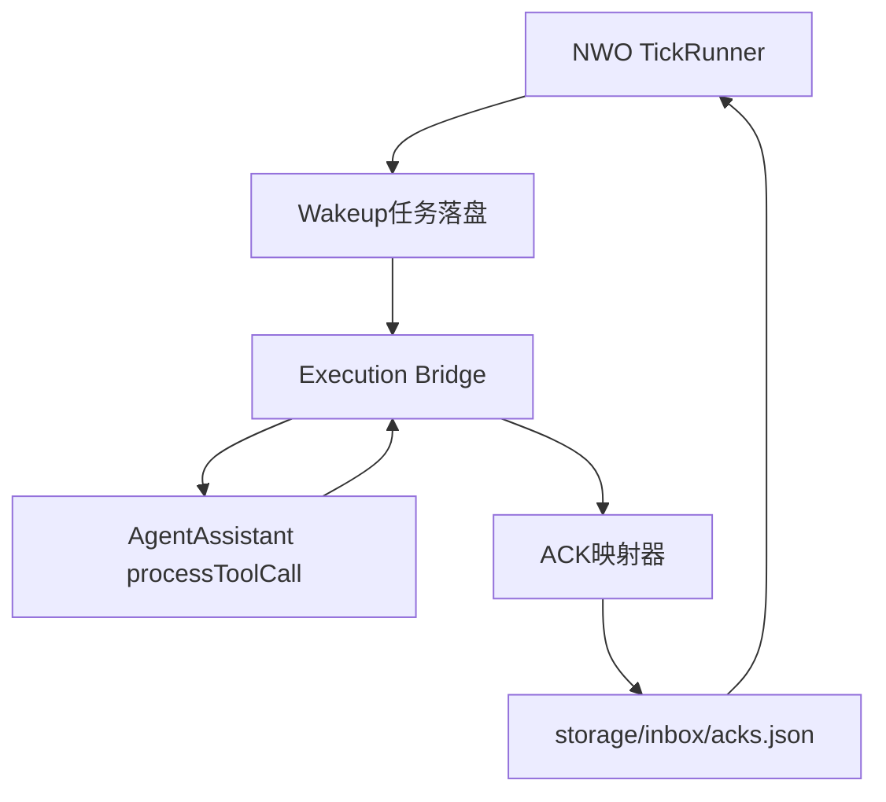
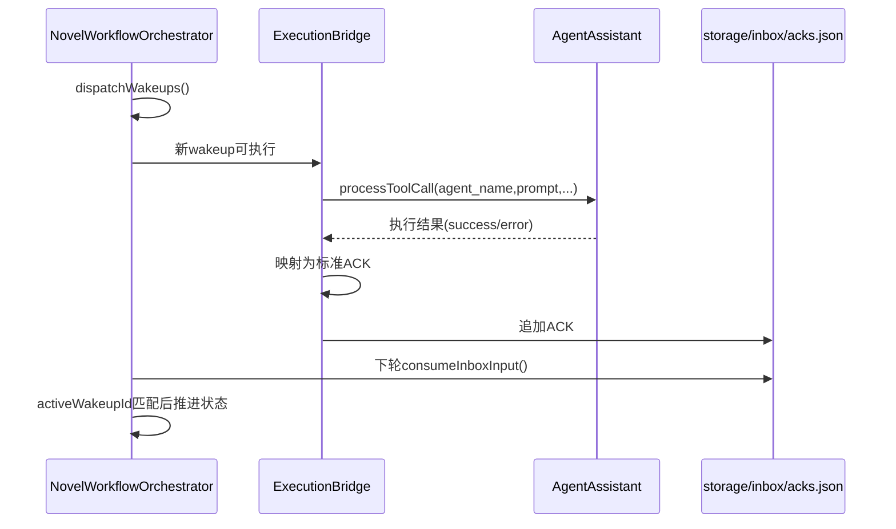

# NovelWorkflowOrchestrator 接入 AgentAssistant 执行层改造方案

## 目录

- [1. 背景与目标](#1-背景与目标)
- [2. 现状问题与改造原则](#2-现状问题与改造原则)
- [3. 目标架构设计](#3-目标架构设计)
- [4. 数据契约与接口定义](#4-数据契约与接口定义)
- [5. 核心改造点（按模块）](#5-核心改造点按模块)
- [6. 分阶段实施计划](#6-分阶段实施计划)
- [7. 风险评估与回滚策略](#7-风险评估与回滚策略)
- [8. 测试与验收标准](#8-测试与验收标准)
- [9. 运维接入与部署建议](#9-运维接入与部署建议)
- [10. 后续增强路线](#10-后续增强路线)

## 1. 背景与目标

### 1.1 背景

当前 `NovelWorkflowOrchestrator` 已完成编排能力（状态机、任务派发、质量门禁、人工介入、审计落盘），但“唤醒任务”仅写入 `storage/wakeups/*.json`，没有内建执行器将任务真正发送给 Agent 并回收结果。

`AgentAssistant` 插件已经具备“按 agent_name + prompt 执行通讯并返回结果”的能力，是天然执行层。

### 1.2 目标

- 将 AgentAssistant 接入 NWO 执行链路，实现 **派发-执行-回执-推进** 闭环。
- 保持 NWO 编排职责清晰，不把执行细节侵入状态机核心。
- 保持现有串行语义：单项目单 Tick 单任务、activeWakeupId 精确 ACK 消费。
- 对人工介入链路保持兼容。

### 1.3 非目标

- 不改动 NWO 顶层状态机业务语义。
- 不引入多项目并行调度策略变更。
- 不在本阶段重写 AgentAssistant 内部模型调用逻辑。

## 2. 现状问题与改造原则

### 2.1 现状问题

1. NWO 生成 wakeup 后无执行主体，任务停留在 pending。
2. ACK 来源依赖外部系统人工注入 `inbox/acks.json`，运维复杂。
3. 人工介入恢复路径有入口模板，但缺少自动执行链路衔接。

### 2.2 改造原则

- 分层解耦：NWO 仅做编排，执行交给 AgentAssistant。
- 失败可恢复：执行失败可重试、可审计、可人工介入。
- 契约先行：先定义 wakeup->execute->ack 标准字段，再落地逻辑。
- 增量上线：先最小闭环，再扩展并发、重试与观测。

## 3. 目标架构设计

### 3.1 逻辑分层



### 3.2 时序



### 3.3 组件职责

- **NWO**：状态推进、门禁治理、人工介入、审计。
- **ExecutionBridge（新增）**：消费 wakeup、调用 AgentAssistant、回写 ACK。
- **AgentAssistant**：执行对话、返回执行文本与错误信息。

## 4. 数据契约与接口定义

### 4.1 Wakeup 执行元数据（新增字段）

在 `wakeups/{wakeupId}.json` 增加：

```json
{
  "executionStatus": "queued",
  "executor": "AgentAssistant",
  "executionAttempt": 0,
  "nextRetryAt": null,
  "lastError": null,
  "sessionId": "wk_20260320_xxxx"
}
```

字段说明：

- `executionStatus`: `queued|running|succeeded|failed`
- `executionAttempt`: 当前尝试次数
- `nextRetryAt`: 下一次可重试时间
- `sessionId`: 传给 AgentAssistant 的会话键

### 4.2 Bridge -> AgentAssistant 调用契约

```json
{
  "agent_name": "世界观设计者",
  "prompt": "基于上下文产出世界观草案并给出结构化结论...",
  "temporary_contact": false,
  "session_id": "wk_20260320_xxxx",
  "maid": "NovelWorkflowOrchestrator"
}
```

约束：

- `agent_name` 必须能在 AgentAssistant 配置中找到。
- `prompt` 必须包含结构化响应要求（ACK字段协议）。

### 4.3 AgentAssistant 结果 -> ACK 映射契约

目标 ACK：

```json
{
  "projectId": "novel_demo_project",
  "wakeupId": "wk_20260320_xxxx",
  "ackStatus": "acted",
  "resultType": "setup_score_passed",
  "metrics": {
    "setupScore": 90
  },
  "issueSeverity": "minor",
  "executorMeta": {
    "executor": "AgentAssistant",
    "agentName": "世界观设计者"
  }
}
```

失败映射规则：

- 网络错误/超时：不立即写 `acted`，改为更新 wakeup 执行状态并重试。
- 多次重试失败后：写 `ackStatus=blocked` + `issueSeverity=major`，触发治理链路。
- 结果解析失败：写 `ackStatus=blocked` + `resultType=executor_output_unparseable`。

### 4.4 inbox 合并写入规则

- 采用“读-合并-原子写”。
- 写前获取 `inbox.lock`。
- 同 `(projectId,wakeupId)` 仅保留最新一条 ACK。

## 5. 核心改造点（按模块）

### 5.1 新增模块

1. `lib/execution/agentAssistantBridge.js`
   - 扫描可执行 wakeup
   - 调用 AgentAssistant
   - 回写 ACK 到 inbox
   - 更新 wakeup 执行状态

2. `lib/execution/ackMapper.js`
   - 解析执行结果
   - 输出标准 ACK
   - 失败兜底映射

3. `lib/execution/retryPolicy.js`
   - 固定/指数退避
   - 最大尝试次数判定

### 5.2 修改现有模块

1. `lib/managers/wakeupDispatcher.js`
   - 初始化执行元数据字段。

2. `lib/storage/stateStore.js`
   - 新增 inbox ACK 追加方法（带去重）。
   - 新增 wakeup 查询方法（按 executionStatus + nextRetryAt）。

3. `NovelWorkflowOrchestrator.js`
   - 入口保持不变，仅在运行模式允许时触发 Bridge（或由独立定时器触发）。

4. `plugin-manifest.json`
   - 增加执行层开关与重试参数 schema。

### 5.3 配置新增建议

```env
NWO_EXECUTOR_ENABLED=true
NWO_EXECUTOR_TYPE=agent_assistant
NWO_EXECUTOR_MAX_CONCURRENCY=2
NWO_EXECUTOR_MAX_RETRIES=3
NWO_EXECUTOR_RETRY_BACKOFF_SEC=30
NWO_AGENTASSISTANT_TIMEOUT_MS=120000
NWO_AGENTASSISTANT_TEMPORARY_CONTACT=false
```

## 6. 分阶段实施计划

### Phase 1：最小闭环（推荐先落）

目标：实现“wakeup 自动执行并回写 ACK”。

- 新增 Bridge 单次执行能力（不做并发）。
- wakeup 增加最小执行状态字段。
- 支持 ACK 写入 inbox 并被 NWO 下一轮消费。
- 覆盖一条端到端集成测试。

交付标准：

- `wakeup_sent -> acted_ack -> state_advanced` 可复现。

### Phase 2：可靠性增强

- 增加重试策略与 backoff。
- 增加失败兜底 ACK 规则。
- 增加执行审计（`audit/execution_*.json`）。

### Phase 3：可观测与运维能力

- 输出执行指标（成功率、平均耗时、重试次数）。
- 增加待执行积压告警阈值。
- 增加执行健康评分与告警等级（`green/yellow/red`）。
- 在 Tick 顶层输出固定 `result.health` 字段，便于运维统一读取。
- 增加人工“重驱动某个 wakeup”工具脚本。

## 7. 风险评估与回滚策略

### 7.1 主要风险

1. AgentAssistant 输出非结构化，ACK 解析失败。
2. Bridge 与 Tick 并发读写导致重复消费。
3. 执行超时过多导致积压。

### 7.2 控制措施

- 强制响应模板 + JSON 提取器 + 失败兜底映射。
- 文件锁 + 幂等键 + 去重写入。
- 重试上限 + 熔断阈值 + 人工介入兜底。

### 7.3 回滚策略

- 通过 `NWO_EXECUTOR_ENABLED=false` 一键关闭执行桥，仅保留原有记录模式。
- 保留 inbox 输入链路，不影响现有人工注入流程。

## 8. 测试与验收标准

### 8.1 单元测试

- `ackMapper`：成功、解析失败、异常映射。
- `retryPolicy`：重试窗口与上限判定。
- `stateStore` inbox 合并与去重写入。

### 8.2 集成测试

1. `dispatch -> bridge -> inbox -> tick advance`
2. 执行超时后重试成功
3. 连续失败后 blocked ACK + 人工介入触发
4. activeWakeupId 不匹配 ACK 不推进（回归）

### 8.3 验收指标

- E2E 推进成功率 >= 95%
- 执行失败重试后恢复率 >= 80%
- 无重复 ACK 导致的异常推进

## 9. 运维接入与部署建议

### 9.1 部署模式

建议采用“双定时器”：

- 定时器A：NWO Tick（现有，5分钟）
- 定时器B：ExecutionBridge（建议 10~30 秒）

原因：避免执行层耗时拉长 tick 周期。

### 9.2 运维检查清单

- AgentAssistant 已正确加载 agent_name 配置。
- NWO 与 AgentAssistant 可访问同一 VCP API。
- `storage/inbox`、`storage/wakeups` 目录权限正常。
- 执行审计与 tick 审计持续增长且无错误峰值。

## 10. 后续增强路线

1. 结构化输出协议升级：引入 response schema 校验。
2. 多执行器抽象：后续可接入其他执行插件，Bridge 走统一接口。
3. 任务优先级：不同阶段可设置执行优先级与超时策略。
4. 可视化面板：展示 wakeup 队列、执行状态、失败分布与人工介入入口。
