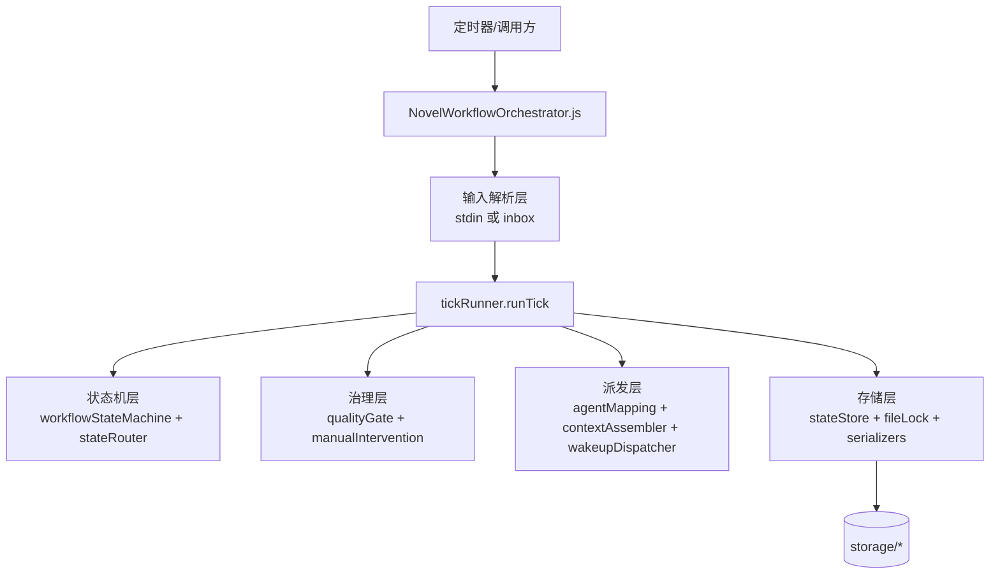
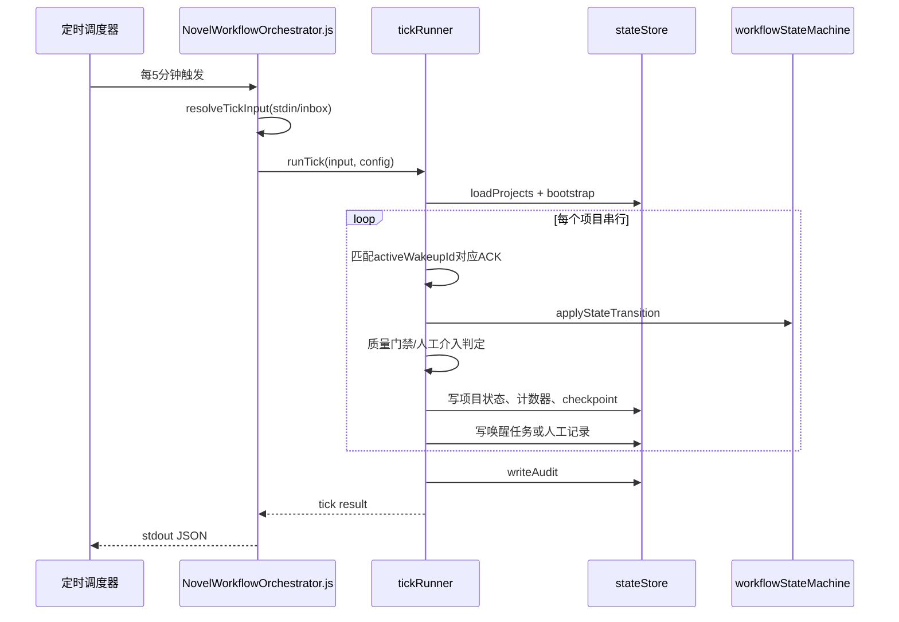

# NovelWorkflowOrchestrator 插件实现说明

## 目录

- [1. 文档目标与适用对象](#1-文档目标与适用对象)
- [2. 插件定位与运行模式](#2-插件定位与运行模式)
- [3. 总体架构设计](#3-总体架构设计)
- [4. 核心功能模块](#4-核心功能模块)
- [5. 数据模型与接口定义](#5-数据模型与接口定义)
- [6. 配置方法](#6-配置方法)
- [7. 使用示例](#7-使用示例)
- [8. 运维与调试指南](#8-运维与调试指南)
- [9. 已知限制](#9-已知限制)
- [10. 后续扩展计划](#10-后续扩展计划)
- [11. 附录：关键源码映射](#11-附录关键源码映射)

## 1. 文档目标与适用对象

本文档基于当前插件实现（`Plugin/NovelWorkflowOrchestrator`）编写，目标是让以下角色能够直接开展工作：

- 技术团队：快速理解调度状态机、ACK 消费规则与持久化结构。
- 运维人员：可按固定流程部署、排障、恢复人工介入。
- 第三方开发者：可基于接口约定接入 ACK 回传、人工回复与扩展模块。

## 2. 插件定位与运行模式

### 2.1 插件定位

NovelWorkflowOrchestrator 是一个**静态定时 Tick 编排器**，负责将小说创作流程转化为可审计、可恢复、可治理的状态推进链路。

### 2.2 运行模式

- 插件类型：`static`
- 入口命令：`node NovelWorkflowOrchestrator.js`
- 调度频率：`*/5 * * * *`
- 通信协议：`stdio`

以上定义见 `plugin-manifest.json`。

### 2.3 输入来源优先级

当前实现支持两种输入通道，并采用如下优先级：

1. `stdin`（外部调用显式传参）  
2. `storage/inbox/*.json`（无 stdin 时自动回退读取）  
3. 空输入 `{}`  

这使插件可在“纯定时调用、无 stdin”场景下继续工作。

## 3. 总体架构设计

### 3.1 分层结构图



### 3.2 主执行时序图



### 3.3 设计原则

- 单项目串行：单项目单 Tick 最多派发 1 个 Agent 任务。
- ACK 精确消费：仅 `wakeupId == activeWakeupId` 的 ACK 参与推进。
- 可审计：每轮写 `audit + checkpoints + wakeups`。
- 可恢复：人工介入后支持 `manualReplies` 恢复或终止。

## 4. 核心功能模块

### 4.1 入口层（NovelWorkflowOrchestrator.js）

职责：

- 读取 env 配置并构建运行时配置。
- 解析输入（stdin 或 inbox 回退）。
- 调用 `runTick` 并输出结果 JSON。

关键能力：

- `resolveTickInput`：无 stdin 时读取 `storage/inbox/acks.json` 与 `storage/inbox/manual_replies.json`。

### 4.2 调度核心（lib/core/tickRunner.js）

职责：

- 按项目串行处理 Tick。
- 处理 ACK 匹配、状态迁移、质量门禁、人工介入、任务派发、审计落盘。

关键规则：

- ACK 优先级归并：`acted > blocked > waiting`（同项目多 ACK）。
- 活跃任务绑定：只消费 `activeWakeupId` 匹配 ACK，其他作为 stale ACK 审计。
- 人工介入入口输出：`manualReviewPending[].replyTemplate`。

### 4.3 状态机（workflowStateMachine + stateRouter）

职责：

- 顶层状态推进：`INIT -> SETUP_* -> CHAPTER_CREATION -> COMPLETED`
- 章节子状态推进：`CH_PRECHECK -> CH_GENERATE -> CH_REVIEW -> CH_REFLOW/CH_ARCHIVE`

设定阶段回合机制：

- `designer -> critic -> 判定`
- critic 未通过：回到 designer，并 `debate.round + 1`
- 达上限：返回阻塞原因，触发人工介入候选信号

### 4.4 Agent 映射与上下文组装

职责：

- `agentMappingResolver`：根据阶段和角色解析目标 Agent。
- `contextAssembler`：生成标准化唤醒上下文（objective、qualityPolicy、counterSnapshot 等）。
- `wakeupDispatcher`：创建并落盘任务，控制预算与幂等键。

关键规则：

- 设定阶段按 `SETUP_*_(DESIGNER|CRITIC)` 映射。
- 每次仅派发一个 Agent（即使配置了逗号列表，也只取首个）。
- 角色缺失时可升级到 `SUPERVISOR`。

### 4.5 质量门禁与人工介入

职责：

- `qualityGateManager`：评估 setup/chapter 质量并改写 ACK 的 `resultType/qualityGate`。
- `manualInterventionManager`：停滞检测、冻结、人工恢复（resume/abort）。

触发人工介入条件：

- 设定回合超限
- 章节迭代超限
- 停滞 Tick 超阈值
- ACK 标记 `issueSeverity=critical`

### 4.6 存储层（stateStore）

目录结构：

```text
storage/
  projects/
  wakeups/
  counters/
  quality_reports/
  manual_review/
  inbox/
    acks.json
    manual_replies.json
  checkpoints/
  audit/
```

特性：

- 原子写入（tmp + rename）
- 文件锁互斥（lock file）
- inbox 消费后自动清空并写审计留痕

## 5. 数据模型与接口定义

### 5.1 Tick 输入接口

```json
{
  "acks": [
    {
      "projectId": "novel_demo_project",
      "wakeupId": "wk_20260319_xxxx",
      "ackStatus": "acted",
      "metrics": {
        "setupScore": 90
      }
    }
  ],
  "manualReplies": [
    {
      "projectId": "novel_demo_project",
      "decision": "resume",
      "resumeStage": "CHAPTER_CREATION",
      "resumeSubstate": "CH_REVIEW"
    }
  ]
}
```

字段约束：

- `acks[].projectId` 必填
- `acks[].wakeupId` 建议必填（用于 activeWakeupId 精确匹配）
- `manualReplies[].decision` 支持 `resume | abort`

### 5.2 Tick 输出接口（摘要）

```json
{
  "status": "success",
  "tickId": "20260319083200_abcd1234",
  "projectsScanned": 1,
  "projectsAdvanced": 1,
  "wakeupsDispatched": 1,
  "manualInterventionsOpened": 0,
  "manualInterventionsResolved": 0,
  "health": {
    "status": "green",
    "score": 100,
    "source": "execution_bridge",
    "backlogAlertTriggered": false
  },
  "manualReviewPending": [],
  "wakeupSummary": []
}
```

说明：

- `health` 是顶层固定字段，运维侧可直接读取，无需依赖 `execution` 子对象。
- 当执行器关闭时：`status=not_available`；执行器开启但本轮无执行数据时：`status=unknown`。

执行桥接详细字段示例：

```json
{
  "execution": {
    "scanned": 2,
    "executed": 1,
    "failed": 1,
    "retried": 1,
    "producedAcks": 1,
    "metrics": {
      "successRate": 0.5,
      "retryRate": 0.5,
      "averageDurationMs": 128.4,
      "queueBefore": {
        "pendingTotal": 4,
        "pendingReady": 3,
        "pendingDelayed": 1,
        "running": 0,
        "failed": 2,
        "succeeded": 9
      },
      "queueAfter": {
        "pendingTotal": 3,
        "pendingReady": 2,
        "pendingDelayed": 1,
        "running": 0,
        "failed": 3,
        "succeeded": 10
      }
    },
    "backlogAlert": {
      "triggered": false,
      "threshold": 100,
      "pendingTotal": 3,
      "pendingReady": 2
    },
    "health": {
      "status": "yellow",
      "score": 68
    }
  }
}
```

人工介入待处理项示例：

```json
{
  "projectId": "novel_demo_project",
  "status": "waiting_human_reply",
  "manualRecordPath": ".../storage/manual_review/novel_demo_project.json",
  "replyTemplate": {
    "manualReplies": [
      {
        "projectId": "novel_demo_project",
        "decision": "resume",
        "resumeStage": "CHAPTER_CREATION",
        "resumeSubstate": "CH_REVIEW"
      }
    ]
  }
}
```

### 5.3 关键持久化模型

- `projects/{projectId}.json`：状态主记录（含 `debate`、`activeWakeupId`、`manualReview`）
- `wakeups/{wakeupId}.json`：派发任务与 ACK 生命周期
- `manual_review/{projectId}.json`：人工介入报告与决策记录
- `audit/tick_{tickId}.json`：整轮输入、配置和结果快照

## 6. 配置方法

### 6.1 基础配置示例

```env
NWO_ENABLE_AUTONOMOUS_TICK=true
NWO_TICK_MAX_PROJECTS=5
NWO_TICK_MAX_WAKEUPS=20
NWO_STORAGE_DIR=storage
NWO_BOOTSTRAP_PROJECT_ID=novel_demo_project
```

### 6.2 设定阶段角色映射

```env
NWO_STAGE_SETUP_WORLD_DESIGNER=世界观设计者
NWO_STAGE_SETUP_WORLD_CRITIC=世界观挑刺者
NWO_STAGE_SETUP_CHARACTER_DESIGNER=人物设定师
NWO_STAGE_SETUP_CHARACTER_CRITIC=人物挑刺者
```

### 6.3 质量治理参数

```env
NWO_SETUP_PASS_THRESHOLD=85
NWO_SETUP_MAX_DEBATE_ROUNDS=3
NWO_CHAPTER_MAX_ITERATIONS=3
NWO_CHAPTER_OUTLINE_COVERAGE_MIN=0.90
NWO_CHAPTER_POINT_COVERAGE_MIN=0.95
```

### 6.4 执行层可靠性参数

```env
NWO_EXECUTOR_ENABLED=true
NWO_EXECUTOR_TYPE=agent_assistant
NWO_EXECUTOR_MAX_WAKEUPS=20
NWO_EXECUTOR_MAX_RETRIES=3
NWO_EXECUTOR_RETRY_BACKOFF_SEC=30
NWO_EXECUTOR_BACKLOG_ALERT_THRESHOLD=100
NWO_AGENTASSISTANT_TIMEOUT_MS=120000
NWO_AGENTASSISTANT_API_HOST=127.0.0.1
NWO_AGENTASSISTANT_API_PORT=5678
NWO_AGENTASSISTANT_API_PATH=/v1/human/tool
```

## 7. 使用示例

### 7.1 纯定时模式（无 stdin）

运维只需确保外部系统将 ACK/人工回复写入 inbox：

- `storage/inbox/acks.json`
- `storage/inbox/manual_replies.json`

插件下一轮自动消费，无需传 stdin。

### 7.2 人工介入恢复示例

当 Tick 输出出现 `manualReviewPending` 时，复制 `replyTemplate` 写入：

```json
{
  "manualReplies": [
    {
      "projectId": "novel_demo_project",
      "decision": "resume",
      "resumeStage": "SETUP_WORLD",
      "resumeSubstate": null
    }
  ]
}
```

### 7.3 运行截图（终端输出示例）

```text
✔ tickRunner 在无角色映射时进入阻塞并完成持久化
✔ tickRunner 支持角色映射分发与回执推进
✔ tickRunner 仅消费 activeWakeupId 匹配的ACK
✔ tickRunner 在设定回合达到最大轮次时触发人工介入
✔ tickRunner 接收人工回复后可恢复调度
ℹ tests 29
ℹ pass 29
ℹ fail 0
```

## 8. 运维与调试指南

### 8.1 常见排查路径

1. 看 `audit/tick_*.json`：确认输入、配置、结果。
2. 看 `checkpoints/*.json`：定位每项目迁移原因（`transitionReason`）。
3. 看 `projects/*.json`：确认 `activeWakeupId` 与 `manualReview.status`。
4. 看 `manual_review/*.json`：确认人工决策是否写入并 resolved。

### 8.2 关键故障场景

- 长期 `manual_review_pending`：通常是 `manualReplies` 未注入。
- 状态不推进：通常是 ACK 未匹配 `activeWakeupId`。
- 频繁 `review_failed`：检查章节质量指标阈值设置是否过严。

## 9. 已知限制

- 当前通信协议仍定义为 `stdio`，inbox 回退属于运行时增强路径，非 manifest 层显式契约。
- 单项目单 Tick 单任务是硬约束，吞吐量受 Tick 周期与项目数上限影响。
- 章节迭代使用 `default_chapter` 聚合计数，暂未细分到多章节 ID 粒度。
- 已内建 AgentAssistant 执行桥接器，但仍依赖外部 VCP API 的可用性与鉴权配置。

## 10. 后续扩展计划

### 10.1 接口与治理

- 增加 inbox 输入 schema 校验与错误隔离队列（bad records）。
- 补充 `manualReplies` 幂等键，避免重复恢复。
- 输出更细粒度指标（每阶段耗时、回合通过率、回流次数分布）。

### 10.2 扩展能力

- 支持多章节并行编排（仍保证单章节内串行）。
- 接入统一事件总线，替代文件 inbox 模式。
- 增加 Web 运维面板查看 `manualReviewPending` 与一键恢复。

### 10.3 工程化

- manifest 版本与变更日志版本自动校验。
- 增加端到端回放工具（基于 audit 重放）。
- 增加压测场景（多项目长周期稳定性）。

## 11. 附录：关键源码映射

| 能力 | 文件 |
|---|---|
| 插件入口/配置解析/输入回退 | `NovelWorkflowOrchestrator.js` |
| Tick 主流程 | `lib/core/tickRunner.js` |
| 顶层状态机 | `lib/core/workflowStateMachine.js` |
| 章节子状态路由 | `lib/core/stateRouter.js` |
| Agent 解析 | `lib/managers/agentMappingResolver.js` |
| 上下文组装 | `lib/managers/contextAssembler.js` |
| 任务派发 | `lib/managers/wakeupDispatcher.js` |
| 质量门禁 | `lib/managers/qualityGateManager.js` |
| 人工介入 | `lib/managers/manualInterventionManager.js` |
| 文件存储 | `lib/storage/stateStore.js` |
| 文件锁 | `lib/storage/fileLock.js` |
