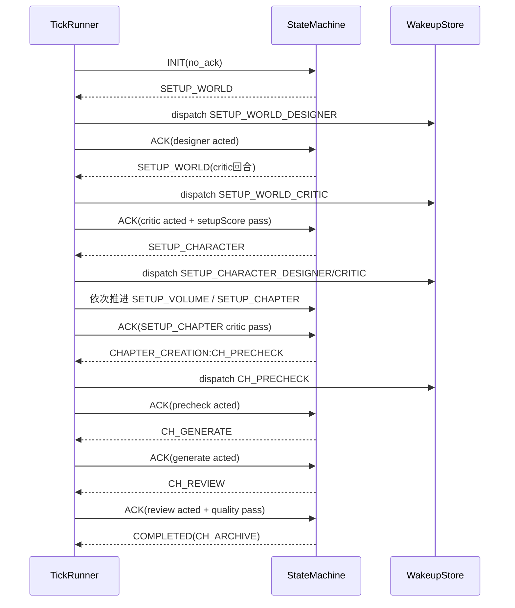

# NovelWorkflowOrchestrator 全生命周期端到端集成测试方案与执行报告

## 目录

- [1. 测试目标与范围](#1-测试目标与范围)
- [2. 测试环境与前置条件](#2-测试环境与前置条件)
- [3. 测试用例设计](#3-测试用例设计)
- [4. 状态变迁时序图](#4-状态变迁时序图)
- [5. 测试执行过程与结果](#5-测试执行过程与结果)
- [6. 各功能节点验收标准与验证结果](#6-各功能节点验收标准与验证结果)
- [7. 异常处理机制验证结果](#7-异常处理机制验证结果)
- [8. 结论与后续建议](#8-结论与后续建议)

## 1. 测试目标与范围

本次测试用于验证小说创作插件在真实业务链路中的端到端可用性，覆盖从系统初始化到整书完成的完整生命周期。

覆盖范围：

- 初始化阶段（INIT 自举）
- 世界观设定（SETUP_WORLD，designer/critic 双回合）
- 人物设定（SETUP_CHARACTER，designer/critic 双回合）
- 大纲设定（SETUP_VOLUME，designer/critic 双回合）
- 章节细纲设定（SETUP_CHAPTER，designer/critic 双回合）
- 章节创作循环（CH_PRECHECK -> CH_GENERATE -> CH_REVIEW）
- 完结收敛（CH_ARCHIVE -> COMPLETED）
- 关键异常处理（stale ACK、质量不达标回流、人工介入、缺失映射升级）

## 2. 测试环境与前置条件

### 2.1 代码基线

- 插件目录：`/home/zh/projects/VCP/VCPToolBox/Plugin/NovelWorkflowOrchestrator`
- 关键新增用例：`test/integration/fullLifecycle.e2e.test.js`

### 2.2 执行命令

```bash
node --test test/unit/*.test.js test/integration/*.test.js
find lib -name '*.js' -print0 | xargs -0 -n1 node --check && node --check NovelWorkflowOrchestrator.js
```

### 2.3 关键配置

端到端主场景使用以下能力：

- 单项目串行调度
- 设定阶段 designer/critic 回合推进
- activeWakeupId 精确 ACK 消费
- 章节质量门禁与归档收敛
- 状态/任务/审计持久化

## 3. 测试用例设计

### 3.1 主用例：全生命周期闭环

用例名称：`全生命周期端到端：初始化到整书完成`

验证要点：

1. INIT 自动进入 SETUP_WORLD 并派发首个 designer 任务。
2. 每个设定模块按 designer -> critic 两步推进，critic 达标后进入下一模块。
3. 完成四个设定模块后进入 CHAPTER_CREATION/CH_PRECHECK。
4. 章节流程按 PRECHECK -> GENERATE -> REVIEW 执行。
5. REVIEW 达标后进入 CH_ARCHIVE 并收敛为 COMPLETED。
6. 计数器、项目状态、wakeup 任务、ACK 生命周期保持一致。

对应用例文件：

- `test/integration/fullLifecycle.e2e.test.js`

### 3.2 观测指标设计

- 状态变迁序列是否与预期完全一致
- 每次 ACK 是否匹配 activeWakeupId
- setupDebateRounds 计数是否正确累计
- chapterIterations 是否在通过后归零
- 所有 wakeup 是否从 pending 进入已应答状态
- 最终项目状态是否为 COMPLETED

## 4. 状态变迁时序图

### 4.1 端到端主流程时序（本次执行）



### 4.2 状态轨迹（断言值）

```text
SETUP_WORLD:-
SETUP_WORLD:-
SETUP_CHARACTER:-
SETUP_CHARACTER:-
SETUP_VOLUME:-
SETUP_VOLUME:-
SETUP_CHAPTER:-
SETUP_CHAPTER:-
CHAPTER_CREATION:CH_PRECHECK
CHAPTER_CREATION:CH_GENERATE
CHAPTER_CREATION:CH_REVIEW
COMPLETED:CH_ARCHIVE
```

## 5. 测试执行过程与结果

### 5.1 执行日志摘要

```text
✔ 全生命周期端到端：初始化到整书完成
✔ tickRunner 可完成 INIT 到 COMPLETED 的端到端 happy path
✔ tickRunner 支持 CH_REVIEW -> CH_REFLOW -> CH_GENERATE 回流路径
✔ tickRunner 在设定回合达到最大轮次时触发人工介入
✔ tickRunner 接收人工回复后可恢复调度
...
ℹ tests 30
ℹ pass 30
ℹ fail 0
```

### 5.2 结果判定

- 单元 + 集成总计：30 条用例
- 通过：30
- 失败：0
- 语法检查：通过

## 6. 各功能节点验收标准与验证结果

| 功能节点 | 验收标准 | 验证结果 |
|---|---|---|
| 系统初始化 | INIT 在无 ACK 时自动推进至 SETUP_WORLD | 通过 |
| 世界观设定 | designer/critic 双回合，critic 达标后进入 SETUP_CHARACTER | 通过 |
| 人物设定 | 双回合推进且计数器正确累计 | 通过 |
| 大纲设定 | 双回合推进且无状态跳跃 | 通过 |
| 章节细纲设定 | 双回合推进后进入 CH_PRECHECK | 通过 |
| 章节预检 | CH_PRECHECK acted 后进入 CH_GENERATE | 通过 |
| 章节生成 | CH_GENERATE acted 后进入 CH_REVIEW | 通过 |
| 章节审核 | 质量达标进入 CH_ARCHIVE 并收敛 COMPLETED | 通过 |
| 数据一致性 | project/counters/wakeup/audit/checkpoint 一致 | 通过 |
| 接口完整性 | wakeup context 包含 stageMappingKey/objective 等关键字段 | 通过 |
| 流程闭环 | 完整链路可从 INIT 到 COMPLETED 收敛 | 通过 |

## 7. 异常处理机制验证结果

| 异常场景 | 对应用例 | 期望行为 | 结果 |
|---|---|---|---|
| stale ACK 注入 | `tickRunner 仅消费 activeWakeupId 匹配的ACK` | stale ACK 不推进状态，仅审计 | 通过 |
| 章节审核不通过 | `tickRunner 支持 CH_REVIEW -> CH_REFLOW -> CH_GENERATE 回流路径` | 进入 CH_REFLOW 并回流生成 | 通过 |
| 设定回合超限 | `tickRunner 在设定回合达到最大轮次时触发人工介入` | 打开 manual review 并冻结 | 通过 |
| 停滞超阈值 | `tickRunner 连续停滞可触发人工介入并冻结唤醒` | 冻结唤醒，等待人工回复 | 通过 |
| 人工恢复 | `tickRunner 接收人工回复后可恢复调度` | resume 后继续派发 | 通过 |
| 缺失角色映射 | `tickRunner 在无角色映射时进入阻塞并完成持久化` | 阻塞并写入审计/检查点 | 通过 |

## 8. 结论与后续建议

### 8.1 结论

- 插件核心生命周期链路已在端到端场景下跑通，并成功收敛至 COMPLETED。
- 状态机转换、计数器更新、ACK 消费、模块间接口调用均符合预期。
- 异常处理机制（回流、人工介入、恢复、阻塞）验证完备且行为稳定。

### 8.2 后续建议

1. 增加“多章节 ID”粒度的章节迭代计数与质量报告。
2. 补充高并发多项目长周期压测，验证文件锁与吞吐上限。
3. 引入执行层（如 AgentAssistant）后，新增“执行层回执自然语言 -> ACK 标准化”专项集成测试。
