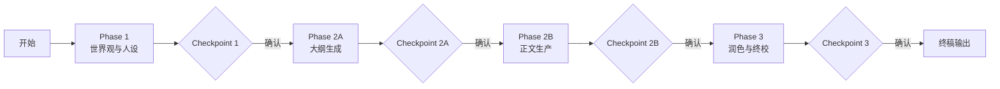
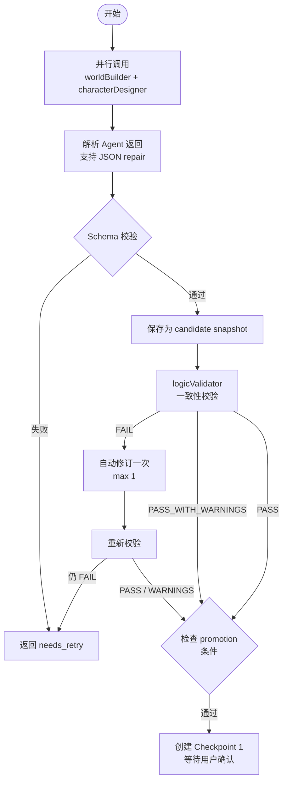
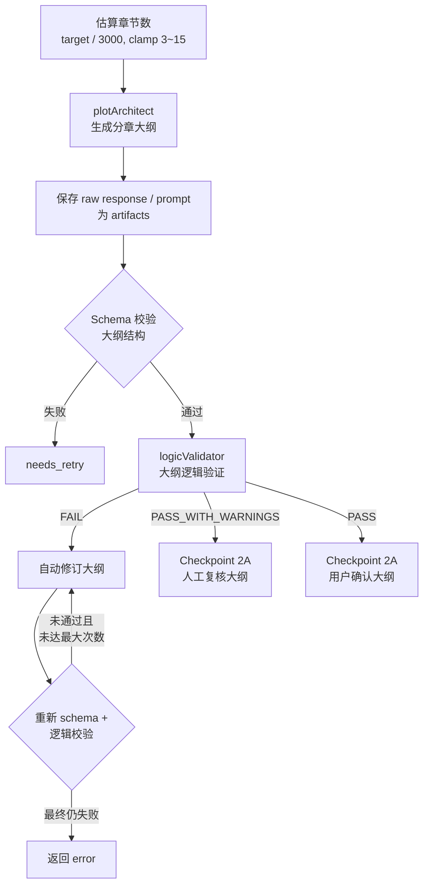
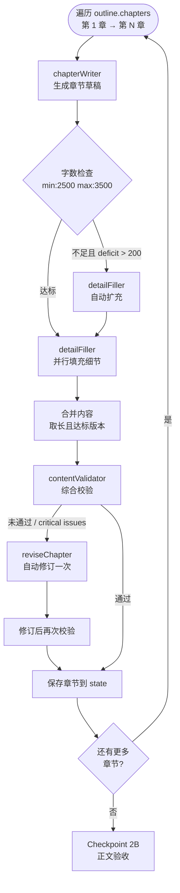
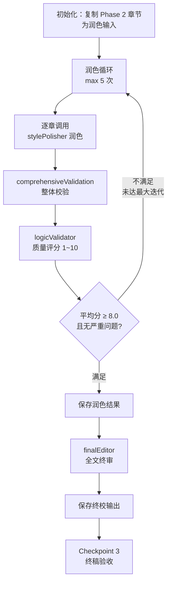
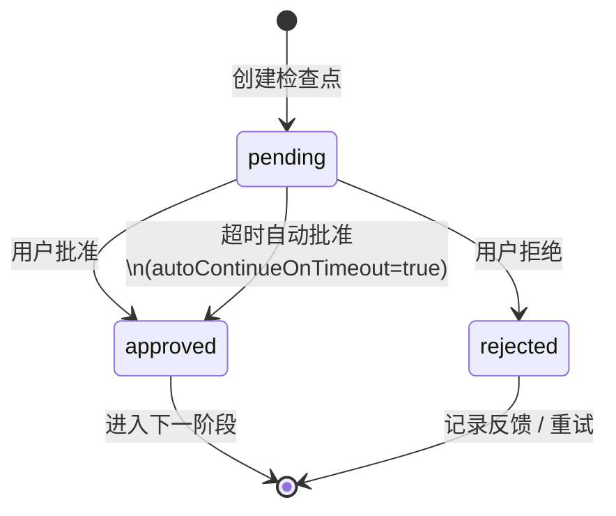
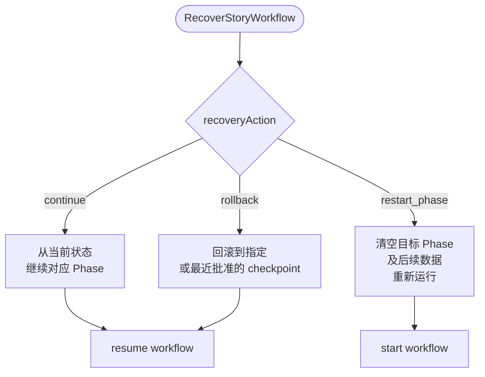

# StoryOrchestrator 短文创作工作流说明

本文档基于 `Plugin/StoryOrchestrator` 当前代码实现，系统梳理短文创作的完整工作流、状态流转、Agent 分工及关键机制。

---

## 1. 工作流概述

短文创作工作流采用 **三阶段流水线 + 检查点（Checkpoint）人机确认** 的架构：

| 阶段 | 名称 | 权重 | 核心产出 |
|------|------|------|----------|
| Phase 1 | 世界观与人设搭建 | 30% | 世界观设定（worldview）+ 人物设定（characters） |
| Phase 2 | 大纲与正文生产 | 50% | 分章大纲（outline）+ 各章节正文（chapters） |
| Phase 3 | 润色与终稿 | 20% | 润色后章节（polishedChapters）+ 终校输出（finalOutput） |

整体流程遵循 **生成 → 校验 → （自动修订）→ 检查点确认 → 进入下一阶段** 的闭环模式。



---

## 2. 核心组件与职责

| 组件 | 文件路径 | 职责 |
|------|----------|------|
| `StoryOrchestrator` | `core/StoryOrchestrator.js` | 对外入口，处理 ToolCall 命令，协调各子模块 |
| `WorkflowEngine` | `core/WorkflowEngine.js` | 工作流编排引擎，管理 Phase 切换、检查点等待/恢复、重试、崩溃恢复 |
| `StateManager` | `core/StateManager.js` | 故事状态持久化（SQLite + JSON 双写）、快照（Snapshot）、检查点（Checkpoint）、Artifacts |
| `Phase1_WorldBuilding` | `core/Phase1_WorldBuilding.js` | Phase 1 执行逻辑：世界观 + 人物设计、校验、自动修订 |
| `Phase2_OutlineDrafting` | `core/Phase2_OutlineDrafting.js` | Phase 2 执行逻辑：大纲生成、逻辑校验、逐章正文生产 |
| `Phase3_Refinement` | `core/Phase3_Refinement.js` | Phase 3 执行逻辑：润色循环、整体校验、质量评分、终校定稿 |
| `ChapterOperations` | `core/ChapterOperations.js` | 章节级操作：撰写草稿、评审、修订、润色、细节填充、字数扩充 |
| `ContentValidator` | `core/ContentValidator.js` | 内容一致性校验：世界观、人物、情节逻辑；输出结构化校验报告与质量评分 |
| `AgentDispatcher` | `agents/AgentDispatcher.js` | Agent 调度器，支持同步/异步调用、并行/串行派发 |
| `AgentDefinitions` | `agents/AgentDefinitions.js` | 8 类 Agent 的定义与配置映射 |

---

## 3. Agent 分工一览

| Agent 标识 | 中文名 | 主要职责 | 使用场景 |
|------------|--------|----------|----------|
| `worldBuilder` | 世界观设定 | 基于故事梗概构建世界观 | Phase 1 |
| `characterDesigner` | 人物塑造 | 设计主要人物、性格、关系 | Phase 1 |
| `plotArchitect` | 情节架构 | 生成分章大纲、修订大纲 | Phase 2 大纲阶段 |
| `chapterWriter` | 章节执笔 | 撰写章节草稿、大幅修订 | Phase 2 正文阶段 |
| `detailFiller` | 细节填充 | 扩充场景、感官、情绪、心理描写 | Phase 2 正文扩充与细节填充 |
| `logicValidator` | 逻辑校验 | 验证设定一致性、情节逻辑、输出质量评分 | 各 Phase 校验环节 |
| `stylePolisher` | 文笔润色 | 优化文风、句式、节奏 | Phase 3 润色、小幅修订 |
| `finalEditor` | 终校定稿 | 对全文进行终审、统一调性 | Phase 3 终校阶段 |

所有 Agent 通过本地 HTTP `/v1/chat/completions` 或 `/v1/human/tool` 接口调用，支持超时配置与临时联系人模式。

---

## 4. 各阶段详细流程

### 4.1 Phase 1：世界观与人设搭建



**关键逻辑：**
- 若 Agent 返回经过 `repair`（JSON 截断修复），则 promotion 条件更严格，必须 schema 和 completeness 双满分才能进入 checkpoint。
- 每个 attempt 会记录到 `phase_attempts` 表，包含 raw prompt/response 路径、是否使用 repair、schema/business 校验结果等。

---

### 4.2 Phase 2：大纲与正文生产

本阶段分为 **A. 大纲生成** 和 **B. 正文生产** 两个子阶段。

#### A. 大纲生成



**Checkpoint 类型：** `phase2_outline_confirmation`

- **批准：** 进入正文生产阶段。
- **拒绝：** 根据用户反馈调用 `_reviseOutlineWithFeedback` 重新生成大纲，再次进入 checkpoint。

#### B. 正文生产（逐章串行）



**Checkpoint 类型：** `phase2_content_confirmation`

- **批准：** Phase 2 完成，进入 Phase 3。
- **拒绝：** 返回失败（目前不支持逐章拒绝后的局部重生成，需通过 RecoverStoryWorkflow 回滚或重启）。

---

### 4.3 Phase 3：润色与终稿



**Checkpoint 类型：** `phase3_final_acceptance`

- **批准：** 生成 `finalOutput`（包含 metadata、storyBible、outline、chapters、totalWordCount），标记故事为 `completed`。
- **拒绝：** 记录反馈，重新运行 Phase 3（以反馈作为 `polishFocus` 再次润色）。

---

## 5. 状态管理与持久化

### 5.1 存储架构

采用 **SQLite（主存储）+ JSON 文件（备份/兼容）双写** 策略：

- **SQLite：** 存储故事主表（`stories`）、阶段快照（`phase_snapshots`）、检查点（`checkpoints`）、工作流事件（`workflow_events`）、阶段尝试记录（`phase_attempts`）。
- **JSON 文件：** `state/stories/{storyId}.json`，作为完整状态的副本，便于调试与外部读取。
- **缓存：** `StateManager.cache` 基于内存 Map，配合 `version` 字段实现缓存失效。

### 5.2 核心状态结构

每个故事对象包含以下字段：

```js
{
  id, status, createdAt, updatedAt,
  config: { targetWordCount, genre, stylePreference, storyPrompt },
  phase1: { worldview, characters, validation, userConfirmed, checkpointId, status },
  phase2: { outline, chapters, currentChapter, userConfirmed, checkpointId, status, totalWordCount },
  phase3: { polishedChapters, finalValidation, iterationCount, userConfirmed, checkpointId, status, finalEditorOutput, qualityScores },
  finalOutput: null, // 完成后填充
  workflow: {
    state,        // idle | running | waiting_checkpoint | failed | completed
    currentPhase, // phase1 | phase2 | phase3
    currentStep,
    activeCheckpoint, // { id, phase, type, status, expiresAt, autoContinueOnTimeout }
    retryContext: { phase, step, attempt, maxAttempts, lastError },
    history: [],  // 事件列表
    runToken
  }
}
```

### 5.3 Snapshot 类型

每次更新 Phase 数据时，都会写入 `phase_snapshots` 表：

- `candidate`：初稿/运行中状态
- `validated`：校验通过状态
- `approved`：用户确认状态

---

## 6. 检查点（Checkpoint）机制

### 6.1 检查点触发时机

| 阶段 | 检查点名称 | 触发时机 |
|------|-----------|----------|
| Phase 1 | Checkpoint 1 | 世界观与人设生成并校验通过后 |
| Phase 2 | 大纲确认检查点 | 大纲生成并校验通过后 |
| Phase 2 | 正文验收检查点 | 全部章节撰写完成后 |
| Phase 3 | 终稿验收检查点 | 润色+终校完成后 |



### 6.2 检查点超时自动批准

- 默认超时：`USER_CHECKPOINT_TIMEOUT_MS = 86400000`（24 小时）
- `WorkflowEngine` 启动定时器（默认 60 秒一次）扫描过期检查点
- 过期后若 `autoContinueOnTimeout = true`，则自动批准并推进到下一阶段

### 6.3 用户确认接口

通过 `UserConfirmCheckpoint` 命令传入：
- `story_id`
- `checkpoint_id`
- `approval`（`true` / `false`）
- `feedback`（拒绝时的反馈）

---

## 7. 恢复与重试机制

### 7.1 崩溃恢复（RecoverStoryWorkflow）

支持三种恢复动作：

| 恢复动作 | 说明 |
|----------|------|
| `continue`（默认） | 从当前 workflow 状态继续执行对应 Phase |
| `restart_phase` | 清空指定 Phase 及后续阶段数据，重新运行 |
| `rollback` | 回滚到指定 checkpoint（或最近批准的 checkpoint） |



### 7.2 Phase 重试（RetryPhase）

- 最大重试次数：`MAX_PHASE_RETRY_ATTEMPTS`（默认 3 次）
- 退避延迟：`[0ms, 250ms, 1000ms]`
- 已 `completed` 或 `userConfirmed` 的 Phase 不允许重试，需使用 `restart_phase`

---

## 8. 对外命令接口

`StoryOrchestrator.processToolCall` 支持的命令：

| 命令 | 说明 |
|------|------|
| `StartStoryProject` | 启动新故事项目，进入 Phase 1 |
| `QueryStoryStatus` | 查询故事当前阶段、进度、检查点状态 |
| `UserConfirmCheckpoint` | 用户批准/拒绝检查点 |
| `CreateChapterDraft` | 单独为某章节生成草稿 |
| `ReviewChapter` | 对指定章节内容进行评审 |
| `ReviseChapter` | 根据反馈修订指定章节 |
| `PolishChapter` | 对指定章节进行润色 |
| `ValidateConsistency` | 校验内容与 story bible 的一致性 |
| `CountChapterMetrics` | 统计章节字数及各项指标 |
| `ExportStory` | 导出故事（支持 `markdown`/`txt`/`json`） |
| `RecoverStoryWorkflow` | 崩溃恢复/回滚/重启 |
| `RetryPhase` | 对失败 Phase 进行重试 |

---

## 9. 关键配置参数

| 配置项 | 默认值 | 说明 |
|--------|--------|------|
| `MAX_PHASE_ITERATIONS` | 5 | Phase 内最大迭代/修订次数 |
| `MAX_OUTLINE_REVISION_ATTEMPTS` | 5 | 大纲自动修订最大次数 |
| `MAX_CHAPTER_REVISION_ATTEMPTS` | 1 | 单章自动修订最大次数 |
| `MAX_PHASE_RETRY_ATTEMPTS` | 3 | Phase 级重试最大次数 |
| `QUALITY_THRESHOLD` | 8.0 | Phase 3 润色循环质量分退出阈值 |
| `CRITICAL_ISSUE_THRESHOLD` | 0 | 严重问题容忍阈值 |
| `USER_CHECKPOINT_TIMEOUT_MS` | 86400000 | 检查点超时时间（24h） |
| `CHECKPOINT_EXPIRY_CHECK_INTERVAL_MS` | 60000 | 检查点过期扫描间隔（60s） |
| `STORY_STATE_RETENTION_DAYS` | 30 | 故事状态保留天数 |
| `targetWordCount.min` | 2500 | 单章/故事最小目标字数 |
| `targetWordCount.max` | 3500 | 单章/故事最大目标字数 |

---

## 10. 进度计算规则

`StoryOrchestrator._calculateProgress` 的权重分配：

- **Phase 1 占 30%**：世界观生成完成 70%，用户确认后加满 30%
- **Phase 2 占 50%**：按 `已完成章节数 / 总章节数 × 0.8` 计算，用户确认后加满 50%
- **Phase 3 占 20%**：按 `已润色章节数 / 总章节数 × 0.8` 计算，用户确认后加满 20%
- `finalOutput` 存在时，直接返回 100%

---

## 11. 字数统计策略

- **默认计数模式**：`cn_chars`（中文字符数）
- **长度策略**：`range`（范围达标）或 `min_only`（仅下限达标）
- **自动扩充触发**：当字数 deficit > 200 时，调用 `detailFiller` 进行字数扩充

---

## 12. 附录：文件引用索引

| 功能 | 关键文件 |
|------|----------|
| 工作流入口 | `core/StoryOrchestrator.js` |
| 工作流编排 | `core/WorkflowEngine.js` |
| 状态管理 | `core/StateManager.js` |
| Phase 1 实现 | `core/Phase1_WorldBuilding.js` |
| Phase 2 实现 | `core/Phase2_OutlineDrafting.js` |
| Phase 3 实现 | `core/Phase3_Refinement.js` |
| 章节操作 | `core/ChapterOperations.js` |
| 内容校验 | `core/ContentValidator.js` |
| Agent 调度 | `agents/AgentDispatcher.js` |
| Agent 定义 | `agents/AgentDefinitions.js` |
| 提示词构建 | `utils/PromptBuilder.js` |
| Schema 校验 | `utils/SchemaValidator.js` |
| 字数统计 | `utils/TextMetrics.js` |
