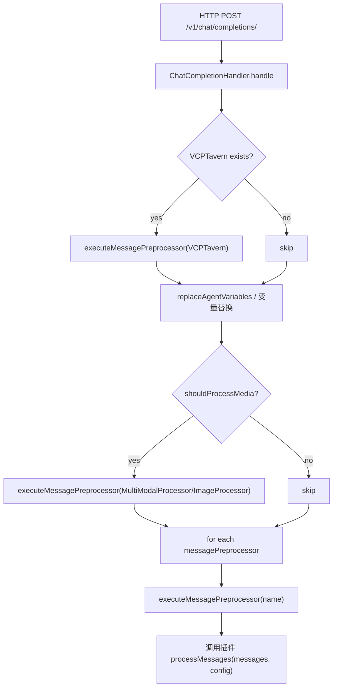

# ChatCompletionHandler 通用消息预处理器调用逻辑分析报告

## 目录
1. 背景与范围  
2. 关键结论  
3. 代码定位：通用消息预处理器相关引用与调用点  
4. 原始定义与实现来源  
5. 引入与装配全过程  
6. 调用链与依赖关系图  
7. 关键代码片段  
8. 结论  

## 1. 背景与范围
本报告聚焦 `modules/chatCompletionHandler.js#L518-529` 的“其他通用消息预处理器”调用段，追踪其在全项目内的引用、实例化与调用过程，并以静态分析方式定位预处理器的定义与实现源头。重点覆盖：
- 通用消息预处理器的所有调用点与引用点
- 预处理器的定义入口（manifest、entryPoint、实现文件）
- 引入到当前文件的完整路径与装配过程
- 关键参数传递与同步/异步执行顺序

## 2. 关键结论
- “通用消息预处理器”在 `chatCompletionHandler.js` 中表现为对 `pluginManager.messagePreprocessors` 的遍历调用，排除已特殊处理的 `VCPTavern` 与媒体处理器（`MultiModalProcessor`/`ImageProcessor`）。  
  参考：[chatCompletionHandler.js:L518-L529](file:///home/zh/projects/VCPToolBox/modules/chatCompletionHandler.js#L518-L529)
- 预处理器的加载与注册由 `PluginManager.loadPlugins()` 完成，基于 `Plugin/*/plugin-manifest.json` 的 `pluginType: messagePreprocessor | hybridservice` + `entryPoint.script` 进行 `require()` 并登记到 `messagePreprocessors` Map。  
  参考：[Plugin.js:L430-L529](file:///home/zh/projects/VCPToolBox/Plugin.js#L430-L529)
- 调用入口统一收敛为 `PluginManager.executeMessagePreprocessor(name, messages)`，该方法异步执行 `processMessages(messages, config)` 并返回处理后的消息数组。  
  参考：[Plugin.js:L347-L368](file:///home/zh/projects/VCPToolBox/Plugin.js#L347-L368)
- 预处理器不是静态单例，而是按插件目录与 manifest 动态发现；具体实现文件由各插件 `entryPoint.script` 决定，例如：  
  - `VCPTavern` → [VCPTavern.js](file:///home/zh/projects/VCPToolBox/Plugin/VCPTavern/VCPTavern.js#L175-L404)  
  - `ImageProcessor` → [image-processor.js](file:///home/zh/projects/VCPToolBox/Plugin/ImageProcessor/image-processor.js#L125-L190)

## 3. 代码定位：通用消息预处理器相关引用与调用点
### 3.1 ChatCompletionHandler 关键调用点
- “通用消息预处理器”调用入口（遍历 `messagePreprocessors`）：  
  [chatCompletionHandler.js:L518-L529](file:///home/zh/projects/VCPToolBox/modules/chatCompletionHandler.js#L518-L529)
- 前置特殊预处理器：
  - `VCPTavern` 优先处理  
    [chatCompletionHandler.js:L449-L458](file:///home/zh/projects/VCPToolBox/modules/chatCompletionHandler.js#L449-L458)
  - 媒体处理器选择（`MultiModalProcessor` 或 `ImageProcessor`）  
    [chatCompletionHandler.js:L503-L515](file:///home/zh/projects/VCPToolBox/modules/chatCompletionHandler.js#L503-L515)
- 其他依赖通道（同属 `messagePreprocessors` Map 的访问）：
  - RAG 刷新路径  
    [chatCompletionHandler.js:L195-L276](file:///home/zh/projects/VCPToolBox/modules/chatCompletionHandler.js#L195-L276)
  - 动态折叠协议（变量替换阶段）  
    [messageProcessor.js:L54-L110](file:///home/zh/projects/VCPToolBox/modules/messageProcessor.js#L54-L110)

### 3.2 PluginManager 中的引用点
- `messagePreprocessors` 作为预处理器注册容器  
  [Plugin.js:L16-L31](file:///home/zh/projects/VCPToolBox/Plugin.js#L16-L31)
- 预处理器发现与注册逻辑  
  [Plugin.js:L450-L529](file:///home/zh/projects/VCPToolBox/Plugin.js#L450-L529)
- 统一执行入口 `executeMessagePreprocessor`  
  [Plugin.js:L347-L368](file:///home/zh/projects/VCPToolBox/Plugin.js#L347-L368)
- 服务初始化后依赖注入到消息预处理器  
  [server.js:L1108-L1123](file:///home/zh/projects/VCPToolBox/server.js#L1108-L1123)

## 4. 原始定义与实现来源
“通用消息预处理器”并非单独文件，而是插件体系中的一类：  
`pluginType: messagePreprocessor` 或 `pluginType: hybridservice`，且具备 `processMessages` 方法。

### 4.1 定义入口（manifest + entryPoint）
以 `ImageProcessor` 为例：
- Manifest 定义：  
  [Plugin/ImageProcessor/plugin-manifest.json](file:///home/zh/projects/VCPToolBox/Plugin/ImageProcessor/plugin-manifest.json#L1-L32)
- entryPoint 指向实现文件：`image-processor.js`

### 4.2 具体实现文件
以 `ImageProcessor` 的实现为例：
- 处理入口为 `processMessages(messages, requestConfig)`  
  [image-processor.js:L125-L183](file:///home/zh/projects/VCPToolBox/Plugin/ImageProcessor/image-processor.js#L125-L183)

以 `VCPTavern` 为例（hybridservice 同时充当预处理器）：
- 处理入口为 `processMessages(messages, config)`  
  [VCPTavern.js:L175-L404](file:///home/zh/projects/VCPToolBox/Plugin/VCPTavern/VCPTavern.js#L175-L404)

## 5. 引入与装配全过程
### 5.1 构建与装配路径
1. `server.js` 创建 `PluginManager` 并调用 `loadPlugins()`  
   [server.js:L1088-L1093](file:///home/zh/projects/VCPToolBox/server.js#L1088-L1093)
2. `PluginManager.loadPlugins()`  
   - 扫描 `Plugin/*/plugin-manifest.json`  
   - 若 `pluginType` 为 `messagePreprocessor` 或 `hybridservice`，且 `communication.protocol = direct`，则 `require(entryPoint.script)`  
   - 发现 `processMessages` 后加入 `messagePreprocessors` Map  
   [Plugin.js:L450-L529](file:///home/zh/projects/VCPToolBox/Plugin.js#L450-L529)
3. 依赖注入阶段（可选）  
   - `server.js` 将 `knowledgeBaseManager` 等依赖注入到所有预处理器  
   [server.js:L1108-L1123](file:///home/zh/projects/VCPToolBox/server.js#L1108-L1123)
4. `ChatCompletionHandler` 构建并注入 `pluginManager`  
   [server.js:L755-L791](file:///home/zh/projects/VCPToolBox/server.js#L755-L791)
5. 每次请求进入 `handle()`，执行通用预处理器循环  
   [chatCompletionHandler.js:L518-L529](file:///home/zh/projects/VCPToolBox/modules/chatCompletionHandler.js#L518-L529)

### 5.2 顺序控制
预处理器顺序来源：
- `PluginManager.loadPlugins()` 读取 `preprocessor_order.json` 排序  
  [Plugin.js:L503-L528](file:///home/zh/projects/VCPToolBox/Plugin.js#L503-L528)
- 若文件不存在，则采用剩余预处理器名称排序补齐  
  当前仓库中未发现 `preprocessor_order.json` 文件，因此运行时可能会落入默认排序。  

## 6. 调用链与依赖关系图
### 6.1 Mermaid 调用链


### 6.2 同步/异步执行顺序
- `executeMessagePreprocessor` 为 async，内部 `await processorModule.processMessages(...)`  
  [Plugin.js:L347-L368](file:///home/zh/projects/VCPToolBox/Plugin.js#L347-L368)
- “通用消息预处理器”遍历为 `for..of` 串行执行，每个预处理器完成后才进入下一个  
  [chatCompletionHandler.js:L518-L529](file:///home/zh/projects/VCPToolBox/modules/chatCompletionHandler.js#L518-L529)

## 7. 关键代码片段
### 7.1 通用消息预处理器循环
```javascript
// modules/chatCompletionHandler.js
// --- 其他通用消息预处理器 ---
for (const name of pluginManager.messagePreprocessors.keys()) {
  if (name === 'ImageProcessor' || name === 'MultiModalProcessor' || name === 'VCPTavern') continue;
  processedMessages = await pluginManager.executeMessagePreprocessor(name, processedMessages);
}
```
来源：[chatCompletionHandler.js:L518-L525](file:///home/zh/projects/VCPToolBox/modules/chatCompletionHandler.js#L518-L525)

### 7.2 预处理器统一执行入口
```javascript
// Plugin.js
async executeMessagePreprocessor(pluginName, messages) {
  const processorModule = this.messagePreprocessors.get(pluginName);
  const pluginSpecificConfig = this._getPluginConfig(pluginManifest);
  const processedMessages = await processorModule.processMessages(messages, pluginSpecificConfig);
  return processedMessages;
}
```
来源：[Plugin.js:L347-L362](file:///home/zh/projects/VCPToolBox/Plugin.js#L347-L362)

### 7.3 预处理器发现与注册
```javascript
// Plugin.js
if (isPreprocessor && typeof module.processMessages === 'function') {
  discoveredPreprocessors.set(manifest.name, module);
}
...
for (const pluginName of finalOrder) {
  this.messagePreprocessors.set(pluginName, discoveredPreprocessors.get(pluginName));
}
```
来源：[Plugin.js:L475-L526](file:///home/zh/projects/VCPToolBox/Plugin.js#L475-L526)

## 8. 结论
- “通用消息预处理器”是对 `messagePreprocessors` Map 的通用遍历调用机制，实际实现由插件 manifest 与 entryPoint 脚本定义。  
- `chatCompletionHandler.js#L518-529` 是所有非特殊预处理器的集中入口，执行顺序由 `PluginManager.loadPlugins()` 决定，默认情况下为预处理器名称排序。  
- 若需要追踪某个具体预处理器的实现，应从 `Plugin/<Name>/plugin-manifest.json` 的 `entryPoint.script` 进入其 `processMessages` 实现文件。
