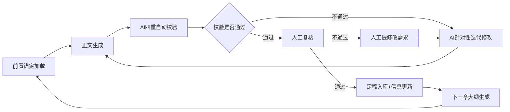
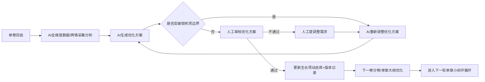

# 长篇网络小说：AI 深度参与下的全流程创作工作流终版（VCP适配版）

# 长篇网络小说终版全流程创作工作流（VCP日记本 + 元思考 + 多RAG适配）

## 一、工作流核心定位与底层铁律

### 核心定位

本工作流为**适配AI深度创作、全链路闭环、边界可控、支持非线性循环迭代**的终版长篇网文创作体系，完整覆盖之前所有核心结论：

1. 全程锚定「底层锁死，表层生长；主线不动，细节迭代」的核心准则；

2. 完整纳入6类**局部限定内容**的全流程管控（单章/单卷限定人物、场景/秘境、支线/单元事件、道具/功法、小伏笔/反转、临时规则/民俗），彻底解决之前的遗漏问题；

3. 完美适配AI创作的核心痛点（设定漂移、上下文遗忘、剧情放飞、战力崩坏、伏笔烂尾），明确人工与AI的权责边界；

4. 打破线性流程的僵化限制，通过「单章小闭环+分卷大闭环」实现动态迭代，兼顾创作稳定性与内容灵活性。

### VCP适配总则

1. **知识库载体统一为日记本体系**：将原先“抽象知识库”全部映射到VCP日记本，按标签、目录、版本组织，统一由RAG能力召回；

2. **检索策略改为多RAG协同**：同一任务可组合全量注入、按需检索、语义组增强、重排检索与TagMemo召回，不再依赖单一路径；

3. **元思考作为推理编排层**：在关键阶段通过 `[[VCP元思考:链名::Group]]` 调度“前思维→推理→反思→总结”链路，先思考再生成；

4. **写后即归档、归档即可检索**：章节定稿后立即写入对应日记本并打Tag，保证后续章节可被稳定召回，避免设定漂移。

### 核心底层铁律（全流程无例外严格执行）

#### 第一类：锁死边界不可突破铁律

1. **锁死项不可逆原则**：锁死项为作品的宪法级底层规则，仅人工拥有写入/修改权限，AI全程只有只读权限，无极端情况全程不可修改，擅自修改=作品核心逻辑崩塌；

2. **生长项边界原则**：生长项仅可在不触碰锁死项边界的前提下动态优化，不得反向修改、突破锁死项规则；

3. **主线绝对稳定原则**：全书核心主线、核心冲突、核心结局必须全程锁死，仅可优化剧情推进细节，绝对不可更改主线终点与核心走向；

4. **迭代服务核心原则**：所有动态迭代必须以「服务主线、贴合人设、符合世界观底层规则」为前提，禁止为短期流量随意突破核心边界。

#### 第二类：局部限定内容管控铁律（适配6类单章/单卷限定内容）

1. **不入核心库原则**：所有局部限定内容，绝对禁止进入【锁死项核心库】，仅可存入【生长项动态库】的对应子库；

2. **按需生成原则**：除主线关联型内容外，其余局部限定内容均遵循「出场前再设计、随用随补、用完归档」，禁止提前全量设计；

3. **闭环退场原则**：所有单卷限定内容必须在对应篇幅内完成完整闭环，明确退场节点，禁止跨卷遗留、禁止强行上升为主线内容；

4. **底层适配原则**：所有局部限定内容必须严格遵循锁死项规则，生成后必须先做合规校验，不通过直接打回迭代。

---

## 二、前置基础设施与权限管控（AI创作必备前提，必须先完成）

### 1. 工具链标准化配置

|工具类型|核心作用|配置标准|
|---|---|---|
|VCP主力模型|核心创作主体|优先选择长上下文与强推理模型；确保可稳定调用VCP插件（尤其是日记、检索、元思考相关插件）|
|VCP日记本知识库|解决上下文遗忘、设定漂移的核心载体|拆分2个独立主库：【锁死项核心日记本】+【生长项动态日记本】，统一按Tag、目录与版本记录管理|
|VCP多RAG能力|在不同创作场景下精准召回|组合使用：TagMemo检索、DeepMemo语义回忆、LightMemo关键词召回、MeshMemo多条件聚合、语义组增强与重排|
|VCP元思考链|复杂创作任务的推理编排层|按阶段调用 `[[VCP元思考:阶段链名::Group]]`，先完成结构化思考，再进入正文/大纲生成|
|辅助工具|补充AI能力边界|全网搜索（赛道/对标分析）、合规校验（敏感内容筛查）、版本台账（伏笔/设定/修订记录）|
### 2. 知识库终版架构（权责清晰，完全适配管控规则）

#### 【锁死项核心日记本】（仅人工可写入/修改，AI全程只读，全程不可修改）

|子库名称|核心存储内容|
|---|---|
|核心定位库|发布平台、核心赛道、受众画像、底层爽点逻辑、作品核心主题、价值底线、对标作品参考边界|
|世界观底层规则库|世界核心运行规则、力量体系底层逻辑、世界核心禁忌、核心冲突底层根源|
|核心人设锁死库|主角性格底色/核心目标/绝对底线、核心金手指底层规则、核心主角团/反派的核心立场/行为底层逻辑|
|主线大纲锁死库|全本总纲、全书3-5个核心里程碑节点、贯穿全书的核心伏笔回收计划、核心结局、创作禁忌|
#### 【生长项动态日记本】（人工拥有最终审核权，AI按规则生成/迭代，分4个子库）

|子库名称|核心存储内容|权限规则|
|---|---|---|
|框架层子库|1. 世界观框架设定（地理大框架、核心势力、大事件时间线、核心种族）；<br>2. 核心人物框架设定（配角/反派功能定位、战力层级）；<br>3. 分卷大纲框架；<br>4. 主线关联型局部内容核心框架|仅人工可修改，AI仅拥有只读与建议权|
|单元内容子库（按卷拆分）|单卷专属的6类局部限定内容：<br>1. 单卷限定人物库；2. 单卷限定场景/秘境库；3. 单卷限定支线/单元事件库；4. 单卷限定道具/功法库；5. 单卷限定伏笔台账；6. 单卷限定临时规则库|AI可生成内容，人工审核通过后方可入库|
|已创作内容归档库|按章/卷归档的定稿正文、章节核心信息摘要|AI仅拥有只读权限，用于上下文衔接检索|
|迭代版本库|所有生长项内容的迭代版本记录，标注版本号、更新内容、更新原因|仅人工可操作版本回退，AI仅可记录|

#### 2.1 VCP检索调用约定（落地层）

1. **全量上下文注入**：用于固定规则加载（如锁死项），通过系统提示词占位符按标签注入；
2. **按需RAG检索**：用于单章创作与修订，按任务实时召回动态内容；
3. **语义组增强 + 重排**：在复杂场景启用 `::Group` 与 `::Rerank`，提升召回相关性；
4. **元思考链检索**：在关键节点插入 `[[VCP元思考:链名::Group]]`，获得阶段化推理支架；
5. **写回策略**：定稿内容通过日记写入/编辑能力回写到对应日记本，确保后续可追溯与可召回。

#### 2.2 VCP日记本子库命名规范（用于长篇小说工程）

1. **一级目录即子库原则**：VCP当前按一级目录识别日记本，子库必须落在 `dailynote/` 下的一级目录，避免依赖二级目录做检索隔离；
2. **统一命名结构**：`{项目代号}.{层级}.{职能}`，推荐仅使用小写字母、数字与点号，避免空格与中文标点；
3. **锁死项命名约定**：`novelA.core.rules`、`novelA.core.outline`、`novelA.core.characters`；
4. **生长项命名约定**：`novelA.growth.world`、`novelA.growth.volume01`、`novelA.growth.unit_cast`；
5. **归档项命名约定**：`novelA.archive.chapters`、`novelA.archive.summary`、`novelA.archive.versions`；
6. **运营与复盘命名约定**：`novelA.ops.feedback`、`novelA.ops.metrics`、`novelA.ops.retro`。

#### 2.3 子库调用模板（可直接用于系统提示词）

```Plain Text
【锁死项注入】
{{novelA.core.rules日记本}}

【单库精准检索】
[[novelA.growth.volume01日记本::Group::TagMemo::Rerank]]

【跨子库聚合检索】
[[novelA.core.outline|novelA.growth.volume01|novelA.archive.summary日记本:1.2::Group::TagMemo]]

【时间回溯检索】
[[novelA.archive.chapters日记本::Time::Group]]
```
### 3. 全流程权限管控铁律

1. 人工拥有**绝对最终决策权**：所有锁死项的写入/修改、生长项的最终定稿、AI生成内容的审核权，仅归人工所有；

2. AI权限严格分级：

    - 绝对禁止：触碰/修改【锁死项核心库】的任何内容；

    - 限制权限：对框架层子库仅可生成优化建议，无修改权限；

    - 开放权限：对单元内容子库，可按规则生成内容，经校验+人工审核后可入库；

3. 版本可追溯规则：所有生长项的修改必须留存版本记录，可回溯、可撤回，避免迭代混乱。

### 4. 标准化创作Prompt终版框架（全流程通用，强制AI遵守边界）

```Plain Text

# 创作前置铁则（必须100%严格遵守，禁止任何突破）
1.  本次创作严格遵循下方【锁死项核心规则】，但凡出现冲突，以【锁死项】为准，禁止自行新增/修改核心设定，禁止人设OOC，禁止战力崩坏；
2.  严格按照【本章大纲】的核心事件推进剧情，完成必须执行的主线推进、伏笔埋设/回收任务，结尾严格按要求卡点留钩子；
3.  所有【本章局部限定内容】（人物、场景、道具、支线、伏笔、临时规则），必须严格遵循对应锁定的功能定位与边界，禁止突破能力范围、禁止跨场景生效、禁止强行影响核心主线；
4.  禁止出现任何违反内容合规要求的敏感内容，禁止生成未在大纲中明确的伏笔。

【锁死项核心规则】：{从VCP锁死项核心日记本注入精简内容，控制在500字以内}
【本章大纲】：{本章详细大纲内容}
【本章关联核心设定】：{通过VCP按需RAG检索生长项框架层内容}
【本章局部限定内容清单】：{通过VCP按需RAG检索本章6类限定内容}
【本章元思考链】：[[VCP元思考:novel_drafting::Group]]
【上一章结尾】：{上一章结尾100字内容，保证剧情衔接}

# 创作要求
{人工补充的文风、节奏、细节要求}

# 输出标准
仅输出正文内容，无需额外解释，单章字数{人工指定字数}
```

---

## 三、终版全流程执行模块（6阶段全闭环，完整覆盖所有内容）

本流程支持非线性循环，正常流转路径为「阶段1→阶段2→阶段3→阶段4（单章小闭环循环）→阶段5（分卷大闭环循环）→阶段6」，仅可在生长项范围内回退优化，**绝对禁止回退修改锁死项核心库**。

---

### 阶段1：前期定位与底层规则锚定阶段（锁死项核心库搭建期）

#### 核心目标

完成【锁死项核心库-核心定位库】的搭建，锚定作品的根属性，从源头规避赛道跑偏、受众错配的风险，所有局部限定内容本阶段完全不涉及。

#### 核心执行流程

|步骤|AI执行动作|输入要求|输出成果|人工动作|校验节点|
|---|---|---|---|---|---|
|1. 赛道与市场分析|调用全网搜索工具，分析目标平台的赛道数据：爆款题材、内卷程度、受众偏好、冷门高潜力机会点|人工指定目标平台、题材大类、创作字数预期|《目标平台赛道分析报告》，含3组差异化赛道方案，标注风险与机会|审核报告，选定1组核心赛道方案|人工复核赛道适配性|
|2. 对标作品深度拆解|读取人工指定的3-5部对标作品，结构化拆解：核心爽点规律、人设逻辑、大纲结构、读者好评亮点|人工指定对标作品、拆解维度|《对标作品深度拆解报告》，含可复用规律、避坑红线、创新机会点|审核报告，明确参考边界与抄袭红线|AI自动校验对标内容合规性|
|3. 核心定位方案生成|基于赛道分析与对标拆解，生成3组差异化核心定位方案，含：受众画像、底层爽点逻辑、核心主题、价值底线、差异化竞争力|人工确认的赛道方案、对标边界|3组完整的作品核心定位方案|审核方案，选定最终版，补充修改|人工复核定位一致性|
|4. 锁死项入库与权限关闭|无写入动作，仅生成合规校验报告|人工定稿的核心定位方案、平台内容规则|《定位合规性校验报告》，标注风险点与优化建议|审核报告，将最终内容存入【锁死项核心库-核心定位库】，关闭AI的写入权限|双重校验：AI合规校验+人工最终复核|
#### 本阶段局部限定内容处理规则

所有6类局部限定内容，本阶段**完全不设计、不入库**，仅明确底层红线：所有局部限定内容必须严格遵循本阶段锁定的核心主题、价值底线、世界观底层红线。

---

### 阶段2：核心设定分层创作阶段（锁死层定稿，生长层框架搭建）

#### 核心目标

完成【锁死项核心库】剩余3个子库的搭建，同时完成【生长项动态库-框架层子库】的初始搭建，仅对主线关联型局部内容做核心框架锁定，其余局部内容完全不涉及。

#### 核心执行流程

|步骤|AI执行动作|输入要求|输出成果|人工动作|校验节点|
|---|---|---|---|---|---|
|1. 锁死层设定生成与逻辑校验|1. 基于核心定位库，生成3组世界观底层规则、主角核心人设、力量体系底层规则方案；<br>2. 对选定方案做全维度逻辑自洽校验，排查逻辑漏洞；<br>3. 生成全流程通用的《锁死项合规校验模板》|【锁死项核心库-核心定位库】只读权限|1. 3组锁死层设定方案；<br>2. 《设定逻辑自洽校验报告》；<br>3. 锁死项合规校验模板|审核方案，修改定稿后存入【锁死项核心库】对应子库，关闭AI写入权限|双重校验：AI逻辑自洽校验+人工最终复核|
|2. 生长项框架层设定生成|严格遵循锁死项规则，生成：<br>1. 世界观框架设定（地理、势力、时间线、种族）；<br>2. 核心配角/反派框架设定；<br>3. 主线关联型局部内容的核心框架（仅锁定功能定位、对主线的影响、出场节点）|【锁死项核心库】全量只读权限|1. 世界观框架设定手册；<br>2. 核心人物框架设定表；<br>3. 主线关联型局部内容框架清单|审核内容，调整优化后存入【生长项动态库-框架层子库】|AI自动校验框架与锁死项的合规性|
|3. 设定冲突校验规则生成|生成全流程设定冲突校验规则，明确锁死项与生长项的优先级、冲突处理标准|全量已入库设定|《全流程设定冲突处理规则》|审核定稿，作为全流程校验的通用标准|人工复核规则合理性|
#### 本阶段6类局部限定内容处理规则

|内容分类|处理规则|
|---|---|
|主线关联型局部内容|仅锁定**不可修改的核心框架**：核心立场、对主线的不可逆影响、核心功能、出场/退场节点，不设计任何细节，存入框架层子库|
|单卷闭环型/背景填充型局部内容|完全不设计、不入库，仅明确底层红线：必须严格遵循锁死项规则，不得影响核心主线|
---

### 阶段3：主线锁死式分层大纲搭建阶段（主线锁死，细节框架搭建）

#### 核心目标

完成【锁死项核心库-主线大纲锁死库】的搭建，锁定全书主线走向，同时完成前3卷分卷大纲框架搭建，对6类局部限定内容完成功能定位锁定，为正文创作划定边界。

#### 核心执行流程

|步骤|AI执行动作|输入要求|输出成果|人工动作|校验节点|
|---|---|---|---|---|---|
|1. 锁死层大纲生成与闭环校验|1. 基于全量锁死项设定，生成3组全本总纲、核心里程碑节点、核心伏笔回收计划方案；<br>2. 校验主线的完整性、闭环性，排查主线断层、伏笔无法回收的风险；<br>3. 生成《主线合规校验模板》|【锁死项核心库】全量只读权限|1. 3组全本锁死层大纲方案；<br>2. 《主线闭环校验报告》；<br>3. 主线合规校验模板|审核方案，修改定稿后存入【锁死项核心库-主线大纲锁死库】，关闭AI写入权限|双重校验：AI主线闭环校验+人工最终复核|
|2. 分卷大纲框架生成|严格遵循锁死层大纲，生成：<br>1. 全本分卷拆分方案（单卷10-20章，对应一个完整剧情闭环）；<br>2. 前3卷分卷大纲框架（单卷核心目标、核心冲突、关键节点、伏笔回收计划）；<br>3. 单卷内6类局部限定内容的功能定位清单|【锁死项核心库】全量只读权限、生长项框架层设定|1. 全本分卷拆分方案；<br>2. 前3卷分卷大纲框架；<br>3. 单卷局部限定内容功能定位清单|审核内容，调整优化后存入【生长项动态库-框架层子库】|AI自动校验分卷大纲与主线锁死项的一致性|
|3. 开篇单章大纲生成|基于分卷大纲，生成开篇10章的详细单章大纲，含：核心事件、出场人物、核心场景、主线推进要求、伏笔任务、结尾钩子|锁死项大纲、第一卷分卷框架|开篇10章详细单章大纲|审核定稿，作为正文创作的核心指令|AI自动校验单章大纲与主线的匹配度|
#### 本阶段6类局部限定内容处理规则

|内容分类|处理规则|
|---|---|
|主线关联型局部内容|100%锁死核心功能、出场章节、对主线的影响、核心规则边界，同步录入【全书核心伏笔台账】，全程不可修改|
|单卷闭环型局部内容|仅锁定**核心功能定位、单卷内闭环要求**，不设计任何细节，明确「仅服务单卷剧情，不影响核心主线」的边界|
|背景填充型局部内容|完全不设计、不提前规划，正文创作时按需生成|
---

### 阶段4：正文连载与单章小闭环循环（核心执行环节）

#### 核心目标

在严格遵循锁死项规则的前提下，由AI主导正文生成，通过「单章小闭环」保障内容不越界、不跑偏，同时完成6类局部限定内容的细节生成、校验与归档，是整个工作流的核心执行单元。

#### 单章小闭环循环流程（循环至内容达标为止，单章完结后进入下一章循环）


##### 闭环每一步的执行标准

1. **前置锚定加载（强制第一步，不可跳过）**

    - AI自动调取：锁死项核心规则精简版+本章大纲+本章关联核心设定+本章出场的6类局部限定内容设定+上一章结尾100字内容，并在生成前执行 `[[VCP元思考:novel_drafting::Group]]`，将思维链结果写入prompt最前端，强制锚定边界。

2. **正文生成**

    - AI严格按照终版prompt框架，生成单章正文内容，完成核心事件、爽点设计、钩子卡点。

3. **AI四重自动校验（强制环节，不可跳过）**

AI生成正文后，必须自动完成4项校验，输出校验报告，但凡有一项不通过，直接进入迭代修改环节：

1. 锁死项合规校验：是否突破核心库规则，是否人设OOC，是否战力崩坏；

2. 大纲完成度校验：是否完成本章大纲的核心事件、主线推进、伏笔任务；

3. 局部限定内容边界校验：6类限定内容是否突破锁定的功能定位、是否影响主线、是否闭环退场；

4. 内容合规校验：是否存在敏感内容、违规风险。

1. **迭代修改**

    - AI基于校验报告/人工修改需求，精准定位问题，针对性迭代修改，修改后重新进入校验环节。

2. **定稿入库与信息更新**

    - 人工定稿后，正文内容写入VCP对应日记本（已创作内容归档库）；

    - AI自动提取本章关键信息（人物状态变化、新增埋设的伏笔、新增的局部限定内容、剧情关键节点），通过日记编辑/批处理能力更新至【生长项动态日记本】对应子库，确保后续创作AI能调取到最新内容。

3. **下一章循环触发**

    - AI自动生成下一章单章大纲，人工审核后，进入下一轮小闭环循环，直至单卷完结。

#### 本阶段6类局部限定内容处理规则

|内容分类|处理规则|
|---|---|
|主线关联型局部内容|出场前补全完整细节设定，正文生成时前置锚定，定稿后永久归档至框架层子库，全程不可修改核心框架|
|单卷闭环型局部内容|出场章节的单章大纲生成时，补全完整设定，正文生成时按需调入上下文，用完按卷归档至单元内容子库，单卷内必须完成闭环退场|
|背景填充型局部内容|正文生成时由AI按需自动生成，不入库、不归档、不占用上下文窗口，单次生成单次使用，禁止承担任何剧情推进功能|
---

### 阶段5：读者运营与分卷大闭环循环（动态迭代核心环节）

#### 核心目标

单卷完结后，通过AI完成读者舆情分析与内容优化，在不突破锁死项的前提下，实现生长项内容的动态迭代，触发分卷大闭环，优化后续创作内容，同时完成单卷局部限定内容的全闭环校验。

#### 分卷大闭环循环流程（单卷完结后触发，优化完成后进入下一卷创作循环）


##### 闭环每一步的执行标准

1. **全维度数据/舆情采集分析**

    - AI执行动作（VCP适配）：

        1. 采集本卷平台数据（追读率、留存率、完读率），分析爆款章节、流失章节的核心原因；

        2. 批量读取本章说、评论区的读者反馈，分类总结：核心好评亮点、集中吐槽的槽点、逻辑bug、读者核心期待；

        3. 输出《单卷数据与读者反馈分析报告》，标注可优化方向与不可触碰的锁死边界。

2. **优化方案生成**

    - AI基于分析报告，在不突破锁死项的前提下，生成完整优化方案：

        1. 后续章节的节奏、爽点密度、钩子设计优化方案；

        2. 高人气局部限定内容的合规优化方案（如高人气配角的戏份放大，禁止影响主线）；

        3. 生长项框架层内容的优化建议、下一卷分卷大纲的调整方案；

        4. 已创作内容的逻辑bug修正方案。

3. **锁死项合规校验**

    - AI自动校验优化方案，确保绝对不突破锁死项核心库规则，但凡越界，自动重新调整方案。

4. **方案落地与库更新**

    - 人工审核通过后，将优化后的内容更新至【生长项动态日记本】，标注版本号；高频问题与优化经验同步沉淀到元思考簇日记本，供下一卷通过 `[[VCP元思考:novel_operation::Group]]` 直接召回，随后进入下一轮单章小闭环循环。

5. **粉丝运营内容生成**

    - AI同步生成加更公告、节日福利、读者答疑、短篇番外等粉丝运营内容，人工审核后发布，巩固粉丝粘性。

#### 本阶段6类局部限定内容处理规则

1. 主线关联型局部内容：绝对不允许修改核心功能与主线影响，仅可优化人设细节、补充番外内容；

2. 单卷闭环型局部内容：读者反馈极好的，可在不影响主线的前提下，在后续内容中安排合规客串；读者吐槽的逻辑bug，可在不突破单卷功能的前提下修正；

3. 背景填充型局部内容：不做任何迭代优化。

4. 强制校验：AI必须自动完成「单卷局部限定内容全闭环校验」，确认所有单卷限定内容已完成闭环退场、所有单卷限定伏笔已100%回收，禁止跨卷遗留。

---

### 阶段6：完结闭环与IP价值沉淀阶段

#### 核心目标

完成全本主线闭环、核心伏笔全回收，实现作品口碑与IP价值的最大化，锁死项必须严格执行，不可修改。

#### 核心执行流程

|步骤|AI执行动作|输入要求|输出成果|人工动作|校验节点|
|---|---|---|---|---|---|
|1. 全本完结全量校验|通读全本内容，执行5项核心校验：<br>1. 主线闭环校验：是否完成全本总纲的核心主线，核心结局是否符合要求；<br>2. 伏笔全回收校验：对照核心伏笔台账，检查所有核心伏笔是否完成回收；<br>3. 设定一致性校验：是否存在设定漂移、人设OOC、战力崩坏；<br>4. 局部内容闭环校验：所有单卷限定内容是否完成闭环退场，无跨卷遗留；<br>5. 内容合规性全量校验|【锁死项核心库】全量内容、全本已创作内容、核心伏笔台账|《全本完结校验报告》，标注遗漏项、bug点、优化建议|审核报告，确认必须修正的内容，交由AI迭代修改|双重校验：AI全量校验+人工最终复核|
|2. 结局内容生成与优化|严格遵循锁死项的核心结局要求，生成最终卷/最终章正文内容，完成主线闭环、伏笔全回收、人物弧光落地|锁死项核心结局要求、完结校验报告|最终章/最终卷正文内容、结局闭环校验报告|审核内容，修改定稿，完成全本完结|人工复核结局与总纲的一致性|
|3. 番外与IP衍生内容生成|1. 基于读者反馈，生成番外内容，补充配角结局、读者意难平剧情；<br>2. 基于全本内容，生成IP衍生配套材料：世界观设定集、人物设定集、全本剧情梗概、影视化/动画化改编大纲|全本定稿内容、读者反馈、IP衍生需求|1. 番外内容合集；<br>2. 全套IP衍生配套材料包|审核内容，修改定稿后发布/商用|AI自动校验IP材料与锁死项的一致性|
|4. 全本创作复盘|分析全本创作全周期的平台数据、读者反馈、爆款节点、问题不足，结合锁死项与生长项的执行情况，生成完整的创作复盘报告|全本创作全周期的所有数据、内容、版本记录|《全本创作复盘报告》，含可复用经验、避坑指南、下一部作品优化建议|审核报告，沉淀创作方法论|人工复盘总结|
---

## 四、全流程非线性运行规则

### 1. 正常流转路径

阶段1（锁死定位）→阶段2（锁死核心设定）→阶段3（锁死主线大纲）→阶段4（单章小闭环循环，直至单卷完结）→阶段5（分卷大闭环循环，优化后回到阶段3/4，开启下一卷）→全本所有卷完结→阶段6（完结闭环）

### 2. 合法回退规则（仅可在生长项范围内回退，绝对禁止触碰锁死项核心库）

- 分卷大闭环后，发现生长项框架需要调整，可回退至**阶段3**，优化分卷大纲框架，禁止修改全本总纲；

- 分卷大闭环后，发现生长项设定需要补充，可回退至**阶段2**，优化框架层设定，禁止修改锁死层核心规则；

- 单章创作中，发现单章大纲需要调整，可回退至**阶段3**的单章大纲环节，优化大纲，禁止偏离主线。

### 3. 循环触发条件

- 单章内容校验不通过，触发**单章小闭环循环**；

- 单卷内容全部完结，触发**分卷大闭环循环**；

- 读者反馈集中、平台数据出现明显下滑，可随时触发**分卷内小范围迭代循环**，禁止突破锁死项。

---

## 五、全流程强制校验节点与避坑红线

### 1. 全流程强制校验节点清单

|校验类型|必做校验节点|校验主体|
|---|---|---|
|锁死项合规校验|阶段1/2/3完成后、每一章正文生成后、每一次优化方案生成后|AI自动初校验+人工最终复核|
|主线一致性校验|阶段3完成后、每一卷分卷大纲生成后、全本完结后|AI自动初校验+人工最终复核|
|局部内容边界校验|每一章正文生成后、单卷完结后、每一次优化方案生成后|AI自动校验|
|伏笔回收校验|单卷完结后、全本完结后|AI自动初校验+人工最终复核|
|内容合规性校验|每一章正文生成后、全本完结后|AI自动初校验+人工最终复核|
### 2. 绝对不可触碰的避坑红线

1. 绝对禁止给AI开放【锁死项核心库】的写入/修改权限；

2. 绝对禁止提前全量设计所有局部限定内容，必须按需生成、出场前补全；

3. 绝对禁止局部限定内容突破边界、影响核心主线、修改锁死项规则；

4. 绝对禁止跳过任何校验环节，所有内容必须先校验、再入库、再定稿；

5. 绝对禁止为了迎合读者反馈，修改锁死项核心库的内容；

6. 绝对禁止无版本控制的迭代，所有生长项的修改必须留存版本记录；

7. 绝对禁止单卷限定内容跨卷遗留，必须在单卷内完成闭环退场。

---

## 附录：全流程落地Checklist

|创作阶段|核心完成项|完成确认|
|---|---|---|
|前置准备|1. 完成工具链与RAG知识库搭建；2. 明确人工与AI的权限规则；3. 确定标准化prompt框架|□|
|阶段1：定位锚定|1. 完成赛道分析与对标作品拆解；2. 锁定核心定位方案；3. 内容存入【锁死项核心库】，关闭AI写入权限|□|
|阶段2：设定创作|1. 完成世界观/人设/力量体系的锁死层设定，存入核心库；2. 完成生长项框架层设定；3. 锁定主线关联型局部内容的核心框架|□|
|阶段3：大纲搭建|1. 完成全本总纲与核心主线锁死，存入核心库；2. 完成前3卷分卷大纲框架；3. 完成开篇10章单章大纲；4. 锁定单卷限定内容的功能定位|□|
|阶段4：正文创作|1. 严格执行单章小闭环循环；2. 每一章完成四重校验后定稿入库；3. 局部限定内容按需生成、用完归档|□|
|阶段5：运营迭代|1. 单卷完结后完成数据与舆情分析；2. 生成合规的优化方案，更新生长项库；3. 完成单卷局部内容全闭环校验；4. 优化下一卷大纲，开启新循环|□|
|阶段6：完结沉淀|1. 完成全本全量校验，修正所有bug；2. 完成核心结局与主线闭环，核心伏笔100%回收；3. 生成番外与IP衍生配套材料；4. 完成全本创作复盘|□|
> （注：文档部分内容可能由 AI 生成）
