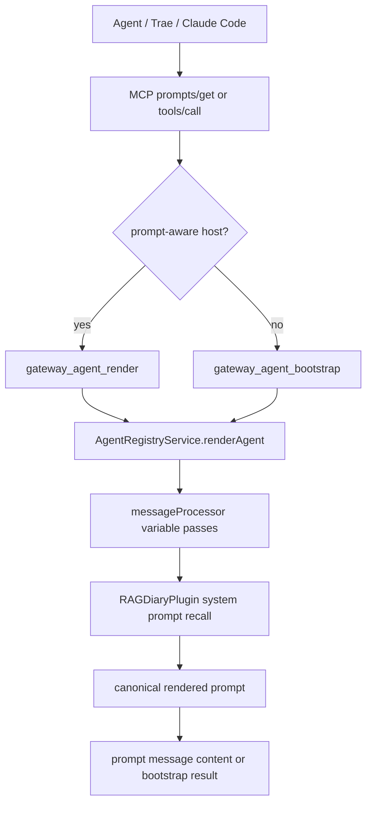
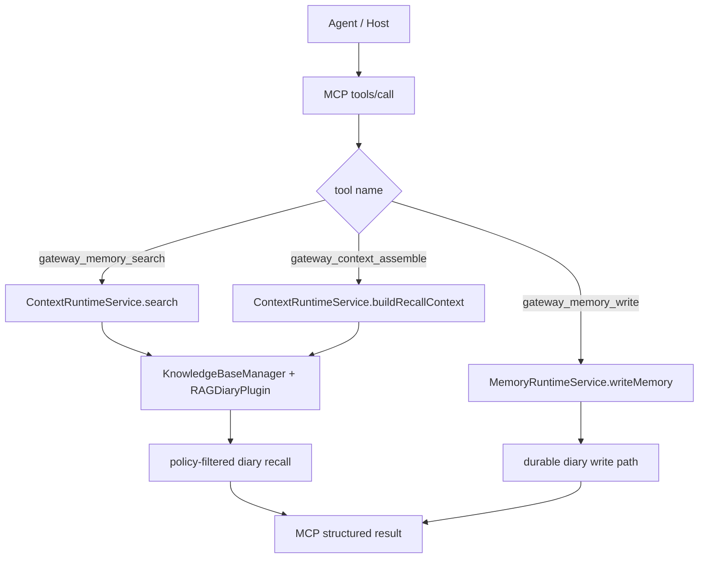

# MCP Bootstrap 与 VCP Diary RAG 链路说明

> 文档目标：说明当前实现中，tool-only 宿主如何通过 `gateway_agent_bootstrap` 获取 canonical agent 注入内容，以及如何通过 `gateway_memory_search` / `gateway_context_assemble` / `gateway_memory_write` 进入统一的 diary RAG 与记忆写入链路。

---

## 1. 结论先行

当前对外 MCP 能力已经收口为两条主路径：

1. **agent 注入路径**
   - prompt-aware 宿主优先走 `prompts/get(name = gateway_agent_render)`
   - tool-only 宿主走 `tools/call(name = gateway_agent_bootstrap)`
2. **记忆与上下文路径**
   - `gateway_memory_search` 负责通用记忆检索
   - `gateway_context_assemble` 负责 canonical recall context 组装
   - `gateway_memory_write` 负责 durable memory 写入

一句话概括：

**MCP 只负责发布稳定的 prompt/tool surface，真正的 prompt render、diary RAG 检索与 memory writeback 语义都统一收口在 Gateway Core。**

---

## 2. 参与模块

当前关键代码位置如下：

- MCP 入口：
  - `modules/agentGateway/adapters/mcpAdapter.js`
  - `modules/agentGateway/adapters/mcpBackendProxyAdapter.js`
- prompt render：
  - `modules/agentGateway/services/agentRegistryService.js`
- canonical context / recall runtime：
  - `modules/agentGateway/services/contextRuntimeService.js`
- durable memory runtime：
  - `modules/agentGateway/services/memoryRuntimeService.js`
- 共享 service bundle 装配：
  - `modules/agentGateway/createGatewayServiceBundle.js`
- 当前聚焦测试：
  - `test/agent-gateway-mcp-adapter.test.js`
  - `test/agent-gateway-mcp-transport.test.js`

---

## 3. Agent Bootstrap 调用图

---

## 4. Diary RAG / Memory 调用图

---

## 5. 请求输入长什么样

### 5.1 `gateway_agent_bootstrap`

常见输入：

- `agentId`
- `variables`
- `model`
- `maxLength`
- `context`
- `messages`

返回重点字段：

- `renderedPrompt`
- `summary`
- `agentId`
- `warnings`
- `truncated`
- `renderMeta`

### 5.2 `gateway_memory_search` / `gateway_context_assemble`

常见输入：

- `query` 或 `recentMessages`
- `diary` / `diaries`
- `mode`
- `k`
- `tokenBudget`
- `maxBlocks`
- `minScore`
- `timeAware`
- `groupAware`
- `rerank`
- `tagMemo`

当前实现的关键约束：

- diary 目标会受 `mcp_agent_memory_policy.json` 限制
- 未显式传 diary 时，会落到 agent 的 `defaultDiaries`
- adapter 与 runtime 两层都会拒绝越权 diary

---

## 6. 关键收口点

### 6.1 Prompt 与 Bootstrap 共用同一渲染源

`gateway_agent_bootstrap` 不自行拼 prompt，而是直接复用：

- `AgentRegistryService.renderAgent()`

这保证：

- prompt-aware 与 tool-only 宿主拿到的是同一语义结果
- 不会出现宿主本地重新拼装 prompt 的漂移
- deferred render 也会复用同一套 job runtime envelope

### 6.2 Diary 访问范围由 agent policy 决定

`gateway_memory_search` 与 `gateway_context_assemble` 的 diary 选择遵循：

1. `mcp_agent_memory_policy.json` 的 `allowedDiaries`
2. 未传 diary 时优先使用 `defaultDiaries`
3. runtime 再次校验，防止绕过 adapter

### 6.3 写入统一走 durable memory contract

`gateway_memory_write` 负责 durable memory 写入，不再暴露 coding 专用 writeback contract。

---

## 7. 当前推荐宿主路径

### 7.1 Prompt-aware 宿主

1. `prompts/list`
2. `prompts/get(name = gateway_agent_render)`
3. 将 `messages[0].content[*].text` 作为 inject-ready prompt body

### 7.2 Tool-only 宿主

1. `tools/list`
2. `tools/call(name = gateway_agent_bootstrap)`
3. 读取 `structuredContent.result.renderedPrompt`
4. 再按需调用 `gateway_memory_search` / `gateway_context_assemble` / `gateway_memory_write`

---

## 8. 验证建议

建议至少验证以下几点：

1. `tools/list` 不再暴露旧的 coding 专用 tool
2. `gateway_agent_bootstrap` 可成功返回 `renderedPrompt` 与 `summary`
3. `gateway_memory_search` / `gateway_context_assemble` 在默认 diary 与显式越权场景下都符合 policy
4. `gateway_memory_write` 仍能完成 durable memory 写入
5. deferred bootstrap / render 可通过 `gateway_job_get` / `gateway_job_cancel` / `resources/read(job events)` 继续追踪

---

## 9. 现状结论

当前 MCP 面向宿主的稳定 contract 已经不再依赖 coding 专用 capability，而是统一为：

- prompt: `gateway_agent_render`
- fallback tool: `gateway_agent_bootstrap`
- memory tools: `gateway_memory_search` / `gateway_context_assemble` / `gateway_memory_write`
- job tools: `gateway_job_get` / `gateway_job_cancel`

这套 contract 更适合 Trae 这类 tool-only 宿主，也更容易和 backend canonical route 保持一致。
