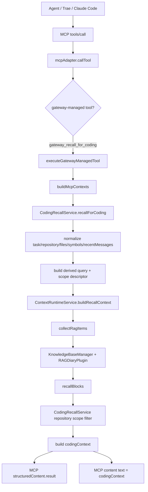
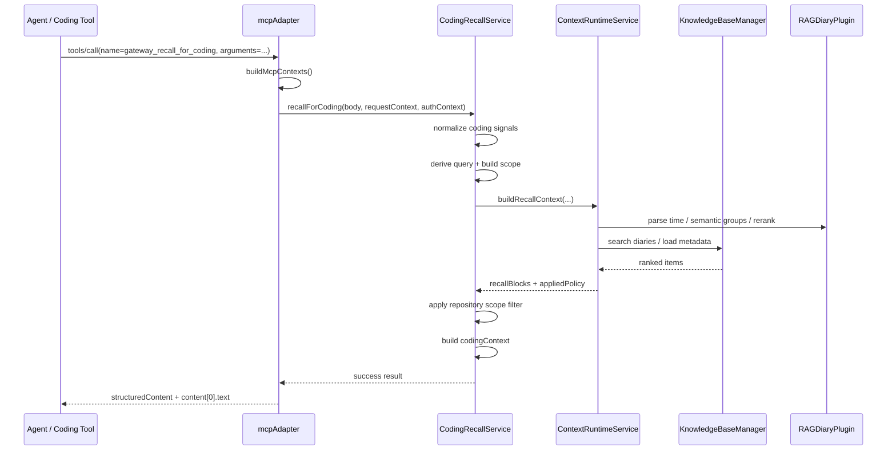
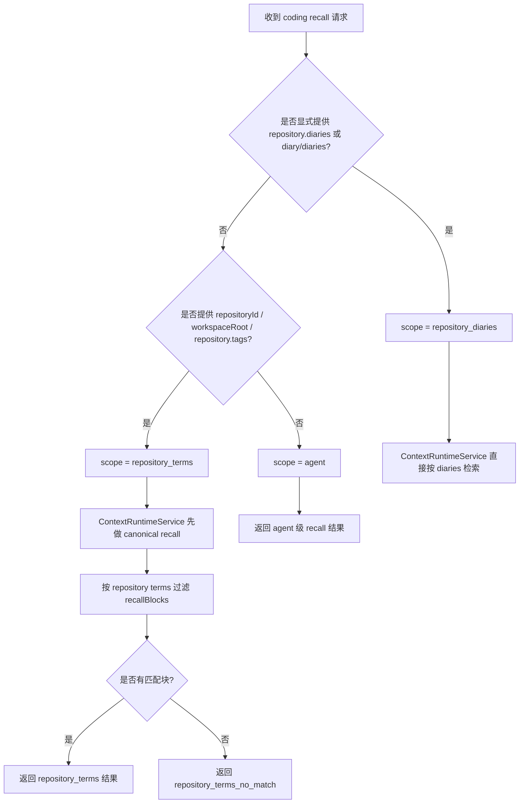

# MCP Coding Recall 与 VCP 日记 RAG 召回链路说明

> 文档目标：说明当前实现中，外部 agent / 编码工具通过 MCP 请求 VCP 的 `gateway_recall_for_coding` 后，VCP 后端如何完成 coding recall、如何进入日记 RAG 检索、如何做项目/仓库隔离，以及最终如何返回可直接消费的 `codingContext`。

---

## 1. 结论先行

当前链路不是“agent 直接读 diary”或“agent 直接扫仓库”，而是下面这条高层路径：

1. **agent / 编码工具** 发起 MCP `tools/call`
2. **MCP adapter** 将 `gateway_recall_for_coding` 识别为 gateway-managed tool
3. **CodingRecallService** 负责：
   - 归一化 coding 输入
   - 生成确定性 recall query
   - 计算项目/仓库 scope
4. **ContextRuntimeService** 负责：
   - 走 canonical 日记 RAG / recall 组装流程
   - 返回 `recallBlocks`
5. **CodingRecallService** 再做：
   - repository/workspace 级结果过滤
   - `codingContext` 文本整形
6. **MCP adapter** 将结果包装成：
   - `structuredContent.result`
   - `content[0].text = codingContext`

一句话概括：

**MCP 只负责发布高层 tool，真正的 recall 语义仍然收口在 Gateway Core；日记 RAG 检索依旧走 canonical runtime，而 coding recall 只是其上的一层编码场景包装。**

---

## 2. 参与模块

当前关键代码位置如下：

- MCP 入口：
  - `modules/agentGateway/adapters/mcpAdapter.js`
- coding recall 高层服务：
  - `modules/agentGateway/services/codingRecallService.js`
- canonical context / recall runtime：
  - `modules/agentGateway/services/contextRuntimeService.js`
- shared service bundle 装配：
  - `modules/agentGateway/createGatewayServiceBundle.js`
- 当前聚焦测试：
  - `test/agent-gateway-coding-recall-service.test.js`
  - `test/agent-gateway-mcp-adapter.test.js`

---

## 3. 整体调用图



---

## 4. 时序图



---

## 5. 请求输入长什么样

当前 `gateway_recall_for_coding` 是 MCP tool，输入模型大致包含：

- `task`
- `repository`
- `workspaceRoot`
- `files`
- `symbols`
- `recentMessages`
- `diary` / `diaries`
- `maxBlocks`
- `tokenBudget`
- `minScore`
- `mode`
- `timeAware`
- `groupAware`
- `rerank`
- `tagMemo`

其中，当前实现已经收紧了最小约束：

- `task` 必填
- 且必须额外提供至少一个：
  - `files`
  - `symbols`
  - `recentMessages`

这代表 coding recall 不是通用“随便搜一下”，而是明确面向编码任务的高层入口。

---

## 6. MCP 入口如何分流

在 `mcpAdapter.js` 中：

1. `callTool()` 识别 `gateway_recall_for_coding`
2. 由于它属于 `MCP_GATEWAY_TOOL_NAMES`
3. 所以不会走普通 plugin tool runtime
4. 而是走 `executeGatewayManagedTool()`

这个分流的意义是：

- `gateway_recall_for_coding` 被视为 **canonical Gateway Core capability**
- 它不是某个插件暴露出来的“业务工具”
- 它要复用：
  - canonical `requestContext`
  - canonical `authContext`
  - canonical failure mapping

也就是说，MCP 并没有单独长出第二套 recall 协议。

---

## 7. CodingRecallService 做了什么

`CodingRecallService.recallForCoding()` 是 coding recall 的核心高层编排层。

它做的事情可以拆成 6 步：

### 7.1 归一化 coding signals

它会分别归一化：

- `task`
- `repository`
- `files`
- `symbols`
- `recentMessages`

目标是把外部工具送来的“编码上下文碎片”收口成稳定内部模型。

### 7.2 校验最小输入

它会拒绝下面两类请求：

- 没有 `agentId/sessionId`
- 没有满足最小 coding recall 输入约束

当前最小约束是：

- 必须有 `task`
- 且必须有 `files/symbols/recentMessages` 至少之一

### 7.3 派生 deterministic query

它不会调用 LLM 临时生成 query，而是确定性拼接：

- `Task: ...`
- `Repository: ...`
- `Workspace: ...`
- `Files: ...`
- `Symbols: ...`
- `Recent: ...`

这样做的好处是：

- 行为可测试
- 不引入额外模型成本
- 不增加不可解释性

### 7.4 构建 scope descriptor

它会根据 repository/workspace 相关输入决定当前 recall scope：

- `repository_diaries`
- `repository_terms`
- `agent`

### 7.5 调用 canonical context runtime

它真正的 recall 检索并不是自己完成，而是继续调用：

- `ContextRuntimeService.buildRecallContext()`

这一步非常关键，意味着：

- token budget
- min score
- rerank
- time aware
- tag memo
- diary policy

这些都还是 canonical context runtime 在负责。

### 7.6 结果后处理

拿到 `recallBlocks` 后，它会：

- 按 repository scope 再做一次结果过滤
- 组装高层输出 `codingContext`
- 返回：
  - `codingContext`
  - `recallBlocks`
  - `diagnostics`
  - `scope`
  - `appliedPolicy`

---

## 8. 日记 RAG 召回是在后端哪里发生的

真正进入“日记 RAG 检索”的位置不是 `mcpAdapter`，也不是 `CodingRecallService`，而是：

- `ContextRuntimeService.buildRecallContext()`

这条路径内部会继续做：

1. 解析 query 或 recent messages
2. 解析 diary / diaries 选择
3. 计算 RAG 参数：
   - `mode`
   - `k`
   - `timeAware`
   - `groupAware`
   - `rerank`
   - `tagMemo`
4. 调用 `collectRagItems()`
5. 由 `KnowledgeBaseManager` 和 `RAGDiaryPlugin` 参与：
   - embedding
   - time parser
   - semantic groups
   - rerank
6. 组装 `recallBlocks`
7. 应用：
   - `minScore`
   - `tokenBudget`
   - `maxBlocks`
   - 截断和去重

所以 coding recall 对 diary RAG 的关系是：

**它不替代 canonical RAG 检索，只是把“编码任务上下文”翻译成更适合 recall runtime 消费的输入。**

---

## 9. 当前项目/仓库隔离是怎么做的

这是当前第二阶段里最关键的一点。

当前没有引入第二套仓库索引，也没有给每个仓库单独建一个独立向量库。

相反，当前实现采用两层策略：

### 9.1 强隔离：repository_diaries

如果请求里明确给了：

- `repository.diaries`
- 或顶层 `diary/diaries`

那么 coding recall 会优先把这些 diary 作为强边界，直接交给 canonical context runtime。

这时可以理解为：

**先在 diary 维度收口，再做 recall。**

### 9.2 弱隔离：repository_terms

如果没有显式 diary，但提供了：

- `repositoryId`
- `workspaceRoot`
- `repository.tags`

那么 service 会从这些字段里提取一组 `repository terms`，再对召回出的 `recallBlocks` 做二次过滤。

过滤检查的字段包括：

- `block.text`
- `block.metadata.sourceDiary`
- `block.metadata.sourceFile`
- `block.metadata.tags`

也就是说，这一步不是新检索，而是 **对 canonical recall 结果做仓库线索过滤**。

### 9.3 无 scope：agent

如果上述 repository/workspace 信息都没有，就退回 agent 级 recall。

### 9.4 不静默放宽

如果用户请求了 repository scope，但一个匹配块都没有：

- 不会偷偷退回 agent 级 recall
- 不会自动放宽 scope
- 会明确返回：
  - `scope.mode = repository_terms_no_match`
  - `recallBlocks = []`
  - `codingContext` 中写明没有命中 repository-scoped memory

这条约束是为了避免跨项目记忆污染。

---

## 10. 当前实现的作用域判定图



---

## 11. 返回结果长什么样

对 MCP client 来说，最终最重要的有两层：

### 11.1 高层文本

- `content[0].text`

这里直接等于：

- `codingContext`

也就是编码工具可以直接消费的文本上下文。

### 11.2 结构化结果

- `structuredContent.result`

其中包含：

- `codingContext`
- `query`
- `recallBlocks`
- `estimatedTokens`
- `appliedPolicy`
- `diagnostics`
- `scope`

这保证了：

- 普通编码工具可以直接吃文本
- 需要可解释性和调试能力的客户端还能看结构化证据

---

## 12. 一次完整链路的 ASCII 图

```text
Coding Tool / Agent
    |
    |  MCP tools/call
    |  name = gateway_recall_for_coding
    v
mcpAdapter.callTool()
    |
    |  gateway-managed tool dispatch
    v
executeGatewayManagedTool()
    |
    |  buildMcpContexts()
    v
CodingRecallService.recallForCoding()
    |
    |-- normalize task/repository/files/symbols/recentMessages
    |-- validate minimal coding signals
    |-- build deterministic query
    |-- build scope descriptor
    v
ContextRuntimeService.buildRecallContext()
    |
    |-- resolve diaries / policy
    |-- collectRagItems()
    |-- KnowledgeBaseManager search
    |-- RAGDiaryPlugin time/group/rerank
    |-- assemble recallBlocks
    v
CodingRecallService post-process
    |
    |-- apply repository scope filter
    |-- build codingContext
    v
mcpAdapter result mapping
    |
    |-- structuredContent.result = full result
    |-- content[0].text = codingContext
    v
Coding Tool / Agent
```

---

## 13. 当前实现的优势

- **保持 canonical 收口**：
  - recall 真正语义仍在 shared Gateway Core
- **不引入第二套索引模型**：
  - 不需要为 coding recall 再建独立向量后端
- **对编码工具更自然**：
  - 外部只需要给 task、files、symbols、recentMessages 等信号
- **可解释**：
  - 返回 `recallBlocks`、`diagnostics`、`scope`
- **避免静默跨项目污染**：
  - scope miss 时明确返回空

---

## 14. 当前局限

- `repository_terms` 仍是启发式过滤，不是物理隔离
- 如果历史记忆没有带稳定的：
  - repository tags
  - sourceFile 线索
  - 文本中的仓库特征
  那么 term-based 过滤效果会受限
- 当前最稳的项目隔离方式仍然是：
  - 显式 `repository.diaries`
  - 或顶层 `diary/diaries`

也就是说：

**当前“仓库隔离”更接近“在 canonical recall 之上附加项目作用域约束”，而不是“每个项目有完全独立的索引空间”。**

---

## 15. 建议理解方式

可以把当前实现理解成两层：

### 底层：canonical memory/context runtime

负责：

- 日记 RAG 检索
- recall block 组装
- token / score / rerank / time-aware / tagMemo 等规则

### 上层：coding recall 包装层

负责：

- 把编码场景输入翻译成 recall 请求
- 表达仓库 scope
- 生成 coding-friendly 输出

最终关系如下：

```text
Canonical diary RAG runtime
    -> 提供真正的 recall 能力

Coding recall service
    -> 提供编码场景包装、scope 和高层输出

MCP adapter
    -> 只负责把它发布给外部 agent / coding tool
```

---

## 16. 对应验证

当前与该链路直接相关的验证包括：

- `test/agent-gateway-coding-recall-service.test.js`
  - query 派生
  - repository-aware scope
  - no-match 不静默放宽
  - task-only 输入拒绝
- `test/agent-gateway-mcp-adapter.test.js`
  - MCP tool 发布
  - coding recall 成功路径
  - validation failure
  - explicit scope metadata
- `test/agent-gateway-context-runtime.test.js`
  - canonical recall runtime 的 search/context 行为

---

## 17. 一句话总结

**当前从 agent 请求 MCP 到 VCP 后端处理日记 RAG 召回的链路，是“高层 coding recall 输入包装 + canonical diary RAG 检索 + repository scope 结果过滤 + codingContext 输出”的组合，而不是第二套独立仓库索引系统。**
