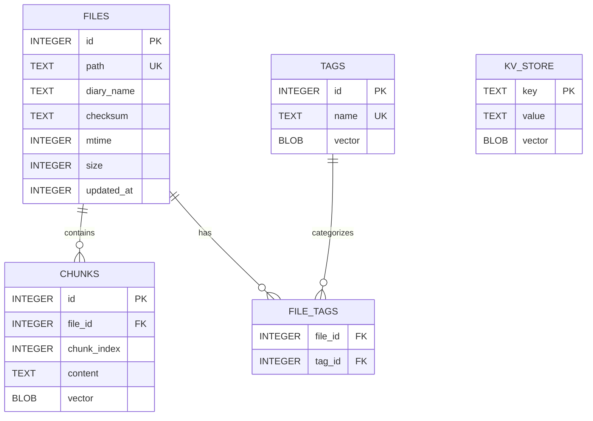

# VCPToolBox 记忆系统 SQLite 架构梳理

生成时间：2026-02-26
目标：系统梳理 knowledge_base.sqlite 的表结构、字段定义、约束、索引与关联关系；提供 ER 图、核心查询示例与优化建议，便于后续 Python 独立重构。

---

## 数据库概览

- 物理位置：VectorStore/knowledge_base.sqlite
- 接入方式：better-sqlite3
- 主要表：files、chunks、tags、file_tags、kv_store
- 设计特征：
  - 用 files 记录文件级元数据（含 diary_name 分组）
  - 用 chunks 存储切块文本及其向量（Float32 → BLOB）
  - 用 tags 管理全局标签及其向量
  - file_tags 维护文件与标签的多对多关系
  - kv_store 缓存 EPA 基底、日记本名称向量、插件描述向量等

参考实现代码位置：
- 表结构与索引定义：[KnowledgeBaseManager.js:L166-L206](file:///home/zh/projects/VCPToolBox/KnowledgeBaseManager.js#L166-L206)
- 运行期典型查询与事务写入：[KnowledgeBaseManager.js:L990-L1209](file:///home/zh/projects/VCPToolBox/KnowledgeBaseManager.js#L990-L1209)

---

## 表结构清单

### 1) files（文件元数据）

- 字段
  - id INTEGER PRIMARY KEY AUTOINCREMENT
  - path TEXT UNIQUE NOT NULL
  - diary_name TEXT NOT NULL
  - checksum TEXT NOT NULL
  - mtime INTEGER NOT NULL
  - size INTEGER NOT NULL
  - updated_at INTEGER
- 约束
  - 主键：id
  - 唯一：path
- 索引
  - idx_files_diary(diary_name)
- 业务含义
  - 记录相对路径、所属日记本名（diary_name）、文件校验与时间信息
  - diary_name 仅作分组标识（未单独规范化为表）
- 数据流
  - 批量处理时按文件变更写入/更新
  - 删除时按 path 定位并清理关联（见 “删除流”）

### 2) chunks（文本块与向量）

- 字段
  - id INTEGER PRIMARY KEY AUTOINCREMENT
  - file_id INTEGER NOT NULL
  - chunk_index INTEGER NOT NULL
  - content TEXT NOT NULL
  - vector BLOB
- 约束
  - 主键：id
  - 外键：file_id → files(id) ON DELETE CASCADE
- 索引
  - idx_chunks_file(file_id)
- 业务含义
  - 存储切块文本与对应向量；id 与 Vexus 向量索引中的条目一一对应
  - chunk_index 标记块顺序，便于还原上下文
- 数据流
  - 批量写入时先清理旧分块，再插入新分块与向量
  - 检索后通过 id 关联回内容与来源文件（hydrate）

### 3) tags（全局标签与向量）

- 字段
  - id INTEGER PRIMARY KEY AUTOINCREMENT
  - name TEXT UNIQUE NOT NULL
  - vector BLOB
- 约束
  - 主键：id
  - 唯一：name
- 业务含义
  - 系统全局标签库；TagMemo 依赖其向量空间进行增强与分析
- 数据流
  - 新标签按需向量化并 upsert 到表；向量同步更新到全局标签 Vexus 索引

### 4) file_tags（文件-标签多对多关系）

- 字段
  - file_id INTEGER NOT NULL
  - tag_id INTEGER NOT NULL
- 约束
  - 复合主键：(file_id, tag_id)
  - 外键：file_id → files(id) ON DELETE CASCADE
  - 外键：tag_id → tags(id) ON DELETE CASCADE
- 索引
  - idx_file_tags_tag(tag_id)
  - idx_file_tags_composite(tag_id, file_id)
- 业务含义
  - 连接文件与标签；共现矩阵、核心标签补全等依赖此表

### 5) kv_store（键值/向量缓存）

- 字段
  - key TEXT PRIMARY KEY
  - value TEXT
  - vector BLOB
- 业务含义
  - 通用缓存容器：如 EPA 基底、日记本名称向量、插件描述向量等

---

## 表关系与依赖

- 一对多
  - files.id → chunks.file_id
- 多对多（经由关联表）
  - files.id ↔ file_tags.file_id ↔ tags.id
- 逻辑分组
  - files.diary_name 作为逻辑分组键，供多索引系统按日记本拆分向量

实体关系图（ER 图）：



---

## 字段与索引说明

- files
  - path：相对路径（相对于 KNOWLEDGEBASE_ROOT_PATH），唯一定位文件
  - diary_name：日记本逻辑分组名；常用于并行搜索与索引文件命名
  - checksum：内容 MD5，用于变更检测与去重写
  - mtime/size：文件层面的变更判定字段
  - updated_at：系统内更新时刻（秒级）
  - 索引：idx_files_diary 支持按日记本筛选；path 已唯一

- chunks
  - chunk_index：块顺序；建议与 file_id 组合形成唯一约束
  - content：清洗后的块文本
  - vector：Float32Array 二进制缓冲（BLOB）
  - 索引：idx_chunks_file 加速按文件取块

- tags
  - name：清洗归一化后的标签名；唯一
  - vector：标签向量（BLOB）

- file_tags
  - 复合主键避免重复关联
  - 现有索引偏向 tag_id → file_id 的方向，便于“从标签找文件”

- kv_store
  - key：命名建议约定前缀，如 plugin_desc_hash:{sha256}
  - vector：通用向量缓存字段，按需使用

---

## 关系映射表（摘要）

- files 1–N chunks（files.id = chunks.file_id）
- files N–M tags（经由 file_tags(file_id, tag_id)）
- files 分组：diary_name 逻辑域 → 多索引体系中的索引实例
- kv_store 独立，无外键依赖

---

## 核心查询示例

1) 检索结果回填（按 chunk.id 获取文本与来源文件）  
来源：[KnowledgeBaseManager.js:L362-L369](file:///home/zh/projects/VCPToolBox/KnowledgeBaseManager.js#L362-L369)

```sql
SELECT c.content AS text, f.path AS sourceFile, f.updated_at
FROM chunks c
JOIN files  f ON c.file_id = f.id
WHERE c.id = ?;
```

2) 并行全局搜索回填（topK hydrate）  
来源：[KnowledgeBaseManager.js:L423-L427](file:///home/zh/projects/VCPToolBox/KnowledgeBaseManager.js#L423-L427)

```sql
SELECT c.content AS text, f.path AS sourceFile
FROM chunks c
JOIN files  f ON c.file_id = f.id
WHERE c.id = ?;
```

3) 通过文件路径批量取块与向量（分批 IN）  
来源：[KnowledgeBaseManager.js:L883-L915](file:///home/zh/projects/VCPToolBox/KnowledgeBaseManager.js#L883-L915)

```sql
SELECT c.id, c.content AS text, c.vector, f.path AS sourceFile
FROM chunks c
JOIN files  f ON c.file_id = f.id
WHERE f.path IN (?, ?, ...);
```

4) 标签共现矩阵（构建共现图）  
来源：[KnowledgeBaseManager.js:L1302-L1328](file:///home/zh/projects/VCPToolBox/KnowledgeBaseManager.js#L1302-L1328)

```sql
SELECT ft1.tag_id AS tag1, ft2.tag_id AS tag2, COUNT(ft1.file_id) AS weight
FROM file_tags ft1
JOIN file_tags ft2 
  ON ft1.file_id = ft2.file_id AND ft1.tag_id < ft2.tag_id
GROUP BY ft1.tag_id, ft2.tag_id;
```

5) 列出所有日记本名（逻辑分组）  
来源：[KnowledgeBaseManager.js:L402-L404](file:///home/zh/projects/VCPToolBox/KnowledgeBaseManager.js#L402-L404)

```sql
SELECT DISTINCT diary_name FROM files;
```

6) 事务性写入示例（标签 upsert、文件与块重建、关系写入）  
来源：[KnowledgeBaseManager.js:L1071-L1146](file:///home/zh/projects/VCPToolBox/KnowledgeBaseManager.js#L1071-L1146)

```sql
-- 伪代码：在单一事务中完成
BEGIN TRANSACTION;
  -- upsert 新标签与向量
  INSERT OR IGNORE INTO tags (name, vector) VALUES (?, ?);
  UPDATE tags SET vector = ? WHERE name = ?;

  -- 新文件或更新文件元信息
  INSERT INTO files (path, diary_name, checksum, mtime, size, updated_at) VALUES (?, ?, ?, ?, ?, ?);
  -- 若存在则 UPDATE 并清理旧块与关系
  DELETE FROM chunks    WHERE file_id = ?;
  DELETE FROM file_tags WHERE file_id = ?;

  -- 写入新分块与关系
  INSERT INTO chunks (file_id, chunk_index, content, vector) VALUES (?, ?, ?, ?);
  INSERT OR IGNORE INTO file_tags (file_id, tag_id) VALUES (?, ?);
COMMIT;
```

7) 删除文件及关联（应用外键或显式清理）  
来源：[KnowledgeBaseManager.js:L1235-L1249](file:///home/zh/projects/VCPToolBox/KnowledgeBaseManager.js#L1235-L1249)

```sql
-- 若启用外键级联，可仅执行：
DELETE FROM files WHERE id = ?;

-- 当前实现包含显式清理（兼容未启用 FK 级联）：
DELETE FROM chunks    WHERE file_id = ?;
DELETE FROM file_tags WHERE file_id = ?;
DELETE FROM files     WHERE id = ?;
```

---

## 设计要点与依赖关系

- files 为所有内容的锚点；chunks 与 file_tags 通过 file_id 从属于 files
- tags 为全局词汇表；与 files 的关系经由 file_tags 表达
- 向量字段统一采用 Float32Array 序列化为 BLOB 存储，Rust 引擎恢复时直接读取
- 多索引体系：
  - 每个 diary_name 对应一个 VexusIndex（chunks 维度）
  - 全局标签使用单例 VexusIndex（tags 维度）
- 共现矩阵在运行时按 file_tags 自连接计算并缓存于内存

---

## 优化建议

结合当前实现与 SQLite 最佳实践，建议如下优化以支持高并发与可维护性：

1) 约束与一致性
- 启用外键：PRAGMA foreign_keys = ON;
- 建议增加唯一约束：UNIQUE(file_id, chunk_index) ON chunks
- 视需要增加 NOT NULL：tags.vector 若策略要求“仅持有向量的标签”

2) 日志与同步模式（按写多读多场景）
- PRAGMA journal_mode = WAL;
- PRAGMA synchronous = NORMAL;
- PRAGMA temp_store = MEMORY;

3) 索引优化（按典型访问路径）
- 新增索引 idx_file_tags_file(file_id) 以优化“从文件找标签”的查询
- 新增复合索引 idx_chunks_file_idx(file_id, chunk_index) 以优化顺序恢复
- 可选新增 idx_files_updated(updated_at) 支持最近变更扫描

4) 结构演进（可选）
- 规范化日记本：引入 diaries(id, name) 表，files.diary_name → files.diary_id
- 全文检索：引入 FTS5 虚表 chunks_fts(content) 与触发器，支持关键字与向量融合检索
- 统计加速：建立物化视图或周期性缓存共现矩阵

5) 维护与健康
- 定期执行 ANALYZE / VACUUM（维护统计信息与碎片）
- 控制事务批量大小，避免超出 SQLite 参数上限（当前实现已分批）

---

## Python 重构提示（映射）

- ORM 建模（SQLAlchemy 示例意向）：
  - class File(id, path, diary_name, checksum, mtime, size, updated_at)
  - class Chunk(id, file_id, chunk_index, content, vector)
  - class Tag(id, name, vector)
  - class FileTag(file_id, tag_id)
  - class KV(key, value, vector)
- 关系：File.one_to_many(Chunk)，File.many_to_many(Tag, through=FileTag)
- 事务：批量写入采用 session.bulk_save_objects 或 executemany 且包裹事务
- 向量：使用 numpy.float32 → bytes 存取，确保维度一致

---

## 证据定位

- 表结构与索引定义：[KnowledgeBaseManager.js:L166-L206](file:///home/zh/projects/VCPToolBox/KnowledgeBaseManager.js#L166-L206)
- 批处理写入逻辑：[KnowledgeBaseManager.js:L990-L1209](file:///home/zh/projects/VCPToolBox/KnowledgeBaseManager.js#L990-L1209)
- Hydrate 查询示例：[KnowledgeBaseManager.js:L362-L369](file:///home/zh/projects/VCPToolBox/KnowledgeBaseManager.js#L362-L369)
- 并行全局检索回填：[KnowledgeBaseManager.js:L423-L427](file:///home/zh/projects/VCPToolBox/KnowledgeBaseManager.js#L423-L427)
- 共现矩阵构建查询：[KnowledgeBaseManager.js:L1302-L1328](file:///home/zh/projects/VCPToolBox/KnowledgeBaseManager.js#L1302-L1328)

