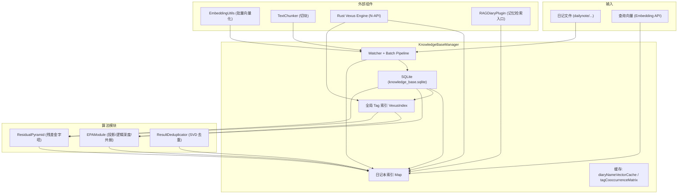

# VCPToolBox 记忆系统技术文档（面向 Python 独立重构）

**版本参考**：VCP 6.4  
**生成时间**：2026-02-25  
**覆盖范围**：记忆系统核心模块、数据流转、存储结构、接口与状态管理  
**主要源码**：KnowledgeBaseManager.js / EPAModule.js / ResidualPyramid.js / ResultDeduplicator.js / TextChunker.js / EmbeddingUtils.js / rag_params.json

---

## 1. 系统概述

记忆系统是 VCPToolBox 的核心 RAG 子系统，面向日记本式知识库与长期记忆场景。其核心目标是：

- 将日记文本切块向量化并持久化
- 构建“日记本索引 + 全局标签索引”双索引结构
- 以 TagMemo（V3.7）为核心算法增强检索质量
- 提供 EPA 语义空间分析、残差金字塔分解、结果去重能力

系统围绕 **KnowledgeBaseManager** 进行编排，依赖 **SQLite + Rust N-API 向量引擎**，并由 **chokidar** 监听文件变化实现增量索引。

---

## 2. 系统整体架构图



---

## 3. 核心组件说明

### 3.1 KnowledgeBaseManager（系统总控）

职责：

- 初始化数据库与索引系统（SQLite + VexusIndex）
- 监听文件变更并批量索引
- 执行检索与 TagMemo 增强
- 提供缓存与兼容性 API
- 管理 rag_params 热更新与索引保存

关键状态：

- `db`: SQLite 连接
- `diaryIndices`: Map<diaryName, VexusIndex>
- `tagIndex`: 全局标签索引
- `diaryNameVectorCache`: 日记本名字向量缓存
- `tagCooccurrenceMatrix`: 标签共现矩阵
- `pendingFiles / batchTimer / saveTimers / ragParamsWatcher`

### 3.2 EPAModule（Embedding Projection Analysis）

职责：

- 用加权 PCA 从标签向量中生成正交语义基
- 计算 query 的逻辑深度（entropy）、语义主轴、跨域共振
- 支持 Rust 引擎投影（加速）

输出指标：

- `logicDepth`: 0~1，意图聚焦程度
- `entropy`: 0~1，信息散乱程度
- `dominantAxes`: 语义主轴列表
- `resonance`: 跨域共振强度

### 3.3 ResidualPyramid（残差金字塔）

职责：

- 对 query 进行逐层残差分解（Gram-Schmidt）
- 计算每层能量解释比例与新颖度指标
- 提供 TagMemo 动态增强所需的特征信号

关键特征：

- `coverage`: 当前标签对 query 的解释覆盖率
- `novelty`: 未被解释能量 + 方向性新颖度
- `tagMemoActivation`: TagMemo 激活强度

### 3.4 ResultDeduplicator（SVD 结果去重）

职责：

- 对检索候选结果做 SVD 主题抽取
- 使用残差投影选择多样性结果
- 保证弱关联信息不被完全丢弃

典型使用位置：

- `KnowledgeBaseManager.deduplicateResults()`

### 3.5 TextChunker（文本切块）

职责：

- 基于 tiktoken 的 token 上限进行分块
- 保持句子边界与片段重叠
- 对超长句子执行强制切割

### 3.6 EmbeddingUtils（批量向量化）

职责：

- 将文本批量发送至 Embedding API
- 支持并发批处理、重试、限流回退
- 支持维度约束与禁用批处理模式

---

## 4. 数据模型定义

### 4.1 物理目录结构（VectorStore）

```
VectorStore/
├── knowledge_base.sqlite
├── index_global_tags.usearch
├── index_diary_{md5hash}.usearch
└── ...
```

### 4.2 SQLite Schema（核心表）

```
files:    文件元数据 (path, diary_name, checksum, mtime, size, updated_at)
chunks:   文本块与向量 (file_id, chunk_index, content, vector)
tags:     标签与向量 (name, vector)
file_tags:文件-标签关系
kv_store: 键值存储 (EPA 基底缓存、日记本向量缓存等)
```

### 4.3 内存结构（运行态状态）

| 字段 | 类型 | 说明 |
|------|------|------|
| diaryIndices | Map<string, VexusIndex> | 日记本独立索引 |
| tagIndex | VexusIndex | 全局 Tag 索引 |
| diaryNameVectorCache | Map<string, number[]> | 日记本名称向量缓存 |
| pendingFiles | Set<string> | 等待索引的文件路径 |
| saveTimers | Map<string, Timeout> | 索引延迟保存 |
| ragParams | object | TagMemo 参数热加载 |

---

## 5. 数据流转机制

### 5.1 文件增量索引流

1. **文件监听**：chokidar 监听 `rootPath`（默认 `dailynote/`）
2. **批量缓冲**：`pendingFiles` 收集文件，按 `batchWindow` 或 `maxBatchSize` 触发
3. **文本切块**：TextChunker 将文件内容切分为 chunk
4. **Tag 抽取**：解析 `Tag:` 行并清洗
5. **Embedding 批量请求**：EmbeddingUtils 并发获取向量
6. **事务写入**：SQLite 事务更新 files/chunks/tags/file_tags
7. **索引写入**：更新日记本索引与 tagIndex
8. **延迟保存**：定时写回 `.usearch` 文件

### 5.2 文件删除流

1. 删除文件触发 watcher
2. SQLite 删除 files/chunks/file_tags
3. 日记本索引移除对应 chunk ID
4. 索引延迟保存

### 5.3 查询流（标准检索）

1. 接收 query 向量与 k 值
2. 选择日记本索引或全局并行索引
3. 可选应用 TagMemo 增强向量
4. VexusIndex.search 返回候选 ID
5. SQLite hydrate：补全文本内容与来源路径

### 5.4 TagMemo 增强向量流程（V3.7）

1. **EPA 分析**：计算逻辑深度与共振
2. **Residual Pyramid**：提取覆盖率与新颖度
3. **动态增强因子计算**：基于逻辑深度/共振/熵
4. **Tag 扩张**：共现矩阵拉回 + 核心标签补全
5. **语义去重**：余弦阈值去冗余标签
6. **向量融合**：原始向量与上下文向量加权融合

---

## 6. API 接口规范（模块级）

> 这里描述的是 KnowledgeBaseManager 暴露给插件与系统的主要接口。

### 6.1 initialize()

- **作用**：初始化数据库、索引、缓存、Watcher、RAG 参数
- **返回**：Promise<void>

### 6.2 search(diaryName?, queryVec, k?, tagBoost?, coreTags?, coreBoostFactor?)

- **输入**
  - `diaryName`: string | null（可选）
  - `queryVec`: number[] | Float32Array
  - `k`: number，默认 5
  - `tagBoost`: number，默认 0
  - `coreTags`: string[]，默认 []
  - `coreBoostFactor`: number，默认 1.33
- **输出**：Array<{text, score, sourceFile, fullPath, matchedTags, boostFactor, tagMatchScore, tagMatchCount, coreTagsMatched}>
- **说明**：若 `diaryName` 为空则并行搜索所有日记本索引

### 6.3 applyTagBoost(vector, tagBoost, coreTags?, coreBoostFactor?)

- **输入**：原始向量与增强参数
- **输出**：{ vector: Float32Array, info: object|null }

### 6.4 getEPAAnalysis(vector)

- **输出**：{ logicDepth, entropy, resonance, dominantAxes }

### 6.5 deduplicateResults(candidates, queryVector)

- **输入**：候选结果与 query 向量
- **输出**：去重后的候选集合

### 6.6 getDiaryNameVector(diaryName)

- **输入**：日记本名称
- **输出**：number[] | null
- **策略**：内存缓存 → SQLite kv_store → Embedding API 生成

### 6.7 getPluginDescriptionVector(descText, getEmbeddingFn)

- **输入**：插件描述文本 + 外部向量化函数
- **输出**：number[] | null
- **策略**：kv_store 持久化缓存

### 6.8 getVectorByText(diaryName, text)

- **输入**：文本内容
- **输出**：与文本内容匹配的向量（若存在）

### 6.9 getChunksByFilePaths(filePaths)

- **输入**：文件路径列表
- **输出**：[{ id, text, vector, sourceFile }]
- **用途**：Time-Aware RAG 二次排序

### 6.10 searchSimilarTags(input, k?)

- **输入**：文本或向量
- **输出**：[{ tag, score }]

### 6.11 shutdown()

- **作用**：关闭 watcher、保存索引、关闭数据库

---

## 7. 状态管理逻辑

### 7.1 启动阶段

- 初始化 SQLite，设置 WAL 与同步策略
- 加载 tagIndex；若缺失则后台恢复
- 预热日记本名称向量缓存
- 构建 Tag 共现矩阵
- 初始化 EPA / ResidualPyramid / ResultDeduplicator
- 启动文件 watcher 与 rag_params 监听

### 7.2 运行阶段

| 状态变量 | 作用 |
|---------|------|
| pendingFiles | 批量索引缓冲 |
| isProcessing | 防止并发批处理 |
| saveTimers | 延迟保存索引 |
| ragParams | TagMemo 动态参数 |
| diaryNameVectorCache | 日记本名称向量缓存 |

### 7.3 关闭阶段

确保 watcher 关闭并触发索引落盘，最后关闭 SQLite 连接。

---

## 8. 持久化策略

1. **SQLite WAL 模式**：提升并发写入稳定性  
2. **索引延迟保存**：降低频繁磁盘写入  
3. **Rust 引擎恢复**：索引丢失时可从 SQLite 重建  
4. **kv_store 缓存**：保存 EPA 基底、日记本向量、插件向量  

---

## 9. 性能优化要点

| 优化点 | 说明 |
|-------|------|
| 批量索引窗口 | batchWindow + maxBatchSize |
| Embedding 并发 | 并发 worker + batch 控制 |
| Tag 共现矩阵 | 减少在线计算 |
| Rust N-API | 索引与投影高性能实现 |
| 去重与降噪 | TagMemo 动态阈值 + 结果去重 |
| 缓存策略 | diaryNameVectorCache + kv_store |

---

## 10. Python 独立重构建议（映射设计）

### 10.1 模块拆分建议

| Node 模块 | Python 建议模块 | 说明 |
|----------|----------------|------|
| KnowledgeBaseManager.js | knowledge_base_manager.py | 总控与数据流 |
| EPAModule.js | epa_module.py | PCA/投影/共振 |
| ResidualPyramid.js | residual_pyramid.py | Gram-Schmidt + 特征 |
| ResultDeduplicator.js | result_deduplicator.py | 去重 |
| TextChunker.js | text_chunker.py | tiktoken 切块 |
| EmbeddingUtils.js | embedding_utils.py | 并发向量化 |

### 10.2 关键可替换依赖

| 功能 | Python 依赖建议 |
|------|----------------|
| SQLite | sqlite3 / SQLAlchemy |
| 向量索引 | FAISS / hnswlib / usearch |
| 向量投影 | numpy / scipy |
| Token 计数 | tiktoken |
| 文件监听 | watchdog |

### 10.3 重构关键点

- 保持 **双索引结构**（日记本索引 + Tag 索引）
- 确保 **向量维度与 Embedding 模型一致**
- 复用 **kv_store** 缓存策略（EPA 基底 + 名称向量）
- 保持 **批处理策略与索引落盘机制**
- TagMemo 关键流程：EPA → ResidualPyramid → 扩张 → 重塑

---

## 11. 可复现性检查清单

- [ ] Embedding API 输入输出格式与维度一致
- [ ] SQLite Schema 与索引文件命名一致
- [ ] TagMemo 参数可热加载（rag_params.json）
- [ ] 索引恢复机制可在空索引场景重建
- [ ] 搜索结果与日记本路径映射正确

