# 完整两阶段长篇小说创作工作流

> 从世界观到正文，全流程质量保障

---

## 一、工作流总览

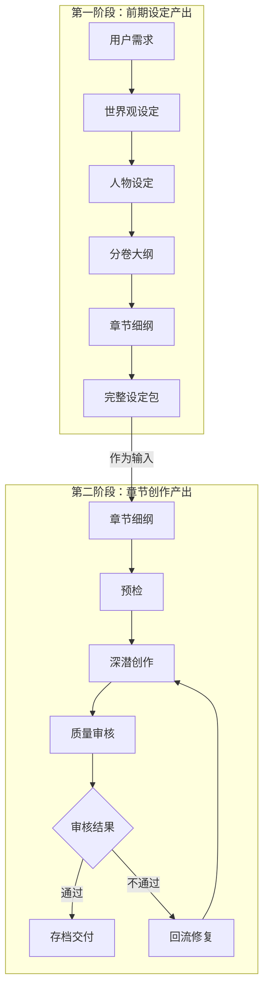

---

## 二、第一阶段：前期设定产出

### 2.1 阶段目标

产出完整的小说前期设定文档，包括：
- 世界观设定（world_building.md）
- 人物设定（characters.md）
- 分卷大纲（volume_outline.md）
- 章节细纲（chapter_outline.md）

### 2.2 质量闭环机制：正反辩论

每层设定都通过**设计者 vs 挑刺者**的多轮辩论来保障质量。

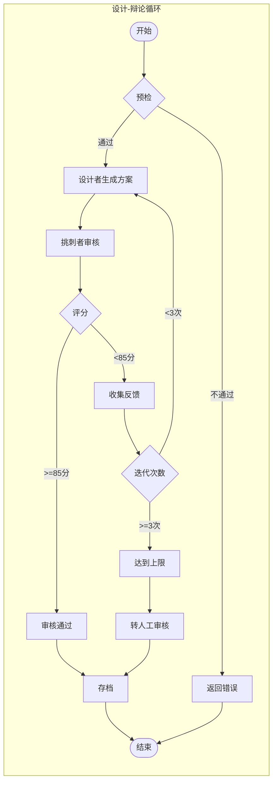

### 2.3 四层设定的依赖关系

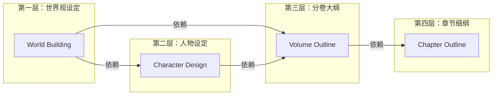

### 2.4 单层的完整流程

以世界观设定为例：

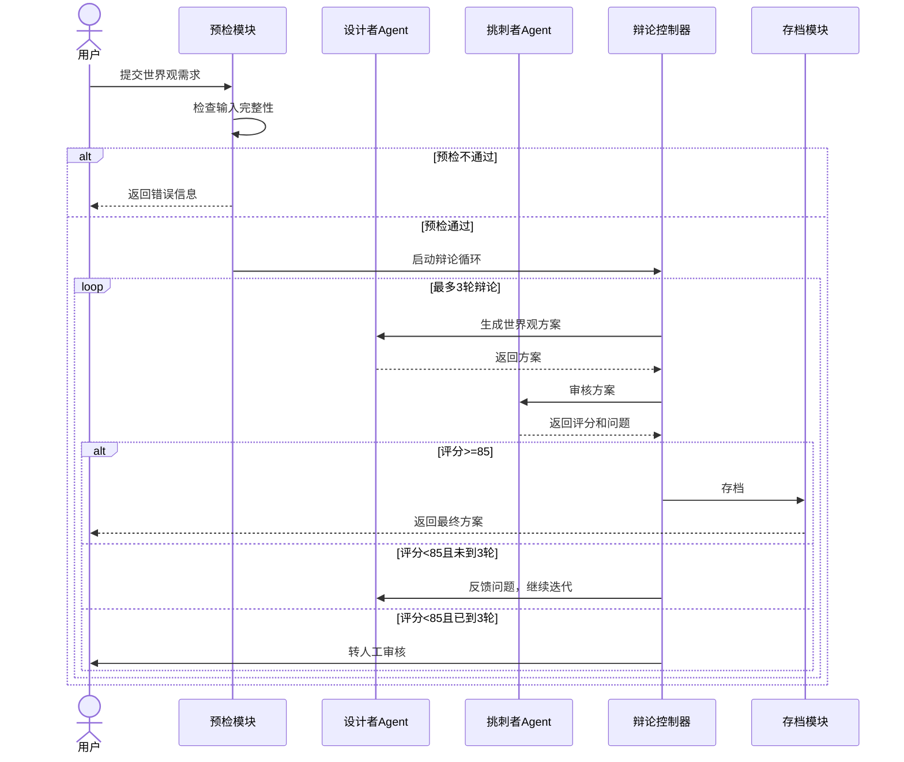

### 2.5 挑刺者的审核维度

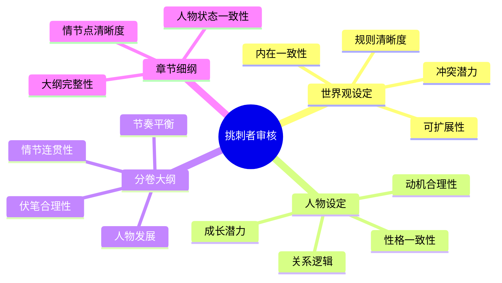

---

## 三、第二阶段：章节创作产出

### 3.1 阶段目标

基于前期设定，逐章创作小说正文，并通过质量闭环保障输出质量。

### 3.2 质量闭环机制：预检-创作-审核-回流

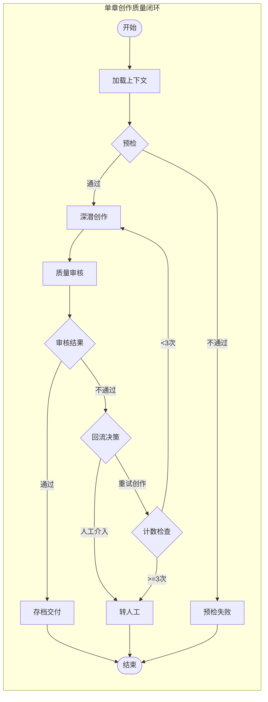

### 3.3 预检阶段

检查输入条件是否满足，避免无效创作。

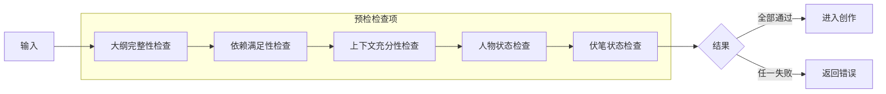

**预检检查项说明：**

| 检查项 | 检查内容 | 失败处理 |
|--------|----------|----------|
| 大纲完整性 | 章节细纲是否存在且完整 | 终止，返回错误 |
| 依赖满足性 | 前置章节是否已完成 | 等待或跳过 |
| 上下文充分性 | 角色状态、世界观信息是否加载 | 补充上下文 |
| 人物状态检查 | 人物当前状态是否符合设定 | 修正状态 |
| 伏笔状态检查 | 待回收伏笔是否已记录 | 补充记录 |

### 3.4 深潜创作阶段

调用LLM生成章节正文。

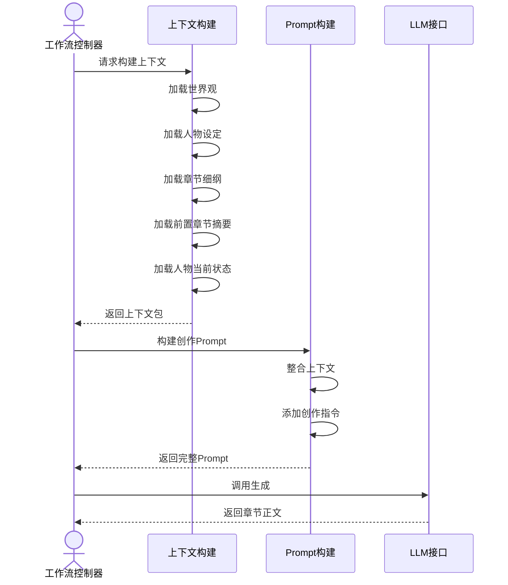

**上下文包含内容：**

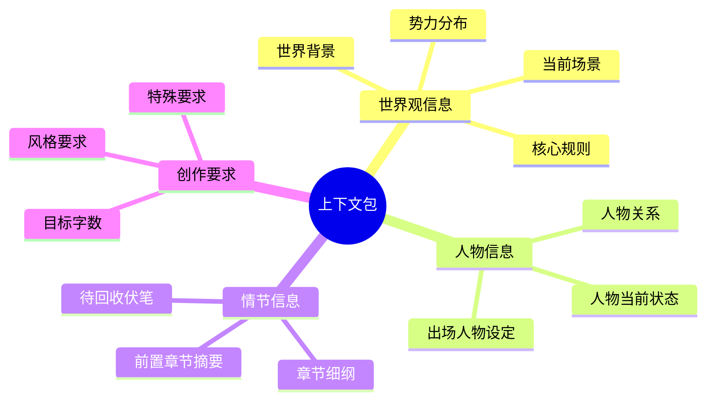

### 3.5 质量审核阶段

多维度审核生成的章节内容。

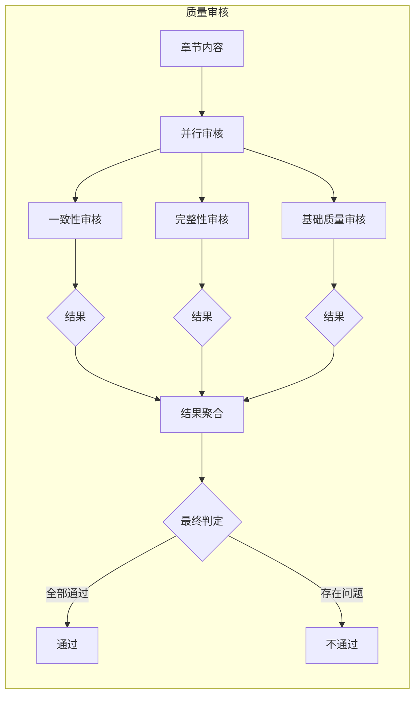

**审核维度说明：**

| 审核维度 | 检查内容 | 通过标准 |
|----------|----------|----------|
| **一致性审核** | 人物名、地点名是否与设定一致 | 0处严重不一致 |
| **人设一致性** | 人物言行是否符合设定 | 0处严重偏离 |
| **情节一致性** | 情节是否与大纲一致 | 大纲覆盖率≥90% |
| **完整性审核** | 是否覆盖大纲要求的情节点 | 情节点覆盖率≥95% |
| **字数达标** | 字数是否在目标范围 | 达标率90%-110% |
| **基础质量** | 语法、错别字、标点 | 无明显错误 |

### 3.6 回流决策阶段

根据审核结果决定回流路径。

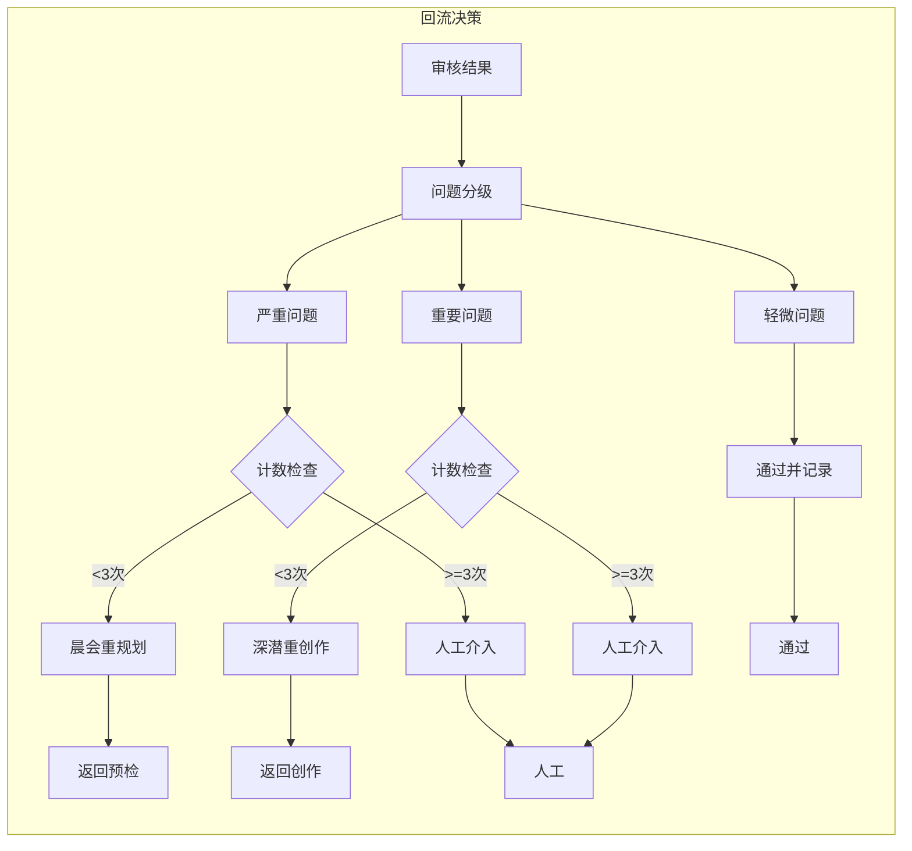

**回流路径说明：**

| 问题级别 | 定义 | 回流路径 | 计数器 |
|----------|------|----------|--------|
| **严重** | 影响理解/设定冲突/人设崩塌 | 晨会重规划 | 回流计数+1 |
| **重要** | 影响体验/逻辑漏洞 | 深潜重创作 | 迭代计数+1 |
| **轻微** | 可优化/不影响主线 | 通过并记录建议 | 不计数 |

### 3.7 完整单章创作流程

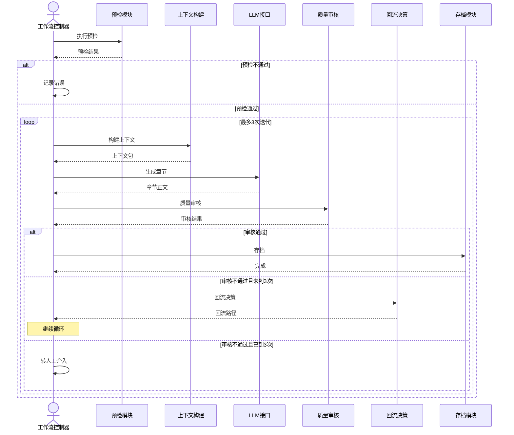

---

## 四、两阶段整合流程

### 4.1 完整工作流

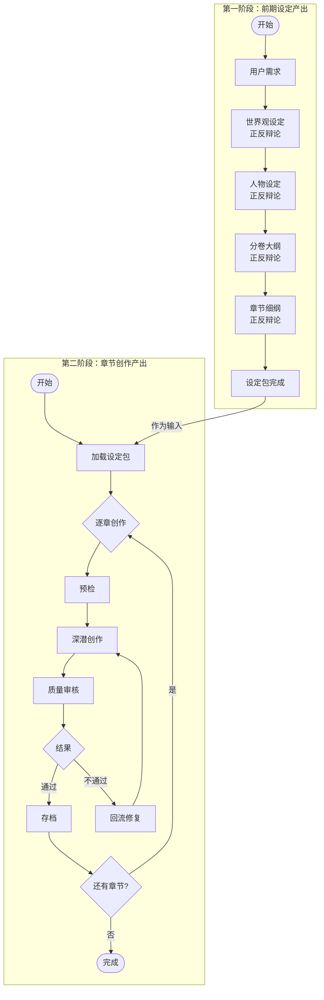

### 4.2 数据流转

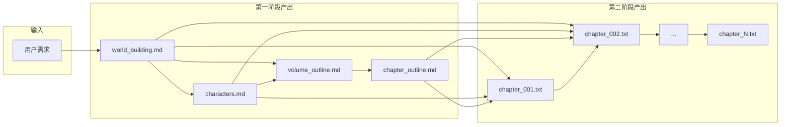

---

## 五、质量门禁汇总

### 5.1 第一阶段质量门禁

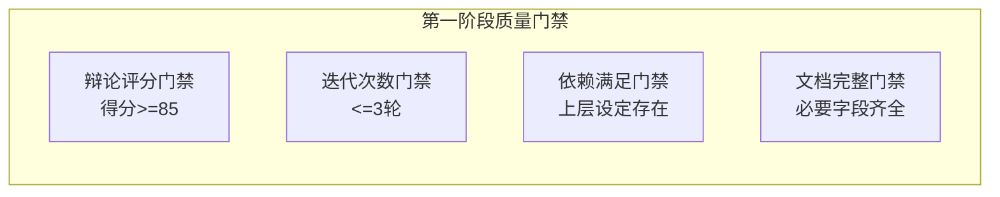

### 5.2 第二阶段质量门禁

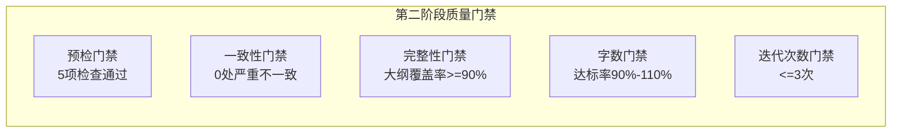

---

## 六、迭代计数器设计

### 6.1 计数器类型

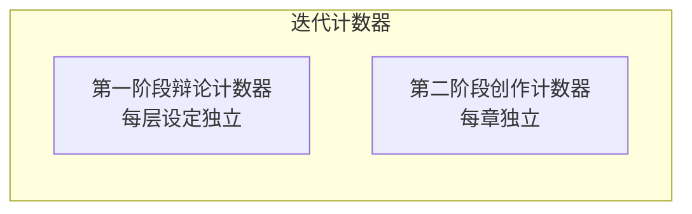

### 6.2 计数器规则

| 阶段 | 计数器 | 上限 | 超限处理 |
|------|--------|------|----------|
| 第一阶段 | 辩论计数器 | 3轮 | 转人工审核 |
| 第二阶段 | 创作迭代计数器 | 3次 | 转人工介入 |

---

## 七、人工介入点

### 7.1 介入触发条件

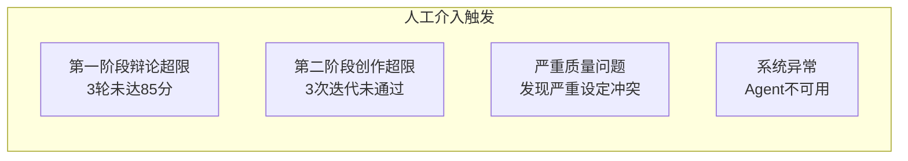

### 7.2 介入处理流程

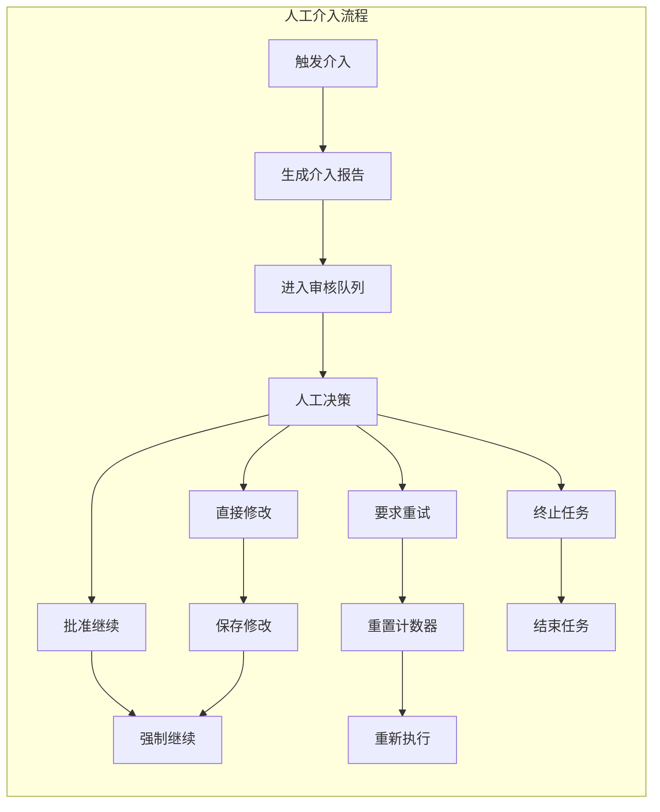

---

## 八、实施计划

### 8.1 阶段划分

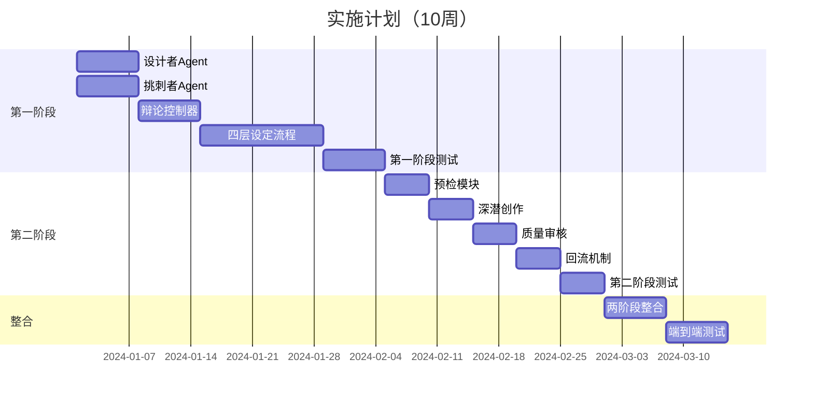

### 8.2 关键里程碑

| 周次 | 里程碑 | 交付物 |
|------|--------|--------|
| Week 2 | 辩论机制可用 | 设计者+挑刺者Agent |
| Week 5 | 前期设定系统完成 | 可产出完整设定包 |
| Week 8 | 章节创作系统完成 | 可产出单章正文 |
| Week 10 | 完整系统可用 | 端到端工作流 |

---

## 九、关键设计决策

### 9.1 为什么采用正反辩论机制？

| 方案 | 优点 | 缺点 |
|------|------|------|
| 单Agent生成 | 简单快速 | 质量不可控 |
| **正反辩论** | **质量有保障，问题前置发现** | **实现复杂，token消耗高** |
| 人工审核 | 质量最高 | 效率最低 |

**决策**：采用正反辩论，在质量和效率之间取得平衡。

### 9.2 为什么最多3轮迭代？

| 迭代次数 | 质量提升 | 成本 | 边际效益 |
|----------|----------|------|----------|
| 1轮 | 60% | 低 | - |
| **3轮** | **85%** | **中** | **最优** |
| 5轮 | 90% | 高 | 递减 |

**决策**：3轮迭代可以捕获80%以上的问题，边际效益最优。

### 9.3 为什么通过阈值设为85分？

- 90分+：过于严格，容易导致无限迭代
- 80分-：过于宽松，质量无法保证
- **85分**：质量与效率的平衡点

---

## 十、总结

### 10.1 两阶段工作流对比

| 维度 | 第一阶段 | 第二阶段 |
|------|----------|----------|
| **产出物** | 设定文档 | 章节正文 |
| **质量机制** | 正反辩论 | 预检-创作-审核-回流 |
| **迭代方式** | 设计者↔挑刺者 | 创作↔审核 |
| **计数器** | 辩论计数器 | 创作迭代计数器 |
| **上限** | 3轮 | 3次 |

### 10.2 核心价值

1. **前期设定质量可控**：通过正反辩论，设定问题在章节创作前被发现
2. **章节创作有兜底**：质量审核+回流机制，保证输出质量
3. **全流程一致性**：从世界观到正文，层层依赖，层层检查
4. **人工介入有明确点**：超限或严重问题时，人工接管

### 10.3 预期效果

- ✅ 前期设定一致性：>95%
- ✅ 章节创作成功率：>90%
- ✅ 明显错误拦截率：>85%
- ✅ 人工介入率：<10%

---

*本工作流通过两阶段质量闭环，实现了从世界观到正文的完整长篇小说AI创作流程。*
