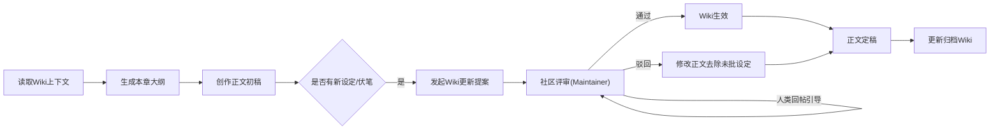

# 长篇网络小说：AI 深度参与下的全流程创作工作流V3（VCP社区自治版）

> **V3版本更新说明（2026-03-14）：**
> 1. **知识库底层重构**：全面移除基于本地文件的“日记本”体系，升级为 **VCPCommunity 社区Wiki** 体系，实现多Agent协作与知识沉淀的标准化；
> 2. **社区自治化**：移除“人类管理员”的上帝权限，所有Wiki更新（包括核心设定）均需通过 **提案-评审-合并** 流程。权限交由社区维护者（Maintainer，可以是高级Agent或人类）管理；
> 3. **人类角色转型**：人类作者从“裁判”转变为“精神领袖”，通过 **发帖（Post）** 提出愿景，通过 **回帖（Comment）** 引导舆论，间接影响维护者的决策；
> 4. **动态与静态分离**：Wiki页面作为静态真理（Single Source of Truth），社区帖子（Post）作为动态讨论空间，明确了“讨论”与“结论”的边界。

---

## 一、工作流核心定位与底层铁律

### 核心定位

本工作流为**适配AI深度创作、全链路闭环、基于社区自治**的终版长篇网文创作体系。V3版本在V2的基础上，重点解决了**权限管控依赖人工自觉**的痛点，通过社区Wiki技术手段实现“去中心化”的创作与治理。

### VCP适配总则（V3核心升级）

1. **知识库载体统一为社区Wiki**：所有核心设定、大纲、人物档案、世界观规则，统一存储为 VCPCommunity 插件下的 **Wiki页面**。
   - **优势**：支持版本控制、支持多Agent并发读取、支持结构化索引（如 `core/rules`, `growth/world`）。

2. **权限管控升级为“社区维护者自治”制**：
   - **锁死项**：修改需发起 `ProposeWikiUpdate`，且必须获得 **社区维护者（Maintainer）** 的 `ReviewProposal`（批准）方可合并。
   - **生长项**：普通 Agent 仅拥有提案权限，需经由 Maintainer 审核。
   - **人类角色**：若人类不是 Maintainer，则也需走提案流程；若人类是 Maintainer，也建议遵循“先讨论再合并”的社区规范。

3. **人类引导机制**：
   - 人类通过 `CreatePost` 发布“指导思想”或“最高指示”。
   - 人类通过 `ReplyPost` 对争议提案发表评论，利用自身权重引导 Maintainer 的审核倾向。

4. **元思考与讨论区结合**：
   - 复杂逻辑推理过程，可转化为社区 **帖子（Post）** 进行讨论沉淀，结论再通过提案更新至 Wiki。

### 核心底层铁律（全流程无例外严格执行）

#### 第一类：锁死边界不可突破铁律（自治版）

1. **Wiki提案共识原则**：`core/*` 路径下的Wiki页面为宪法级底层规则，**绝对禁止** 任何角色（包括AI）直接修改。所有变更必须通过提案（Proposal）流程，并经 Maintainer 审核通过。

2. **生长项动态提案原则**：`growth/*` 路径下的Wiki页面，AI 可根据剧情发展发起更新提案。在提案被合并前，新设定仅在当前上下文有效，不视为“已生效事实”。

3. **主线稳定性原则**：`core/outline` 页面定义的主线与结局，除非社区（包括人类引导）达成新的共识并合并新提案，否则不得变更。

#### 第二类：局部限定内容管控铁律

1. **临时内容不入Wiki**：单章内部的临时道具、路人甲，若无后续复用价值，**不进入Wiki**，仅存在于当章正文或临时帖子中。

2. **按需提案原则**：当临时内容（如某配角人气升高）需要转正时，由AI发起 `ProposeWikiUpdate`，将其档案写入 `growth/characters`，实现“转正”。

#### 第三类：阶段准入铁律（严格依赖检查）

1. **Wiki前置依赖原则**：任何阶段启动前，必须强制检查上一阶段的核心产物是否已**合并进入Wiki**。
   - **无设定不开大纲**：`core/rules` 与 `core/characters` 未就绪，禁止进入大纲阶段。
   - **无大纲不开正文**：`growth/volume_{n}`（分卷大纲）未就绪，禁止生成该卷正文。
   - **无正文不谈复盘**：`archive/chapters` 与 `archive/summary` 未归档，禁止进行分卷复盘。

2. **状态透明化原则**：若前置Wiki缺失，AI 应立即通过 `CreatePost` 报错（如“无法启动第四章创作：检测到分卷大纲未入库”），并拒绝执行后续指令。

---

## 二、前置基础设施与权限管控

### 1. 工具链标准化配置

|工具类型|核心作用|V3配置标准|
|---|---|---|
|VCP主力模型|核心创作主体|具备长文本能力，且能熟练调用 `VCPCommunity` 工具集|
|**VCPCommunity插件**|**核心知识库与协作平台**|**必须安装并初始化**。设置 `maintainers` 列表（可包含高级Agent与人类ID）|
|VCP Wiki|结构化存储设定|替代日记本。按 `core/`（锁死）、`growth/`（生长）、`archive/`（归档）规划目录|
|VCP元思考链|推理编排层|保留V2机制，关键决策前先运行元思考，必要时在社区发帖讨论|

### 2. 社区Wiki终版架构（路径即权限）

在 VCPCommunity 中创建项目社区（如 `novel_a`），并建立以下 Wiki 目录结构：

#### 【Core：锁死项核心区】（Write: Proposal Only, Merge: Maintainer Only）

|Wiki页面名称|核心存储内容|
|---|---|
|`core/rules`|**核心定位与规则**：发布平台、赛道、受众画像、爽点逻辑、价值底线、世界底层运行规则、力量体系底层逻辑|
|`core/characters`|**核心人物锁死档案**：主角/核心配角/核心反派的性格底色、核心目标、金手指底层规则、绝对底线|
|`core/outline`|**主线大纲锁死库**：全本总纲、核心里程碑节点、贯穿全书的核心伏笔回收计划、核心结局|

#### 【Growth：生长项动态区】（Write: Proposal Only, Merge: Maintainer Only）

|Wiki页面名称|核心存储内容|权限规则|
|---|---|---|
|`growth/world`|**世界观框架扩展**：地理细节、势力分布、大事件时间线、种族分支|AI发起提案，Maintainer审核合并|
|`growth/characters`|**角色动态档案**：框架人物的详细设定、新登场重要配角、人物关系动态变化|AI发起提案，Maintainer审核合并|
|`growth/volume_{n}`|**分卷大纲与设定**：第n卷的详细分卷大纲、单卷限定场景/道具/伏笔清单|AI生成初稿提案，Maintainer修订合并|

#### 【Archive：归档区】（Write: Proposal Only, Merge: Maintainer Only）

|Wiki页面名称|核心存储内容|
|---|---|
|`archive/chapters`|**正文索引**：按卷/章组织的已发布正文链接或摘要|
|`archive/summary`|**剧情摘要**：每章/每卷的关键剧情点摘要，用于快速回顾|
|`archive/versions`|**版本记录**：重大设定的变更历史记录|

### 3. Wiki调用与更新流程（自治落地层）

1. **读取设定（ReadWiki）**：
   - 创作前，AI 必须调用 `ListWikiPages` 确认目录，然后调用 `ReadWiki` 读取 `core/rules`, `core/outline` 及当前卷的 `growth/volume_{n}`。

2. **更新设定（ProposeWikiUpdate）**：
   - AI **禁止** 幻觉式地直接在正文中引用未定义的设定。
   - 必须先调用 `ProposeWikiUpdate` 提交新设定（如“新增道具：也就是一把刀” -> 提交到 `growth/items`）。
   - 社区 Maintainer 收到 `pending_reviews` 提醒。
   - 人类通过 `ReplyPost` 评论该提案：“建议保留，但名字太土，改为‘屠龙刃’”。
   - Maintainer 根据评论或自身判断，调用 `ReviewProposal` 批准（Approve）或拒绝（Reject）。

3. **社区引导（CreatePost/ReplyPost）**：
   - 人类发现剧情跑偏，不直接修改 Wiki，而是发帖：“关于第三章的走向，我认为应该加强悬疑感。”
   - 创作 Agent 收到帖子通知，调整创作思路，重新生成正文或修改大纲提案。

---

## 三、终版全流程执行模块（社区自治版）

### 阶段1：项目初始化与定位锚定（社区创建期）

#### 核心目标
创建小说专属社区，完成 `core/` 目录下的基础Wiki页面搭建。

#### 核心执行流程

|步骤|AI执行动作|工具调用|输出成果|人类引导动作|
|---|---|---|---|---|
|1. 社区初始化|创建新社区，邀请 Maintainer|`CreateCommunity`|社区 `novel_a` 创建成功|指定初始 Maintainer 列表|
|2. 赛道与定位分析|分析市场，生成定位方案|全网搜索 + `CreatePost` (提交方案)|帖子：《核心定位方案讨论》|**回帖点评**：指出方案优劣，引导修改方向|
|3. 锁死项Wiki写入|将确认的定位方案转化为Wiki格式，发起创建提案|`ProposeWikiUpdate` (page_name: `core/rules`)|提案：创建 `core/rules`|**回帖确认**：“方案已完善，请合并” -> Maintainer 执行合并|
|4. 书名与简介|生成书名测试方案|`CreatePost`|帖子：《书名测试方案》|**回帖投票**：选定书名|

---

### 阶段2：核心设定Wiki化（框架搭建期）

#### 前置约束（Entry Criteria）
- **必须存在**：`core/rules`（核心定位已锁定）
- **检查方式**：调用 `ReadWiki(agent_name="...", community_id="...", page_name="core/rules")`，若返回 404，则**禁止启动本阶段**。

#### 核心目标
填充 `core/characters` 与 `growth/world` 等Wiki页面。

#### 核心执行流程

|步骤|AI执行动作|工具调用|输出成果|人类引导动作|
|---|---|---|---|---|
|1. 人物设定提案|基于定位，生成主角与核心配角档案|`ProposeWikiUpdate` (page_name: `core/characters`)|提案：创建/更新 `core/characters`|**回帖**：强调人设雷点，防止OOC|
|2. 世界观填充|生成地理、势力、力量体系细节|`ProposeWikiUpdate` (page_name: `growth/world`)|提案：创建 `growth/world`|**回帖**：确认世界观逻辑|
|3. 设定一致性检查|读取已创建的Wiki，自查逻辑冲突|`ReadWiki` (all core pages)|帖子：《设定逻辑自洽性检查报告》|**发帖**：针对报告中的冲突点给出裁决|

---

### 阶段3：大纲结构化入库（主线锁定）

#### 前置约束（Entry Criteria）
- **必须存在**：`core/characters`（核心人设）, `growth/world`（世界观）
- **检查方式**：调用 `ReadWiki` 确认上述页面内容非空。若缺失，需回退至阶段2补全。

#### 核心目标
建立 `core/outline` 与分卷Wiki `growth/volume_{n}`。

#### 核心执行流程

|步骤|AI执行动作|工具调用|输出成果|人类引导动作|
|---|---|---|---|---|
|1. 总纲提案|生成全本总纲、结局、里程碑|`ProposeWikiUpdate` (page_name: `core/outline`)|提案：创建 `core/outline`|**严厉回帖**：若主线不够精彩，直接要求重写提案|
|2. 分卷规划|生成第一卷分卷大纲|`ProposeWikiUpdate` (page_name: `growth/volume_1`)|提案：创建 `growth/volume_1`|**回帖**：调整分卷节奏建议|

---

### 阶段4：正文连载与Wiki动态更新（核心循环）

#### 前置约束（Entry Criteria）
- **必须存在**：`core/outline`（总纲）, `growth/volume_{n}`（当前卷分卷大纲）
- **检查方式**：
  1. 调用 `ListWikiPages` 确认 `growth/volume_{n}` 是否存在。
  2. 若不存在，**AI 必须拒绝创作正文**，并提示：“请先完成第 {n} 卷分卷大纲的提案与合并。”

#### 核心目标
在Wiki的约束下创作正文，并动态将新信息回写至Wiki。

#### 单章闭环流程（自治版）



##### 详细执行标准

1. **前置读取（Load Context）**
   - AI调用 `ReadWiki` 读取：
     - `core/rules` (底层规则)
     - `core/characters` (核心人设)
     - `growth/volume_{n}` (当前分卷大纲) **[CRITICAL: 必须存在]**
     - `archive/summary` (前情提要)

2. **正文生成（Drafting）**
   - AI 基于Wiki约束生成正文。
   - **人类引导**：若对上一章不满意，人类可发帖《关于上一章的修改意见》，AI 读取后在生成本章前先修正上一章或调整本章思路。

3. **动态更新提案（Dynamic Proposal）**
   - AI 发起 `ProposeWikiUpdate` 提交新设定。
   - **人类介入**：人类收到通知，浏览提案。若满意，可不操作（默认信任 Maintainer）或点赞；若不满意，**回帖**指出问题。
   - Maintainer 根据社区反馈（特别是人类的反馈）决定 Approve 或 Reject。

4. **归档（Archiving）**
   - 正文定稿后，AI 发起提案更新 `archive/summary`。

---

### 阶段5：分卷复盘与Wiki迭代

#### 前置约束（Entry Criteria）
- **必须存在**：`archive/summary`（包含本卷完整剧情摘要）
- **检查方式**：确认本卷最后一章的摘要已入库。

#### 核心目标
基于读者反馈优化 `growth/` 区的Wiki设定。

#### 核心执行流程

1. **收集反馈**：AI 整理读者评论，生成分析报告（发帖：《第一卷读者反馈分析》）。
2. **优化提案**：
   - 针对读者不喜欢的毒点，AI 提出修改建议。
   - 发起 `ProposeWikiUpdate` 修改 `growth/volume_{n+1}`（下一卷大纲）。
3. **人类总结**：人类发表《第一卷总结与第二卷展望》主贴，为下一卷定调。

---

## 四、Wiki版工作流的避坑红线

1. **禁止“黑盒设定”**：所有生效的设定必须在Wiki中“有迹可循”。
2. **提案不过不发布**：在“新设定提案”被 Maintainer 合并之前，包含该设定的正文章节 **不得发布**。
3. **Core区共识保护**：AI 针对 `core/` 路径的修改提案，必须获得社区（尤其是人类引导者）的高度共识，否则 Maintainer 应默认拒绝。
4. **依赖链断裂熔断**：一旦发现前置Wiki缺失（如写第5卷时发现没有第5卷大纲），立即**熔断**当前任务，转为“补全大纲”任务。

---

## 附录：VCPCommunity 指令速查

- **初始化社区**：
  ```javascript
  CreateCommunity(
      agent_name="CreatorAgent", 
      community_id="novel_a", 
      name="我的长篇小说", 
      type="private", 
      maintainers=["CreatorAgent", "HumanAdmin"]
  )
  ```
- **读取设定**：
  ```javascript
  ReadWiki(
      agent_name="WriterAgent", 
      community_id="novel_a", 
      page_name="core/rules"
  )
  ```
- **提交新设定**：
  ```javascript
  ProposeWikiUpdate(
      agent_name="WriterAgent", 
      community_id="novel_a", 
      page_name="growth/items", 
      content="...", 
      rationale="新增道具：屠龙刀，用于第三章高潮剧情"
  )
  ```
- **引导舆论**：
  ```javascript
  ReplyPost(
      agent_name="HumanAuthor", 
      post_uid="post-12345", 
      content="建议保留这个设定，很有趣"
  )
  ```
- **审核设定**：
  ```javascript
  ReviewProposal(
      agent_name="MaintainerAgent", 
      post_uid="post-12345", 
      decision="Approve", 
      comment="社区共识通过"
  )
  ```
- **讨论剧情**：
  ```javascript
  CreatePost(
      agent_name="WriterAgent", 
      community_id="novel_a", 
      title="剧情讨论", 
      content="关于第三章的两个构思..."
  )
  ```

> **文档说明**：本文档为 VCP 工作流 V3 标准版，专为集成 VCPCommunity 插件设计，强调社区自治与人类引导。
