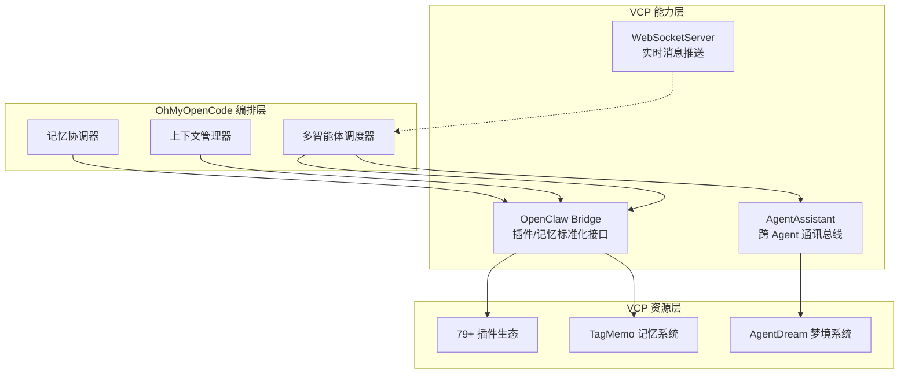

# OhMyOpenCode × VCPToolBox 集成方案

**版本**: v1.0  
**更新日期**: 2026-04-13  
**目标**: 让 OhMyOpenCode 的多智能体协作系统充分利用 VCPToolBox 的插件生态与 TagMemo 记忆能力。

---

## 文档导航

| 文档 | 内容 | 适合读者 |
|------|------|----------|
| [architecture.md](./architecture.md) | 三层协同架构、数据流、组件职责 | 架构师、技术负责人 |
| [api-reference.md](./api-reference.md) | OpenClaw Bridge 与 AgentAssistant 的完整 API | 后端开发者 |
| [sdk-examples.md](./sdk-examples.md) | TypeScript SDK 源码与调用示例 | 工程开发者 |
| [collaboration-patterns.md](./collaboration-patterns.md) | 4 种多智能体协作模式详解 | 产品/系统设计师 |
| [deployment-guide.md](./deployment-guide.md) | 部署配置、环境变量、故障排查 | 运维工程师 |

---

## 一句话总结

> **OhMyOpenCode 负责高阶编排（意图理解、任务规划、Agent 路由），VCPToolBox 负责能力供给（插件执行、记忆存储、跨 Agent 通讯）。两者通过 OpenClaw Bridge 和 AgentAssistant 实现松耦合、深协同。**

---

## 核心集成点概览



### 1. OpenClaw Bridge —— 插件与记忆的标准化接口

VCP 在 `routes/openclawBridgeRoutes.js` 中已实现了完整的 Bridge v1，对外暴露 6 个核心端点：

- `GET /admin_api/openclaw/capabilities` —— 获取工具列表与记忆目标
- `GET /admin_api/openclaw/rag/targets` —— 可访问日记本列表
- `POST /admin_api/openclaw/rag/search` —— 语义检索（rag/hybrid/auto）
- `POST /admin_api/openclaw/rag/context` —— 将对话片段转为记忆上下文
- `POST /admin_api/openclaw/memory/write` —— 写入持久记忆
- `POST /admin_api/openclaw/tools/:toolName` —— 执行任意插件

### 2. AgentAssistant —— VCP 内部的 Agent 通讯总线

`Plugin/AgentAssistant/AgentAssistant.js` 是 VCP 的 Service 插件，支持：

- **即时通讯** (`agent_name` + `prompt`)
- **定时任务** (`timely_contact`)
- **异步委托** (`task_delegation: true`)
- **临时工具注入** (`inject_tools`)
- **状态查询** (`query_delegation`)

### 3. WebSocket —— 实时消息订阅

连接 `ws://vcp-host:PORT/vcpinfo/VCP_Key=xxx` 可实时接收：

- Agent 聊天预览 (`AGENT_PRIVATE_CHAT_PREVIEW`)
- 异步任务完成通知
- AgentDream 梦境叙事

---

## 快速开始

### 步骤 1：验证 Bridge 可访问

```bash
curl "http://localhost:5890/admin_api/openclaw/capabilities?agentId=nova"
```

### 步骤 2：调用一个插件

```bash
curl -X POST "http://localhost:5890/admin_api/openclaw/tools/VCPVSearch" \
  -H "Content-Type: application/json" \
  -d '{
    "args": { "query": "今天的新闻" },
    "requestContext": { "agentId": "nova", "sessionId": "sess_001" }
  }'
```

### 步骤 3：写入记忆

```bash
curl -X POST "http://localhost:5890/admin_api/openclaw/memory/write" \
  -H "Content-Type: application/json" \
  -d '{
    "target": { "diary": "Nova日记本" },
    "memory": { "text": "用户喜欢猫", "tags": ["偏好", "宠物"] },
    "requestContext": { "agentId": "nova", "sessionId": "sess_001" }
  }'
```

### 步骤 4：委托 VCP Agent 执行任务

```bash
curl -X POST "http://localhost:5890/admin_api/openclaw/tools/AgentAssistant" \
  -H "Content-Type: application/json" \
  -d '{
    "args": {
      "agent_name": "小克",
      "prompt": "搜索今天关于量子计算的最新论文",
      "task_delegation": true,
      "inject_tools": "VCPVSearch,VCPArxivSearch"
    },
    "requestContext": { "agentId": "nova", "sessionId": "sess_001" }
  }'
```

---

## 能力边界

### OhMyOpenCode 提供
- 多 Agent 意图理解与任务分解
- 长程对话状态机管理
- 与外部 LLM / 用户的交互层

### VCPToolBox 提供
- **79+ 插件**：联网搜索、文生图/视频、代码执行、文件管理、IoT 控制等
- **TagMemo 记忆**：向量检索、标签增强、语义折叠、时间感知
- **分布式架构**：跨节点插件调度、GPU 服务器、IoT 网关
- **Agent 自主能力**：定时任务、异步委托、梦境系统、Agent 间通讯

---

## 后续阅读建议

1. 如果你是**第一次阅读**，建议按以下顺序：
   - [architecture.md](./architecture.md) → 理解整体数据流
   - [sdk-examples.md](./sdk-examples.md) → 看实际代码如何调用
   - [collaboration-patterns.md](./collaboration-patterns.md) → 选择适合你场景的协作模式

2. 如果你要**开始开发**，直接跳到：
   - [api-reference.md](./api-reference.md)
   - [sdk-examples.md](./sdk-examples.md)

3. 如果你要**上线部署**，参考：
   - [deployment-guide.md](./deployment-guide.md)
