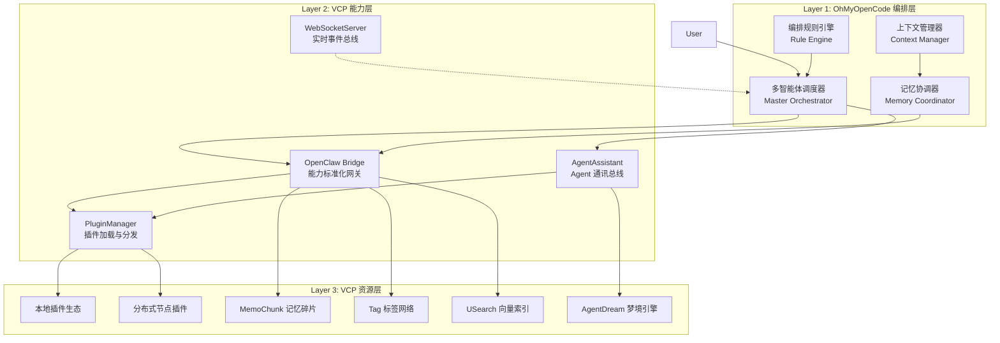
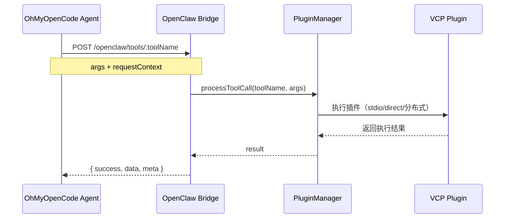
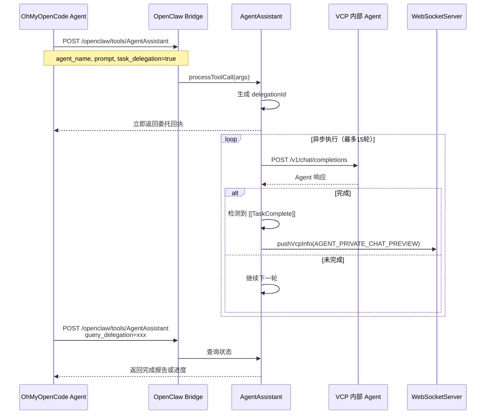
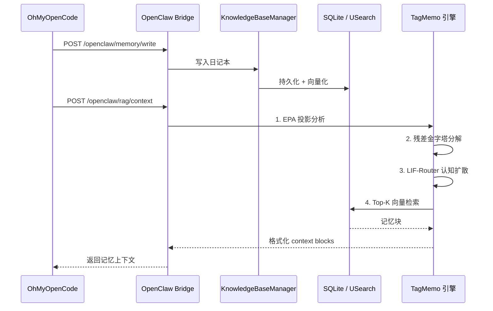
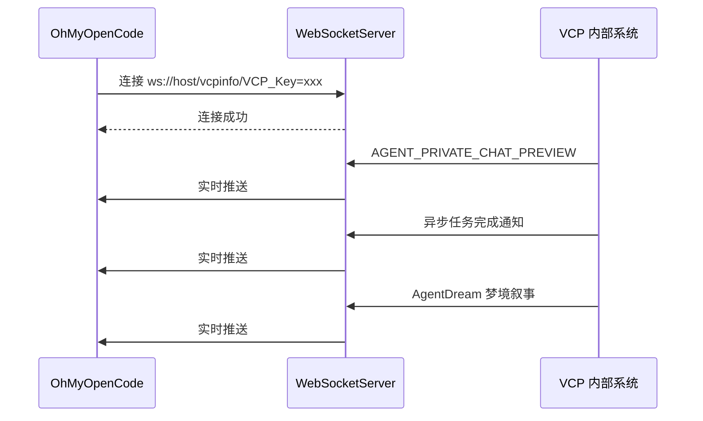

# 架构设计：OhMyOpenCode × VCPToolBox

## 设计哲学

本方案采用 **"联邦式能力供给 + 中心化智能编排"** 的架构：

- **OhMyOpenCode（OOC）** 作为智能编排中枢，负责决策、规划、路由、与用户交互。
- **VCPToolBox（VCP）** 作为能力基座，负责插件执行、记忆存储、Agent 间通讯、分布式资源调度。
- 两者通过 **HTTP（OpenClaw Bridge）** 和 **WebSocket（VCPInfo）** 进行松耦合通信。

这种设计让 OOC 无需维护庞大的插件生态和记忆系统，同时让 VCP 的能力可以被更智能的编排层充分利用。

---

## 三层架构

---

## 各层职责详解

### Layer 1: OhMyOpenCode 编排层

| 组件 | 职责 | 与 VCP 的交互 |
|------|------|---------------|
| **多智能体调度器** | 任务分解、Agent 路由、执行监控 | 调用 AgentAssistant 委托 VCP Agent |
| **记忆协调器** | 决定何时读写记忆、跨 Agent 记忆同步 | 调用 OpenClaw memory/rag 接口 |
| **上下文管理器** | 维护长程对话状态、注入外部上下文 | 调用 OpenClaw rag/context 获取记忆块 |
| **编排规则引擎** | 定义 Agent 协作规则、权限、工作流 | 读取 VCP capabilities 动态调整策略 |

### Layer 2: VCP 能力层

| 组件 | 职责 | 对应文件/模块 |
|------|------|---------------|
| **OpenClaw Bridge** | 将 VCP 插件和记忆能力包装为标准 REST API | `routes/openclawBridgeRoutes.js` |
| **AgentAssistant** | VCP 内部 Agent 间通讯、委托、定时任务 | `Plugin/AgentAssistant/AgentAssistant.js` |
| **WebSocketServer** | 实时推送消息给所有订阅客户端 | `WebSocketServer.js` |
| **PluginManager** | 插件发现、加载、执行、分布式路由 | `Plugin.js` |

### Layer 3: VCP 资源层

| 组件 | 职责 | 技术栈 |
|------|------|--------|
| **本地插件** | 在主服务器直接执行的插件 | Node.js / Python / Rust |
| **分布式节点插件** | 在远程节点执行，通过 WebSocket 注册 | 星型网络拓扑 |
| **MemoChunk** | 记忆碎片的持久化存储 | SQLite |
| **Tag 网络** | 仿生神经标签关联网络 | 自定义 CPU-RNN |
| **USearch 向量索引** | 高性能向量检索 | Rust + mmap |
| **AgentDream** | 离线记忆巩固与联想涌现 | DreamWaveEngine |

---

## 核心数据流

### 数据流 1：OOC Agent 调用 VCP 插件

### 数据流 2：OOC Agent 委托 VCP Agent 执行任务

### 数据流 3：记忆写入与召回

### 数据流 4：实时消息推送（WebSocket）

---

## 身份与权限模型

### Agent ID 映射

| OOC 侧 | VCP 侧 | 说明 |
|--------|--------|------|
| `agentId` | `agentId` | 主身份标识，用于权限隔离和审计 |
| `sessionId` | `sessionId` | 会话标识，用于上下文隔离 |
| `maid` | `maid` | 可选，委托任务中的发送方名称 |

### 权限控制

1. **日记本访问控制**：VCP 通过 `resolveOpenClawAllowedDiaries()` 函数控制 Agent 可访问的日记本范围。
2. **工具审批控制**：高危工具（如 PowerShell）需要管理员审批，`toolApprovalManager.shouldApprove(toolName)` 会返回 `OCW_TOOL_APPROVAL_REQUIRED`。
3. **分布式节点认证**：节点通过 `VCP_Key` 进行 WebSocket 认证。

---

## 接口协议栈

| 协议 | 用途 | 端口/路径 |
|------|------|-----------|
| HTTP REST | OpenClaw Bridge API | `http://host:5890/admin_api/openclaw/*` |
| HTTP REST | VCP Chat Completions（兼容 OpenAI） | `http://host:5890/v1/chat/completions` |
| WebSocket | VCPInfo 实时推送 | `ws://host:5890/vcpinfo/VCP_Key=xxx` |
| WebSocket | VCPLog 日志订阅 | `ws://host:5890/VCPlog/VCP_Key=xxx` |

---

## 容错与重试策略

### OpenClaw Bridge 侧
- 所有接口返回统一格式 `{ success, data/error, meta }`
- `meta.requestId` 用于全链路追踪
- `meta.durationMs` 用于性能监控

### AgentAssistant 委托侧
- 异步委托有默认 5 分钟超时（`DELEGATION_TIMEOUT`）
- 最大 15 轮对话（`DELEGATION_MAX_ROUNDS`）
- 支持 `[[NextHeartbeat::秒数]]` 延迟机制
- 占线锁（`activeSessionLocks`）防止并发冲突

### 网络层建议（OOC 侧实现）
- HTTP 调用建议设置 30-120s 超时
- 异步委托查询建议轮询间隔 5-10s
- WebSocket 断线建议自动重连（指数退避）

---

## 性能特征

| 操作 | 典型延迟 | 瓶颈点 |
|------|----------|--------|
| 插件能力发现 | < 100ms | 本地内存读取 |
| 同步插件调用 | 1-10s | 插件自身执行时间 |
| 异步插件提交 | < 200ms | HTTP 往返 |
| 记忆写入 | < 500ms | 向量化 + SQLite 写入 |
| TagMemo 召回 | 10-100ms | CPU-RNN 查表 + USearch 检索 |
| Agent 委托（单轮） | 3-30s | LLM 推理时间 |

---

## 扩展方向

1. **MCP 协议适配层**：将 OpenClaw Bridge 包装为 MCP Server，兼容更广泛的客户端生态。
2. **统一身份联邦**：打通 OOC Agent 身份与 VCP `agent_map.json`，实现单点登录。
3. **记忆语义网关**：在 OOC 侧实现跨 VCP 实例的记忆聚合层。
4. **可视化编排面板**：在 VCP AdminPanel 中可视化展示 OOC Agent 协作拓扑。
