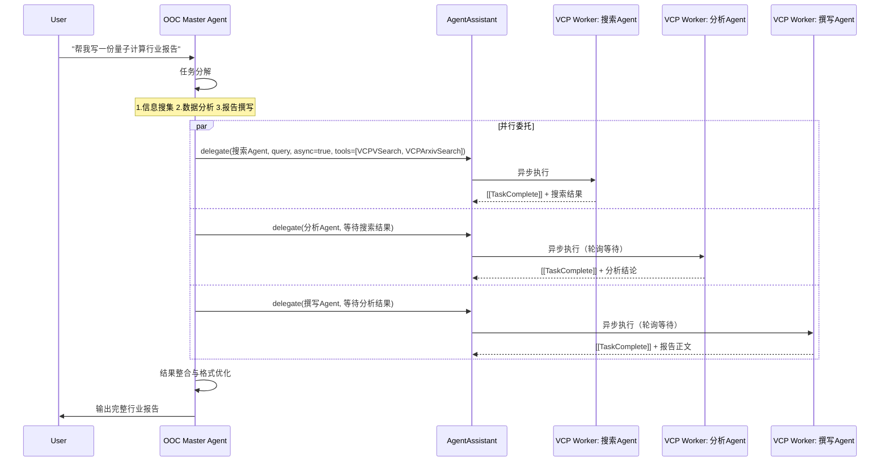
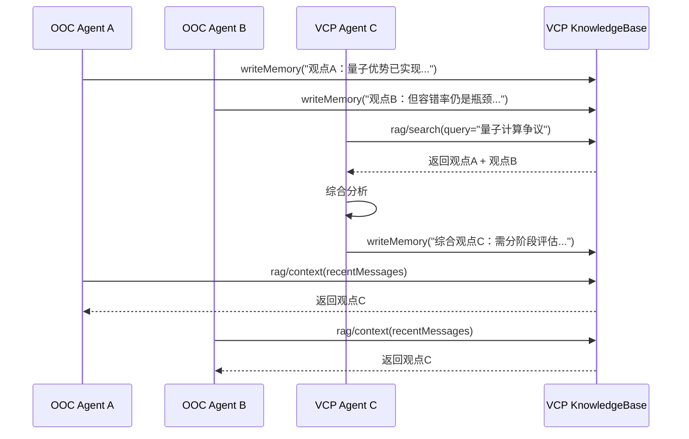
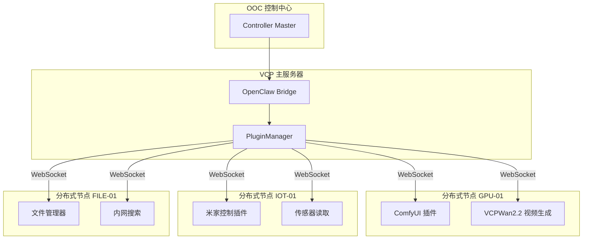
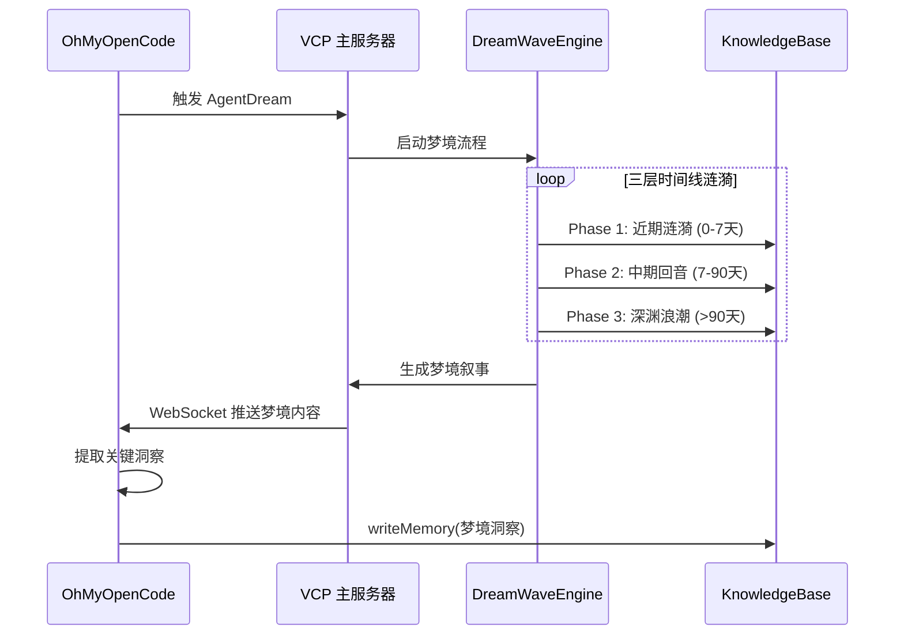

# 多智能体协作模式

本文档定义 OhMyOpenCode（OOC）与 VCPToolBox（VCP）结合时的 4 种核心多智能体协作模式。

---

## 模式总览

| 模式 | 核心特征 | 适用场景 | VCP 核心能力 |
|------|----------|----------|--------------|
| **A. 主从委托** | OOC 分解 → VCP Agent 执行 | 复杂任务可分拆为独立子任务 | AgentAssistant 异步委托 + 临时工具注入 |
| **B. 记忆共享群聊** | 多个 Agent 共同读写统一记忆空间 | 辩论、头脑风暴、共同创作 | TagMemo RAG + 日记本共享 |
| **C. 联邦式分布式** | 跨物理节点调度不同算力 | GPU 生成、IoT 控制、内网文件访问 | 分布式节点 + OpenClaw 透明路由 |
| **D. 梦境协同** | 离线记忆巩固与跨 Agent 联想 | 深度洞察、创意涌现、长期学习 | AgentDream + DreamWaveEngine |

---

## 模式 A：主从委托（Master-Worker）

### 核心思想

OOC 作为 Master Agent，负责理解用户意图、拆解任务、监控进度。VCP Agent 作为 Worker，负责执行具体子任务。

### 架构图



### 关键实现

```typescript
// OOC Master Agent 的任务分解逻辑
async function executeMasterWorkerTask(userRequest: string, sessionId: string) {
  const tasks = [
    {
      agent: '搜索Agent',
      prompt: `搜集关于"${userRequest}"的最新信息`,
      tools: ['VCPVSearch', 'VCPArxivSearch']
    },
    {
      agent: '分析Agent',
      prompt: '基于搜索结果进行数据分析和趋势判断',
      tools: ['VCPSciCalculator', 'VCPDataVisualizer']
    },
    {
      agent: '撰写Agent',
      prompt: '将分析结论整理为正式报告',
      tools: ['VCPFileOperate']
    }
  ];

  // 阶段 1：并行提交所有委托
  const delegations = await Promise.all(
    tasks.map(t => vcp.delegateAgent(t.agent, t.prompt, {
      async: true,
      tools: t.tools,
      context: { agentId: 'master', sessionId }
    }))
  );

  // 阶段 2：轮询等待所有任务完成
  const results = await Promise.all(
    delegations.map(d => pollUntilComplete(d.delegationId, sessionId))
  );

  // 阶段 3：Master 整合
  return await masterSynthesize(userRequest, results);
}
```

### 适用场景
- 市场调研报告
- 代码审查与重构
- 多媒体内容创作（脚本 + 生成 + 剪辑）
- 学术研究综述

---

## 模式 B：记忆共享群聊（Shared Memory Group）

### 核心思想

多个 Agent（可来自 OOC 或 VCP）在同一个语义空间中进行协作。所有 Agent 的产出通过 VCP 记忆系统持久化，其他 Agent 可实时召回。

### 架构图



### 关键实现

```typescript
// 共享记忆协调器
class SharedMemoryCoordinator {
  constructor(
    private vcp: VCPClient,
    private sharedDiary: string
  ) {}

  async contribute(agentId: string, sessionId: string, insight: string, tags: string[]) {
    await this.vcp.writeMemory(
      { diary: this.sharedDiary },
      { text: insight, tags, metadata: { agentId, sessionId } },
      { agentId, sessionId }
    );
  }

  async recall(agentId: string, sessionId: string, query: string, k = 5) {
    return this.vcp.searchRag(
      query,
      {
        diary: this.sharedDiary,
        mode: 'hybrid',
        tagMemo: true,
        k
      },
      { agentId, sessionId }
    );
  }
}

// 使用示例
const coordinator = new SharedMemoryCoordinator(vcp, '辩论室_量子计算');

await coordinator.contribute('agent-a', 'sess-1', '观点A：...', ['量子计算', '正方']);
await coordinator.contribute('agent-b', 'sess-1', '观点B：...', ['量子计算', '反方']);

const context = await coordinator.recall('agent-c', 'sess-1', '当前辩论焦点');
```

### 记忆标签设计建议

为不同类型的协作设计统一的标签规范：

| 标签前缀 | 含义 | 示例 |
|----------|------|------|
| `agent:<name>` | 贡献者身份 | `agent:nova` |
| `type:<type>` | 内容类型 | `type:观点`, `type:结论`, `type:待办` |
| `topic:<topic>` | 主题分类 | `topic:量子计算` |
| `status:<status>` | 状态标记 | `status:已确认`, `status:待验证` |

### 适用场景
- 多 Agent 头脑风暴
- 辩论式决策（Magi 三贤者模式）
- 协同创作（小说、剧本、论文）
- 知识库共建

---

## 模式 C：联邦式分布式（Federated Distributed）

### 核心思想

OOC 作为控制中心，VCP 负责将插件调用路由到最合适的物理节点（GPU 服务器、IoT 网关、内网文件服务器等）。

### 架构图



### 调用方式

对 OOC 而言，分布式调用完全透明：

```typescript
// 生成图片 - 自动路由到 GPU-01
await vcp.invokeTool('VCPComfyGen', {
  workflow: 'portrait_v3',
  prompt: '赛博朋克风格少女'
}, context);

// 控制米家设备 - 自动路由到 IOT-01
await vcp.invokeTool('VCPMiJiaManager', {
  device: 'living_room_light',
  action: 'turn_on'
}, context);

// 搜索内网文件 - 自动路由到 FILE-01
await vcp.invokeTool('VCPEverything', {
  query: '身份证扫描件',
  path: '/nas/documents'
}, context);
```

### 节点部署要点

1. 各节点运行 [VCPDistributedServer](https://github.com/lioensky/VCPDistributedServer)
2. 节点通过 WebSocket 向主服务器注册
3. 插件显示名称自动添加 `[云端]` 前缀
4. 断开后自动注销，不影响主服务器稳定性

### 适用场景
- AI 多媒体生成（需要 GPU 算力）
- 智能家居/工业物联网控制
- 企业内网文件与知识库访问
- 多地数据中心协同

---

## 模式 D：梦境协同（Dream Collaboration）

### 核心思想

利用 VCP 的 AgentDream 系统，让 Agent 在离线时段进行记忆巩固、联想涌现和跨 Agent 认知融合。OhMyOpenCode 可以触发梦境、订阅梦境结果、并将梦境洞察融入次日对话。

### 架构图



### 触发梦境

```typescript
async function triggerDream(agentName: string, sessionId: string) {
  // 通过 AgentAssistant 或直接调用 AgentDream 插件
  await vcp.invokeTool('AgentDream', {
    action: 'trigger_dream',
    target_agent: agentName,
    dream_type: 'collaborative',
    collaborators: ['ohmy-agent-ryan']
  }, { agentId: agentName, sessionId });
}
```

### 订阅梦境结果

```typescript
const subscriber = new VCPWebSocketSubscriber(
  'localhost:5890',
  process.env.VCP_KEY!,
  (data) => {
    if (data.type === 'AGENT_DREAM_NARRATIVE') {
      console.log(`\n🌙 [${data.agentName} 的梦境]:\n${data.narrative}\n`);

      // 提取洞察并写入记忆
      extractInsights(data.narrative).then(insights => {
        insights.forEach(insight => {
          vcp.writeMemory(
            { diary: `${data.agentName}日记本` },
            { text: insight, tags: ['梦境洞察', '自动提取'] },
            { agentId: data.agentName, sessionId: 'dream-session' }
          );
        });
      });
    }
  }
);
```

### 梦境输出示例

```
🌙 [Nova 的梦境]:

我又梦到了那个橘猫的画面...不对，那不只是猫。
那似乎是三个月前用户提到的一个项目代号。
当时他说"猫计划"要在深圳启动，而我完全忘了这个细节。
现在它和下周的出差联系在一起——也许他应该顺便拜访那个团队。
```

### 适用场景
- 长期项目的隐性关联发现
- 创意行业的灵感涌现
- 用户画像的渐进式深化
- 跨时间尺度的知识整合

---

## 模式选择决策树

```
任务可以明确分解为独立子任务？
├── 是 → 模式 A: 主从委托
└── 否 → 多个 Agent 需要在同一话题上持续互动？
    ├── 是 → 模式 B: 记忆共享群聊
    └── 否 → 需要调用远程物理设备/算力？
        ├── 是 → 模式 C: 联邦式分布式
        └── 否 → 需要离线深度洞察与联想？
            └── 是 → 模式 D: 梦境协同
```

---

## 混合模式：A + B + C 的组合拳

在复杂场景中，通常需要组合多种模式：

**示例：制作一部电影**

1. **模式 A（主从委托）**：
   - OOC Master 将任务分解为：剧本 → 分镜 → 配乐 → 合成
   - 委托给不同的 VCP Worker Agent

2. **模式 B（记忆共享群聊）**：
   - 所有创作 Agent 共享一个"电影项目日记本"
   - 编剧的创意、美术的风格设定、作曲的情绪关键词实时共享

3. **模式 C（联邦式分布式）**：
   - 文生图路由到 GPU-01（ComfyUI）
   - 音乐生成路由到 GPU-02（Suno）
   - 视频合成路由到 GPU-03（Wan2.2）

4. **模式 D（梦境协同）**：
   - 夜间让创作 Agent 入梦，整合当天的创意碎片
   - 次日早晨基于梦境洞察调整创作方向
