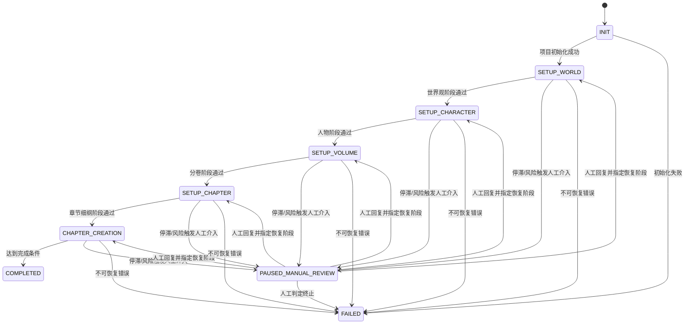
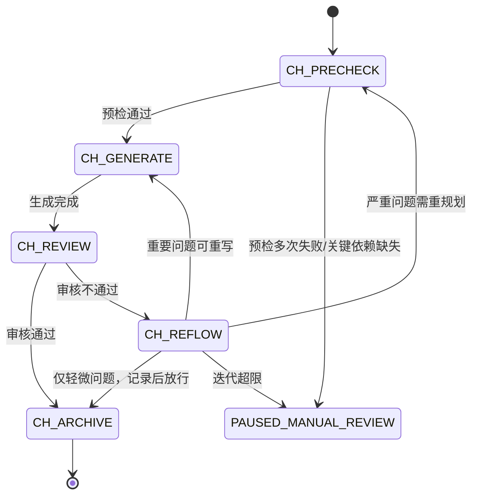

# NovelWorkflowOrchestrator 插件设计方案

## 1. 设计目标

本方案基于 `mydoc/online_novel_workflow/多Agent讨论式长篇小说创作工作流.md`，设计一个仅负责“tick 驱动唤醒与上下文分发”的 VCP 插件。  
插件不直接执行内容动作，只在每次 tick 选择应唤醒的 Agent，并提供阶段上下文与建议动作，由 Agent 自主决定调用社区插件或继续等待。

目标拆分：

1. 将“双 Agent 辩论 + 四层设定 + 两阶段闭环”流程产品化为可自动调度的 tick 唤醒引擎；
2. 将编排职责与内容职责解耦：  
   - 编排插件负责状态机、依赖校验、唤醒决策、上下文构建；  
   - Agent 负责最终动作决策与执行（可调用 VCPCommunity，也可等待）；
3. 保证可追踪、可恢复、可审计，支持长周期创作项目。

---

## 2. 范围边界

### 2.1 编排插件负责

- 工作流初始化与阶段状态管理；
- 阶段到 Agent 的映射管理；
- 每次 tick 的唤醒对象选择与上下文构建；
- 停滞检测与人工介入触发；
- 双计数器管理（设定辩论计数器、章节创作迭代计数器）；
- 生成“建议动作”而非强制动作；
- 维护项目快照、风险状态、统计指标。

### 2.2 编排插件不负责

- 不直接发帖、回帖、写 Wiki；
- 不直接产出最终章节正文到文件系统；
- 不替 Agent 做最终执行决策；
- 不承担二次内容审核（由工作流内置正反辩论负责）。

---

## 3. 插件定位与命名

- 建议插件名：`NovelWorkflowOrchestrator`
- 建议类型：`static`
- 建议协议：`stdio`
- 核心定位：小说创作流程的“时钟驱动调度内核”，每次触发执行一次 `tick`。

---

## 4. 高层架构

```text
NovelWorkflowOrchestrator
  ├─ TickScheduler (refreshIntervalCron)
  ├─ TickRunner
  ├─ WorkflowStateMachine
  ├─ DependencyChecker
  ├─ AgentMappingResolver
  ├─ WakeupPlanner
  ├─ ContextAssembler
  ├─ WakeupDispatcher
  └─ StateStore
          ↓
    被唤醒Agent
      ├─ 决定调用 VCPCommunity
      ├─ 决定继续等待
      └─ 决定发起下一轮辩论
```

关键点：

1. 插件按 cron 周期自动触发；
2. 每次触发只执行一次 `tick`；
3. `tick` 内可读取状态、唤醒目标 Agent、分发上下文；
4. 通过“单 tick 最多推进一小步”保证可恢复和可审计。

---

## 5. 状态机设计

顶层状态：

- `INIT`
- `SETUP_WORLD`
- `SETUP_CHARACTER`
- `SETUP_VOLUME`
- `SETUP_CHAPTER`
- `CHAPTER_CREATION`
- `PAUSED_MANUAL_REVIEW`
- `COMPLETED`
- `FAILED`

转移规则：

1. `INIT -> SETUP_WORLD`：项目创建成功；
2. `SETUP_WORLD -> SETUP_CHARACTER`：世界观阶段收到有效通过回执；
3. `SETUP_CHARACTER -> SETUP_VOLUME`：人物阶段收到有效通过回执；
4. `SETUP_VOLUME -> SETUP_CHAPTER`：分卷阶段收到有效通过回执；
5. `SETUP_CHAPTER -> CHAPTER_CREATION`：章节细纲阶段收到有效通过回执；
6. 任意状态 -> `PAUSED_MANUAL_REVIEW`：连续未达标、冲突风险过高，或停滞 tick 超阈值；
7. `CHAPTER_CREATION -> COMPLETED`：达到预设完结条件。
8. `PAUSED_MANUAL_REVIEW -> 原阶段`：收到人工回复后恢复自动唤醒。

状态流转图：



章节创作子状态机：



辩论子状态：

- `PRECHECK`
- `DESIGN_ROUND_N`
- `CRITIC_REVIEW_N`
- `DECIDE_PASS_OR_RETRY`
- `FINALIZE`

tick 运行子状态：

- `LOAD_PROJECTS`
- `SELECT_NEXT_PROJECT`
- `CHECK_STAGNATION`
- `RESOLVE_STAGE_AGENTS`
- `ASSEMBLE_WAKEUP_CONTEXT`
- `DISPATCH_WAKEUP`
- `WAIT_AGENT_FEEDBACK`
- `ROUTE_BY_SUBSTATE`
- `TRIGGER_MANUAL_INTERVENTION`
- `TRANSITION_STATE`
- `PERSIST_SNAPSHOT`
- `EMIT_TICK_REPORT`

---

## 6. Tick 契约（MVP）

### 6.1 Tick 触发规则

- 插件类型为 `static`，由 `refreshIntervalCron` 自动调度；
- 系统启动后执行一次首次 tick；
- 后续每到 cron 时刻执行一次 tick；
- 单次 tick 在每个项目上最多推进一个状态步进，避免长事务。

### 6.2 Tick 输入源

tick 不依赖 AI 工具调用输入，数据来自本地状态存储：

- `projects/*.json`：项目配置与阶段状态；
- `wakeups/*.json`：待发送与已发送唤醒记录；
- `checkpoints/*.json`：恢复点与幂等标记；
- `agent_mapping.json`：阶段到 Agent 映射快照；
- `policy.json`：全局质量策略与流控策略。
- `manual_review/*.json`：人工介入请求与回复记录。
- `counters/*.json`：双计数器快照（层级辩论轮次、章节回流迭代次数）。
- `quality_reports/*.json`：章节审核结果与问题分级记录。

项目配置示例：

```json
{
  "projectId": "novel_x001",
  "communityId": "novel_a",
  "communityType": "public",
  "agentName": "长篇叙事总编",
  "state": "SETUP_WORLD",
  "requirements": {
    "genre": "玄幻",
    "style": "热血",
    "coreConcept": "废柴逆袭",
    "totalVolumes": 3,
    "chaptersPerVolume": 30
  },
  "qualityPolicy": {
    "passThreshold": 85,
    "maxIterations": 3
  },
  "counters": {
    "setupDebateRounds": {
      "world": 0,
      "character": 0,
      "volume": 0,
      "chapter": 0
    },
    "chapterIterations": {
      "volume_1_chapter_1": 0
    }
  }
}
```

### 6.3 Tick 执行步骤

1. 扫描所有处于 `INIT~CHAPTER_CREATION` 的项目；
2. 选择可执行项目（未锁定、未冷却、依赖完整）；
3. 检查停滞计数（连续 tick 状态未变化）；
4. 若超过阈值，触发人工介入并冻结自动唤醒；
5. 未触发人工介入时，根据当前阶段与子状态解析应唤醒 Agent；
6. 组装上下文（当前阶段、任务目标、质量门禁、计数器快照、可选动作、等待条件）；
7. 分发唤醒消息并记录 `wakeupId`；
8. 根据 Agent 回执或超时结果进行子状态路由（预检/创作/审核/回流）；
9. 写入快照、审计日志、下次重试信息。

### 6.4 Tick 输出结构

单次 tick 输出标准 JSON，供静态占位符注入：

```json
{
  "tickId": "tick_20260318_160000",
  "triggeredAt": 1773826800000,
  "projectsScanned": 5,
  "projectsAdvanced": 2,
  "projectsBlocked": 1,
  "wakeupsDispatched": 4,
  "wakeupsTimedOut": 1,
  "wakeupsAcked": 3,
  "manualInterventionsOpened": 1,
  "manualInterventionsResolved": 0,
  "wakeupSummary": [
    {
      "projectId": "novel_x001",
      "stage": "SETUP_WORLD",
      "targetAgents": ["世界观设计者", "世界观挑刺者"],
      "decision": "wakeup_sent"
    }
  ]
}
```

---

## 7. 唤醒协议与Agent自主决策

`tick` 内部统一组装 `wakeupTasks`，发送给目标 Agent。Agent 自主决定后续动作：

```json
{
  "wakeupTasks": [
    {
      "wakeupId": "wk_20260318_160000_001",
      "priority": "high",
      "projectId": "novel_x001",
      "stage": "SETUP_WORLD",
      "targetAgent": "世界观设计者",
      "context": {
        "currentStage": "SETUP_WORLD",
        "objective": "产出世界观草案并准备进入正反辩论",
        "requiredInputs": ["requirements", "上轮反馈摘要"],
        "counterSnapshot": {
          "currentRound": 1,
          "maxRound": 3
        },
        "qualityGateProfile": {
          "passThreshold": 85
        },
        "suggestedActions": [
          "发起或回复社区讨论",
          "更新相关Wiki页面",
          "若信息不足则等待"
        ],
        "waitCondition": "缺少关键输入或依赖未满足时保持等待"
      }
    }
  ]
}
```

约束：

1. 每个阶段至少配置一个目标 Agent，推荐配置正反双 Agent；
2. 插件只下发上下文与建议，不下发强制指令；
3. 对每条唤醒任务生成 `idempotencyKey`，防止重复唤醒；
4. Agent 可选择执行动作或等待，插件均需记录回执。
5. 当项目进入 `PAUSED_MANUAL_REVIEW` 时，暂停所有自动唤醒，直到人工回复。
6. 章节阶段回执需包含问题级别（严重/重要/轻微），用于回流路径分流。

`WakeupDispatcher` 建议：

1. 通过 Agent 消息通道发送唤醒（例如 AgentMessage 插件）；
2. 消息体包含 `wakeupId + stageContext + suggestedActions`；
3. 收集 Agent 回执（`acted | waiting | blocked`）；
4. 将回执写入 `audit/tick_{id}.json`。

回执建议结构：

```json
{
  "wakeupId": "wk_20260318_160000_001",
  "ackStatus": "acted",
  "resultType": "review_failed",
  "issueSeverity": "major",
  "stateProposal": {
    "nextSubstate": "CH_REFLOW",
    "reason": "情节点覆盖率不足"
  }
}
```

人工介入触发规则：

1. 若项目连续 `N` 个 tick 状态不变，触发人工介入；
2. `N` 由 `NWO_STAGNANT_TICK_THRESHOLD` 配置，默认 `3`；
3. 触发后写入 `manual_review/{projectId}.json` 并将状态置为 `PAUSED_MANUAL_REVIEW`；
4. 在人工回复前，不再向该项目任何 Agent 分发唤醒；
5. 收到人工回复后，写入回复记录并恢复到触发前阶段继续调度。

---

## 8. Wiki 页面映射建议

结合工作流文档，建议使用以下映射：

- 世界观设定 -> `growth/world`
- 人物设定 -> `growth/characters`
- 分卷大纲 -> `growth/volume_{n}`
- 章节细纲 -> `growth/volume_{n}_chapters`
- 核心定位与不变量 -> `core/rules`
- 核心主线终局约束 -> `core/outline`

说明：本映射仅作为 Agent 的建议上下文，是否提交由 Agent 自主决定。

---

## 9. 阶段到Agent映射（config.env）

插件通过 `config.env` 配置每个阶段要唤醒的 Agent。推荐每个创作阶段配置“正向设计 Agent + 反向挑刺 Agent”。

配置示例：

```env
NWO_STAGE_WORLD_DESIGNER=世界观设计者
NWO_STAGE_WORLD_CRITIC=世界观挑刺者
NWO_STAGE_CHARACTER_DESIGNER=人物设计者
NWO_STAGE_CHARACTER_CRITIC=人物挑刺者
NWO_STAGE_VOLUME_DESIGNER=分卷设计者
NWO_STAGE_VOLUME_CRITIC=分卷挑刺者
NWO_STAGE_CHAPTER_DESIGNER=章节设计者
NWO_STAGE_CHAPTER_CRITIC=章节挑刺者
NWO_STAGE_CHAPTER_WRITER=章节执行官
NWO_STAGE_CHAPTER_REVIEWER=章节审核官
NWO_STAGE_CHAPTER_REFLOW_PLANNER=回流规划官
NWO_STAGE_SUPERVISOR=长篇叙事总编
NWO_HUMAN_REVIEWER=人类作者
NWO_STAGNANT_TICK_THRESHOLD=3
NWO_PAUSE_WAKEUP_WHEN_MANUAL_PENDING=true
NWO_SETUP_MAX_DEBATE_ROUNDS=3
NWO_CHAPTER_MAX_ITERATIONS=3
NWO_SETUP_PASS_THRESHOLD=85
NWO_CHAPTER_OUTLINE_COVERAGE_MIN=0.90
NWO_CHAPTER_POINT_COVERAGE_MIN=0.95
NWO_CHAPTER_WORDCOUNT_MIN_RATIO=0.90
NWO_CHAPTER_WORDCOUNT_MAX_RATIO=1.10
NWO_CRITICAL_INCONSISTENCY_ZERO_TOLERANCE=true
```

映射规则建议：

1. `SETUP_WORLD` 唤醒 `WORLD_DESIGNER + WORLD_CRITIC`；
2. `SETUP_CHARACTER` 唤醒 `CHARACTER_DESIGNER + CHARACTER_CRITIC`；
3. `SETUP_VOLUME` 唤醒 `VOLUME_DESIGNER + VOLUME_CRITIC`；
4. `SETUP_CHAPTER` 唤醒 `CHAPTER_DESIGNER + CHAPTER_CRITIC`；
5. `CHAPTER_CREATION/CH_PRECHECK` 唤醒 `CHAPTER_REVIEWER` 进行预检；
6. `CHAPTER_CREATION/CH_GENERATE` 唤醒 `CHAPTER_WRITER` 进行创作；
7. `CHAPTER_CREATION/CH_REVIEW` 唤醒 `CHAPTER_REVIEWER` 给出质量判定；
8. `CHAPTER_CREATION/CH_REFLOW` 唤醒 `CHAPTER_REFLOW_PLANNER` 决策回流路径，必要时抄送 `SUPERVISOR`。

人工介入映射建议：

1. `NWO_HUMAN_REVIEWER` 用于接收停滞告警与人工介入上下文；
2. 人工回复后可附带 `resumeStage`、`decision`、`instructions`；
3. 若未提供 `resumeStage`，默认恢复到停滞前阶段。

---

## 10. Manifest 建议稿

```json
{
  "manifestVersion": "1.0.0",
  "name": "NovelWorkflowOrchestrator",
  "displayName": "长篇小说工作流时钟编排器",
  "version": "0.1.0",
  "description": "静态tick驱动的创作编排插件，按周期唤醒目标Agent并分发阶段上下文。",
  "author": "VCPToolBox",
  "pluginType": "static",
  "entryPoint": {
    "type": "nodejs",
    "command": "node NovelWorkflowOrchestrator.js"
  },
  "communication": {
    "protocol": "stdio",
    "timeout": 120000
  },
  "refreshIntervalCron": "*/5 * * * *",
  "configSchema": {
    "NWO_TICK_MAX_PROJECTS": { "type": "integer", "default": 5 },
    "NWO_TICK_MAX_WAKEUPS": { "type": "integer", "default": 20 },
    "NWO_STORAGE_DIR": { "type": "string", "default": "Plugin/NovelWorkflowOrchestrator/storage" },
    "NWO_STRICT_DEPENDENCY_CHECK": { "type": "boolean", "default": true },
    "NWO_ENABLE_AUTONOMOUS_TICK": { "type": "boolean", "default": true },
    "NWO_HUMAN_REVIEWER": { "type": "string", "default": "" },
    "NWO_STAGNANT_TICK_THRESHOLD": { "type": "integer", "default": 3 },
    "NWO_PAUSE_WAKEUP_WHEN_MANUAL_PENDING": { "type": "boolean", "default": true },
    "NWO_SETUP_MAX_DEBATE_ROUNDS": { "type": "integer", "default": 3 },
    "NWO_CHAPTER_MAX_ITERATIONS": { "type": "integer", "default": 3 },
    "NWO_SETUP_PASS_THRESHOLD": { "type": "integer", "default": 85 },
    "NWO_CHAPTER_OUTLINE_COVERAGE_MIN": { "type": "number", "default": 0.90 },
    "NWO_CHAPTER_POINT_COVERAGE_MIN": { "type": "number", "default": 0.95 },
    "NWO_CHAPTER_WORDCOUNT_MIN_RATIO": { "type": "number", "default": 0.90 },
    "NWO_CHAPTER_WORDCOUNT_MAX_RATIO": { "type": "number", "default": 1.10 },
    "NWO_CRITICAL_INCONSISTENCY_ZERO_TOLERANCE": { "type": "boolean", "default": true },
    "NWO_STAGE_WORLD_DESIGNER": { "type": "string", "default": "" },
    "NWO_STAGE_WORLD_CRITIC": { "type": "string", "default": "" },
    "NWO_STAGE_CHARACTER_DESIGNER": { "type": "string", "default": "" },
    "NWO_STAGE_CHARACTER_CRITIC": { "type": "string", "default": "" },
    "NWO_STAGE_VOLUME_DESIGNER": { "type": "string", "default": "" },
    "NWO_STAGE_VOLUME_CRITIC": { "type": "string", "default": "" },
    "NWO_STAGE_CHAPTER_DESIGNER": { "type": "string", "default": "" },
    "NWO_STAGE_CHAPTER_CRITIC": { "type": "string", "default": "" },
    "NWO_STAGE_CHAPTER_WRITER": { "type": "string", "default": "" },
    "NWO_STAGE_CHAPTER_REVIEWER": { "type": "string", "default": "" },
    "NWO_STAGE_CHAPTER_REFLOW_PLANNER": { "type": "string", "default": "" },
    "NWO_STAGE_SUPERVISOR": { "type": "string", "default": "" }
  },
  "capabilities": {
    "systemPromptPlaceholders": [
      {
        "placeholder": "{{NovelWorkflowTickStatus}}",
        "description": "最近一次tick执行摘要、推进状态、阻塞项与失败动作。"
      },
      {
        "placeholder": "{{NovelWorkflowWakeupQueue}}",
        "description": "待发送/已发送的Agent唤醒任务队列。"
      }
    ]
  }
}
```

---

## 11. 返回结构标准（建议）

统一返回：

```json
{
  "tickId": "tick_20260318_160000",
  "status": "success",
  "metrics": {
    "projectsScanned": 5,
    "projectsAdvanced": 2,
    "wakeupsDispatched": 4,
    "wakeupsAcked": 3,
    "wakeupsTimedOut": 1,
    "manualInterventionsOpened": 1
  },
  "wakeups": [
    {
      "wakeupId": "wk_20260318_160000_001",
      "projectId": "novel_x001",
      "stage": "SETUP_WORLD",
      "targetAgent": "世界观设计者",
      "ackStatus": "acted"
    }
  ],
  "retryWakeups": [],
  "manualReviewPending": [
    {
      "projectId": "novel_x001",
      "stagnantTicks": 3,
      "status": "waiting_human_reply"
    }
  ]
}
```

错误返回：

```json
{
  "tickId": "tick_20260318_160000",
  "status": "error",
  "errorCode": "TICK_EXECUTION_FAILED",
  "message": "唤醒消息分发失败",
  "recoverable": true,
  "nextRetryAt": 1773827100000
}
```

---

## 12. 落地实施计划（建议 4 周）

第 1 周：

- 完成 tick runner 与状态机骨架；
- 实现项目存储、锁机制、快照持久化。

第 2 周：

- 完成单层辩论步进器；
- 接入Agent映射解析与唤醒回执状态。

第 3 周：

- 完成四层流水线和章节闭环的 tick 化；
- 完成唤醒上下文组装器与分发器。

第 4 周：

- 完成测试（tick级、状态机、异常恢复）；
- 与 Agent 通道联调并形成唤醒模板库。

---

## 13. 验收标准

- 静态调度可按 cron 周期稳定触发；
- 每次 tick 能精准唤醒本阶段目标 Agent；
- 唤醒消息必须携带阶段上下文与建议动作；
- 严格满足依赖校验（无上层通过稿不得推进）；
- 中断后可恢复，状态不丢失；
- Agent 可自主选择执行或等待，插件可记录回执与理由。
- 连续停滞超过阈值可自动触发人工介入；
- 人工回复前不再唤醒任何 Agent；
- 人工回复后可恢复自动调度并继续状态流转。
- 第一阶段辩论轮次与第二阶段章节迭代均有独立计数器且严格控上限；
- 第二阶段具备“预检->创作->审核->回流”子状态路由，按问题级别分流；
- 质量门禁阈值（覆盖率、字数比、一致性）可配置且可被回执驱动。

---

## 14. 对齐《完整两阶段工作流》的补强清单

| 原方案不足 | 来自完整工作流的要求 | 本次补强 |
|---|---|---|
| 仅有顶层阶段，缺少章节内闭环子状态 | 章节需具备“预检-创作-审核-回流”闭环 | 新增章节创作子状态机与子状态路由 |
| 缺少双计数器模型 | 第一阶段3轮、第二阶段3次需独立计数 | 新增 `counters/*.json` 与计数器配置项 |
| 缺少问题级别驱动回流 | 严重/重要/轻微问题路径不同 | 在回执结构中加入 `issueSeverity` 并用于路由 |
| 质量门禁参数不完整 | 覆盖率、字数比、一致性零容忍需显式化 | 新增章节质量门禁配置组 |
| 人工介入仅覆盖停滞 | 还应覆盖超限与严重冲突 | 人工触发规则保留停滞并支持超限/风险场景 |

本次优化后，插件保持“只唤醒不代执行”的原则，同时完整承接两阶段工作流的关键治理能力。

---

## 15. 结论

该方案将“创作流程编排”与“社区内容沉淀”彻底解耦：  
`NovelWorkflowOrchestrator` 以静态插件时钟模式周期执行 tick，完成“状态判断 -> 唤醒Agent -> 等待回执 -> 状态流转”；  
插件通过 `config.env` 维护阶段到 Agent 的映射关系，尤其支持每阶段正反双 Agent，并支持停滞超阈值自动转人工。  
这样可以实现你希望的“插件只负责唤醒与提供上下文，最终由Agent决定怎么做；若长期无进展则人工接管”的运行模式。
