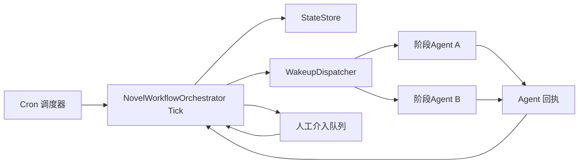
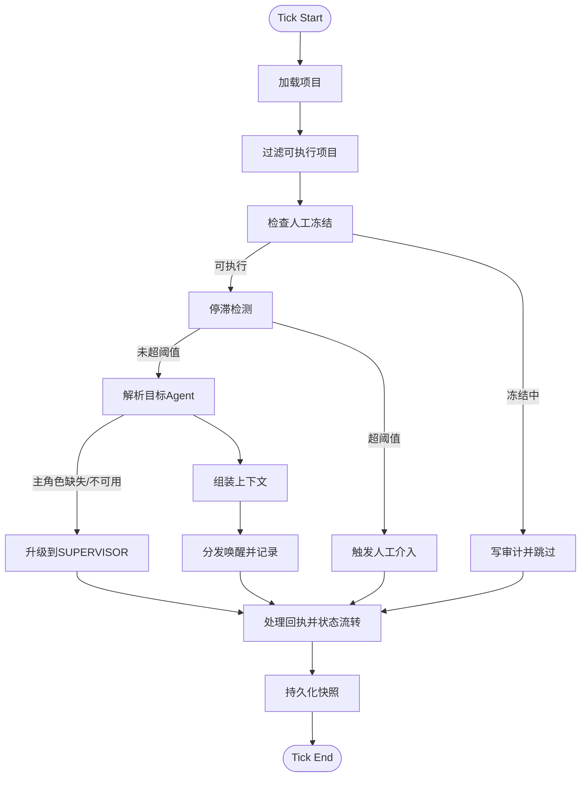

# NovelWorkflowOrchestrator 插件详细设计文档

## 1. 文档定位

本文档是 `NovelWorkflowOrchestrator插件设计方案.md` 的工程化展开版本，用于直接指导插件开发、联调、验收与运维。

设计前提：

1. 插件形态为 `static + stdio`；
2. 插件职责是“tick 唤醒 + 上下文分发 + 状态路由”，不代替 Agent 执行动作；
3. Agent 可自主决定调用社区插件或等待；
4. 支持停滞检测与人工介入冻结机制。

---

## 2. 目标与非目标

### 2.1 目标

- 周期性调度创作项目并按阶段唤醒正确 Agent；
- 对齐两阶段工作流（设定阶段 + 章节阶段）；
- 提供可追踪、可恢复、可审计的状态推进；
- 在停滞或高风险时自动转人工并冻结唤醒；
- 通过配置完成阶段角色映射与门禁参数调优。

### 2.2 非目标

- 不直接调用 `VCPCommunity` 写入内容；
- 不直接生成章节正文或设定正文；
- 不替代 Agent 的审稿与创作判断；
- 不做跨项目的内容语义合并。

---

## 3. 系统上下文



---

## 4. 模块分解

### 4.1 TickRunner

职责：

- 驱动一次完整 tick 生命周期；
- 控制单项目步进上限；
- 聚合本次 tick 指标输出。

输入：

- 项目状态集合；
- 全局配置；
- 未处理回执与人工回复。

输出：

- tick 结果 JSON；
- 更新后的项目快照；
- 新增的唤醒任务。

### 4.2 WorkflowStateMachine

职责：

- 管理顶层状态；
- 管理章节子状态；
- 根据回执与门禁决定状态转移。

### 4.3 AgentMappingResolver

职责：

- 将当前 `state + substate` 映射到目标 Agent；
- 支持一对多映射（例如设计者 + 挑刺者）；
- 校验配置缺失并输出阻塞原因。

### 4.4 ContextAssembler

职责：

- 组装唤醒上下文；
- 注入质量门禁参数、计数器快照、等待条件；
- 生成对 Agent 可执行但非强制的建议动作。

### 4.5 WakeupDispatcher

职责：

- 下发 `wakeupTask`；
- 处理幂等键；
- 记录发送结果与重试信息。

### 4.6 ManualInterventionManager

职责：

- 监控停滞计数与高风险信号；
- 触发 `PAUSED_MANUAL_REVIEW`；
- 在人工回复到达前冻结唤醒。

### 4.7 StateStore

职责：

- 文件化持久化；
- 快照写入、读取、回滚；
- 并发互斥锁与原子更新。

---

## 5. 目录与存储模型

建议目录：

```text
Plugin/NovelWorkflowOrchestrator/storage/
├── projects/
│   └── {projectId}.json
├── wakeups/
│   └── {wakeupId}.json
├── counters/
│   └── {projectId}.json
├── quality_reports/
│   └── {projectId}_{chapterId}_{ts}.json
├── manual_review/
│   └── {projectId}.json
├── checkpoints/
│   └── {projectId}_{ts}.json
└── audit/
    └── tick_{tickId}.json
```

### 5.1 项目状态模型（projects）

```json
{
  "projectId": "novel_x001",
  "state": "SETUP_WORLD",
  "substate": null,
  "communityId": "novel_a",
  "requirements": {},
  "qualityPolicy": {
    "setupPassThreshold": 85,
    "setupMaxDebateRounds": 3,
    "chapterMaxIterations": 3
  },
  "stagnation": {
    "unchangedTicks": 0,
    "threshold": 3
  },
  "manualReview": {
    "status": "none",
    "requestedAt": null,
    "resumeStage": null
  },
  "updatedAt": 0
}
```

### 5.2 计数器模型（counters）

```json
{
  "projectId": "novel_x001",
  "setupDebateRounds": {
    "world": 1,
    "character": 0,
    "volume": 0,
    "chapter": 0
  },
  "chapterIterations": {
    "volume_1_chapter_1": 2
  }
}
```

### 5.3 人工介入模型（manual_review）

```json
{
  "projectId": "novel_x001",
  "status": "waiting_human_reply",
  "triggerReason": "stagnant_ticks_exceeded",
  "stagnantTicks": 3,
  "report": {
    "state": "CHAPTER_CREATION",
    "substate": "CH_REVIEW",
    "lastWakeups": []
  },
  "humanReply": null
}
```

---

## 6. 状态机详细规则

### 6.1 顶层状态

- `INIT`
- `SETUP_WORLD`
- `SETUP_CHARACTER`
- `SETUP_VOLUME`
- `SETUP_CHAPTER`
- `CHAPTER_CREATION`
- `PAUSED_MANUAL_REVIEW`
- `COMPLETED`
- `FAILED`

### 6.2 章节子状态

- `CH_PRECHECK`
- `CH_GENERATE`
- `CH_REVIEW`
- `CH_REFLOW`
- `CH_ARCHIVE`

### 6.3 关键转移守卫

1. `SETUP_*` 转下一阶段必须满足：
   - `ackStatus=acted`
   - 审核评分达到 `setupPassThreshold`
   - 未超过 `setupMaxDebateRounds`
2. `CH_REVIEW -> CH_ARCHIVE` 必须满足：
   - 严重问题数为 0
   - 覆盖率、字数比满足门禁
3. `CH_REFLOW -> PAUSED_MANUAL_REVIEW` 条件：
   - 章节迭代次数 >= `chapterMaxIterations`
4. 任意状态转 `PAUSED_MANUAL_REVIEW` 条件：
   - 连续停滞 tick 超阈值；
   - 高风险冲突；
   - Agent 不可用超时累计超限。

---

## 7. Tick 执行算法



### 7.1 伪代码

```text
for project in runnableProjects:
  if project.manualReview.status == waiting_human_reply:
    continue

  if project.unchangedTicks >= STAGNANT_THRESHOLD:
    openManualReview(project)
    freezeWakeup(project)
    continue

  agents = resolveAgents(project.state, project.substate)
  if agents.missingOrUnavailable:
    escalateToSupervisor(project)
    markBlocked(project)
    continue

  context = buildContext(project, counters, qualityPolicy)
  wakeup = dispatch(project, agents, context)
  ack = collectAck(wakeup)
  routeState(project, ack, qualityReports, counters)
  save(project, counters, audit)
```

---

## 8. 阶段到Agent映射规则

### 8.1 主映射

| 状态 | 子状态 | 角色映射 |
|---|---|---|
| `SETUP_WORLD` | - | `WORLD_DESIGNER + WORLD_CRITIC` |
| `SETUP_CHARACTER` | - | `CHARACTER_DESIGNER + CHARACTER_CRITIC` |
| `SETUP_VOLUME` | - | `VOLUME_DESIGNER + VOLUME_CRITIC` |
| `SETUP_CHAPTER` | - | `CHAPTER_DESIGNER + CHAPTER_CRITIC` |
| `CHAPTER_CREATION` | `CH_PRECHECK` | `CHAPTER_REVIEWER` |
| `CHAPTER_CREATION` | `CH_GENERATE` | `CHAPTER_WRITER` |
| `CHAPTER_CREATION` | `CH_REVIEW` | `CHAPTER_REVIEWER` |
| `CHAPTER_CREATION` | `CH_REFLOW` | `CHAPTER_REFLOW_PLANNER` |
| `PAUSED_MANUAL_REVIEW` | - | `HUMAN_REVIEWER` |

### 8.2 缺省策略

- 如果主角色未配置，抄送 `SUPERVISOR` 并标记阻塞；
- 如果 `HUMAN_REVIEWER` 未配置，则项目直接进入 `FAILED` 并给出配置错误。

### 8.3 `SUPERVISOR` 的功能位置

`SUPERVISOR` 是工作流里的“升级协调位”，只在异常或缺口场景介入，不占用常规主路径。

触发时机：

1. 当前阶段主角色未配置；
2. 当前阶段主角色连续不可用；
3. 回执长期为 `waiting/blocked` 且无进展；
4. 需要跨阶段协调（例如回流阶段与创作阶段冲突）。

介入动作：

- 接收升级上下文包（缺口说明、当前状态、候选补救动作）；
- 决策改派角色、维持等待、转人工介入或终止；
- 输出管理型回执，不直接替代业务角色生成正文。

说明：

- 因为 `SUPERVISOR` 是兜底角色，所以在主映射表中不作为常规阶段执行者展示；
- 它在算法里对应 `resolveAgents` 失败后的升级分支。

---

## 9. 唤醒上下文与回执契约

### 9.1 唤醒任务结构

```json
{
  "wakeupId": "wk_20260318_160000_001",
  "projectId": "novel_x001",
  "state": "CHAPTER_CREATION",
  "substate": "CH_REVIEW",
  "targetAgent": "章节审核官",
  "context": {
    "objective": "完成章节质量审核并返回问题分级",
    "qualityGateProfile": {
      "outlineCoverageMin": 0.9,
      "pointCoverageMin": 0.95,
      "wordcountRange": [0.9, 1.1],
      "criticalInconsistencyZeroTolerance": true
    },
    "counterSnapshot": {
      "chapterIteration": 2,
      "chapterIterationMax": 3
    },
    "suggestedActions": [
      "完成审核并回执结果",
      "必要时给出回流建议",
      "信息不足时返回 waiting"
    ]
  }
}
```

### 9.2 回执结构

```json
{
  "wakeupId": "wk_20260318_160000_001",
  "ackStatus": "acted",
  "resultType": "review_failed",
  "issueSeverity": "major",
  "metrics": {
    "outlineCoverage": 0.82,
    "pointCoverage": 0.88,
    "wordcountRatio": 0.93,
    "criticalInconsistencyCount": 0
  },
  "stateProposal": {
    "nextSubstate": "CH_REFLOW",
    "reason": "情节点覆盖不足"
  }
}
```

`ackStatus` 枚举：

- `acted`
- `waiting`
- `blocked`

`issueSeverity` 枚举：

- `critical`
- `major`
- `minor`

---

## 10. 人工介入机制

### 10.1 触发条件

1. `unchangedTicks >= NWO_STAGNANT_TICK_THRESHOLD`
2. 章节迭代超限
3. 设定辩论超限
4. 严重冲突问题无法自动消解
5. Agent 连续不可用

### 10.2 冻结策略

- 进入 `PAUSED_MANUAL_REVIEW` 后，对该项目禁止派发任何自动唤醒；
- 仅允许向 `NWO_HUMAN_REVIEWER` 发送人工介入包；
- 人工回复前，tick 只更新监控指标，不推进状态。

### 10.3 人工回复契约

```json
{
  "projectId": "novel_x001",
  "decision": "resume",
  "resumeStage": "CHAPTER_CREATION",
  "resumeSubstate": "CH_REFLOW",
  "instructions": "先执行回流重规划，再进入重写"
}
```

`decision` 枚举：

- `resume`
- `retry`
- `edit_applied`
- `abort`

---

## 11. 配置设计（config.env）

### 11.1 核心调度配置

```env
NWO_ENABLE_AUTONOMOUS_TICK=true
NWO_TICK_MAX_PROJECTS=5
NWO_TICK_MAX_WAKEUPS=20
NWO_STAGNANT_TICK_THRESHOLD=3
NWO_PAUSE_WAKEUP_WHEN_MANUAL_PENDING=true
```

### 11.2 质量门禁配置

```env
NWO_SETUP_MAX_DEBATE_ROUNDS=3
NWO_CHAPTER_MAX_ITERATIONS=3
NWO_SETUP_PASS_THRESHOLD=85
NWO_CHAPTER_OUTLINE_COVERAGE_MIN=0.90
NWO_CHAPTER_POINT_COVERAGE_MIN=0.95
NWO_CHAPTER_WORDCOUNT_MIN_RATIO=0.90
NWO_CHAPTER_WORDCOUNT_MAX_RATIO=1.10
NWO_CRITICAL_INCONSISTENCY_ZERO_TOLERANCE=true
```

### 11.3 阶段角色配置

```env
NWO_STAGE_WORLD_DESIGNER=
NWO_STAGE_WORLD_CRITIC=
NWO_STAGE_CHARACTER_DESIGNER=
NWO_STAGE_CHARACTER_CRITIC=
NWO_STAGE_VOLUME_DESIGNER=
NWO_STAGE_VOLUME_CRITIC=
NWO_STAGE_CHAPTER_DESIGNER=
NWO_STAGE_CHAPTER_CRITIC=
NWO_STAGE_CHAPTER_WRITER=
NWO_STAGE_CHAPTER_REVIEWER=
NWO_STAGE_CHAPTER_REFLOW_PLANNER=
NWO_STAGE_SUPERVISOR=
NWO_HUMAN_REVIEWER=
```

---

## 12. 错误处理与恢复

### 12.1 错误分级

| 级别 | 示例 | 处理策略 |
|---|---|---|
| 可恢复 | Agent 超时、回执丢失 | 重试 + 指数退避 |
| 半可恢复 | 配置缺失、角色缺失 | 转人工 + 阻塞项目 |
| 不可恢复 | 状态文件损坏且无检查点 | 标记 `FAILED` |

### 12.2 恢复策略

1. 启动时扫描 `checkpoints`，优先恢复最近一致快照；
2. `wakeupId` 幂等检查防重复；
3. 对单项目失败隔离，避免全局 tick 中断。

---

## 13. 可观测性与审计

### 13.1 Tick 指标

- `projectsScanned`
- `projectsAdvanced`
- `wakeupsDispatched`
- `wakeupsAcked`
- `wakeupsTimedOut`
- `manualInterventionsOpened`
- `manualInterventionsResolved`

### 13.2 审计日志字段

```json
{
  "tickId": "tick_20260318_160000",
  "projectId": "novel_x001",
  "fromState": "CHAPTER_CREATION",
  "fromSubstate": "CH_REVIEW",
  "toState": "CHAPTER_CREATION",
  "toSubstate": "CH_REFLOW",
  "wakeupId": "wk_20260318_160000_001",
  "actor": "章节审核官",
  "decision": "review_failed_major",
  "ts": 1773826800000
}
```

---

## 14. 测试设计

### 14.1 单元测试

- Agent 映射解析测试；
- 子状态路由测试；
- 停滞计数与人工触发测试；
- 回执解析与门禁判定测试；
- 幂等键去重测试。

### 14.2 集成测试

- 从 `SETUP_WORLD` 到 `COMPLETED` 的完整 happy path；
- 章节阶段多轮回流后通过路径；
- 停滞 3 tick 自动转人工并冻结；
- 人工回复后恢复调度。

### 14.3 回归测试清单

1. 修改 `NWO_CHAPTER_POINT_COVERAGE_MIN` 后门禁行为变化符合预期；
2. 缺失某阶段 Agent 配置时阻塞信息可读；
3. 多项目并发下不会交叉污染状态文件。

---

## 15. 实施分期

### 第 1 期：内核落地

- TickRunner、StateStore、WorkflowStateMachine；
- 顶层状态机 + 章节子状态机；
- 基础配置加载与校验。

### 第 2 期：协议落地

- WakeupContext 与 Ack 契约；
- Agent 映射解析与分发实现；
- 质量门禁判定器。

### 第 3 期：治理落地

- 停滞检测；
- 人工介入冻结/恢复；
- 审计与指标输出。

### 第 4 期：稳定化

- 联调测试；
- 压测与异常恢复演练；
- 发布前验收。

---

## 16. 验收标准

- 插件严格遵守“只唤醒不代执行”；
- 两阶段关键闭环（设定辩论、章节回流）可通过状态路由完整表达；
- 双计数器独立生效且超限策略正确；
- 人工介入触发、冻结、恢复链路完整；
- 配置化门禁参数可动态调优；
- 审计日志可还原任意一次状态跳转。
