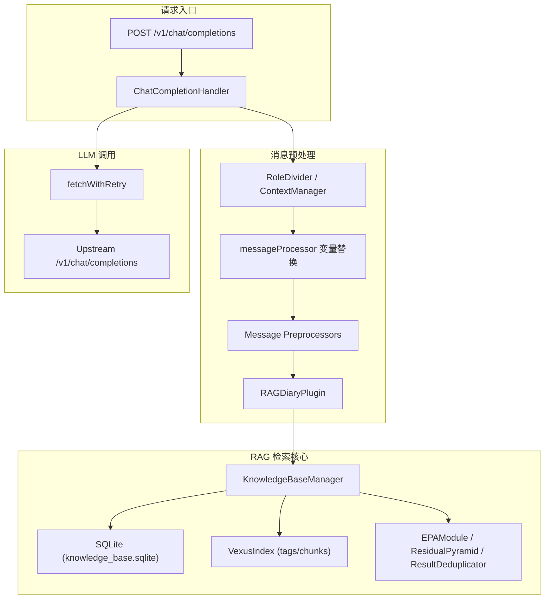
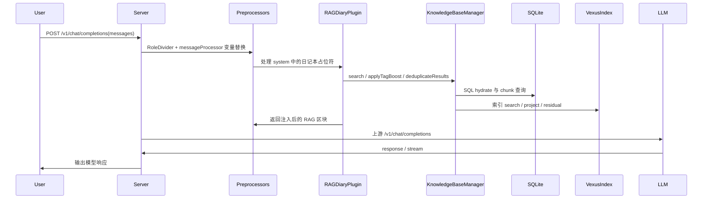

# VCPToolBox 知识库 RAG 技术文档（从用户消息到响应生成）

**版本**：VCP 6.4  
**生成时间**：2026-02-26  
**版本控制参考**：分支 xxbb / 提交 3d54cad  
**覆盖范围**：消息预处理、SQLite 检索、向量索引匹配、排序与上下文组装、Prompt 工程、LLM 调用、响应后处理  

---

## 目录

1. 系统总体概览  
2. 系统架构图与数据流图  
3. Step 1：消息预处理与查询解析  
4. Step 2：SQLite 知识库检索策略与 SQL 构建  
5. Step 3：向量索引匹配算法与相似度计算  
6. Step 4：结果排序与上下文组装  
7. Step 5：Prompt 工程与 LLM 调用  
8. Step 6：响应生成与后处理  
9. 异常处理机制  
10. 性能优化方案  
11. 测试用例（可执行检查）  
12. 部署说明  
13. 关键代码索引  

---

## 1. 系统总体概览

当用户向 `/v1/chat/completions` 发送消息后，系统会经历如下核心路径：

1. **消息预处理**：角色拆分、变量替换、工具/媒体/插件预处理  
2. **RAG 解析**：解析 system 中的日记本占位符，组合 query 向量  
3. **SQLite + 向量索引检索**：查询 chunk ID 与内容  
4. **结果排序与上下文组装**：去重、重排、生成 RAG 区块  
5. **Prompt 工程**：将 RAG 区块注入 system 消息  
6. **LLM 调用**：调用上游 Chat Completions  
7. **响应后处理**：流式错误回退、RAG 区块刷新  

---

## 2. 系统架构图与数据流图

### 2.1 系统架构图



### 2.2 数据流图（从用户消息到响应）



---

## 3. Step 1：消息预处理与查询解析

### 3.1 入口与上下文处理

处理入口位于 [server.js](file:///home/zh/projects/VCPToolBox/server.js#L794-L830)，转发到 [chatCompletionHandler.js](file:///home/zh/projects/VCPToolBox/modules/chatCompletionHandler.js#L360-L567)。

关键步骤：

- Context 剪裁：`contextManager.pruneMessages()`  
- RoleDivider：拆分角色楼层  
- 变量替换：`messageProcessor.replaceAgentVariables()`  
- 执行消息预处理器链：`pluginManager.executeMessagePreprocessor()`

### 3.2 变量替换与占位符解析

变量解析逻辑集中在 [messageProcessor.js](file:///home/zh/projects/VCPToolBox/modules/messageProcessor.js#L14-L376)，负责：

- Agent 递归展开  
- `{{SarPromptX}}`、`{{VarX}}` 等动态变量替换  
- 处理系统提示中嵌入的工具描述  

### 3.3 RAG 占位符识别

RAG 入口在 [RAGDiaryPlugin.processMessages](file:///home/zh/projects/VCPToolBox/Plugin/RAGDiaryPlugin/RAGDiaryPlugin.js#L856-L1034)，识别如下语法：

- `[[某日记本]]`：语义检索  
- `<<某日记本>>`：全文检索  
- `《《某日记本::Time::Group::TagMemo》》`：混合检索  
- `{{某日记本}}`：直接引入全文  

### 3.4 查询向量生成

核心做法：

1. 选取最后的 user / assistant 消息  
2. 清理 HTML、Emoji、工具噪音  
3. 合并上下文生成统一 query 文本  
4. `getSingleEmbeddingCached()` 调用 Embedding API

```javascript
const combinedQueryForDisplay = aiContent
  ? `[AI]: ${aiContent}\n[User]: ${userContent}`
  : userContent;
const queryVector = await this.getSingleEmbeddingCached(combinedQueryForDisplay);
```

---

## 4. Step 2：SQLite 知识库检索策略与 SQL 构建

SQLite 负责保存 chunk、tag 与 file 元数据：

- `files(path, diary_name, checksum, mtime, size, updated_at)`  
- `chunks(file_id, chunk_index, content, vector)`  
- `tags(name, vector)`  
- `file_tags(file_id, tag_id)`  
- `kv_store(key, value, vector)`

### 4.1 SQL 查询构建示例

在 [KnowledgeBaseManager._searchSpecificIndex](file:///home/zh/projects/VCPToolBox/KnowledgeBaseManager.js#L315-L385)，通过 chunk ID 回填文本：

```sql
SELECT c.content as text, f.path as sourceFile, f.updated_at
FROM chunks c
JOIN files f ON c.file_id = f.id
WHERE c.id = ?
```

### 4.2 Time-Aware RAG SQL 取回

在 [KnowledgeBaseManager.getChunksByFilePaths](file:///home/zh/projects/VCPToolBox/KnowledgeBaseManager.js#L883-L915)：

```sql
SELECT c.id, c.content as text, c.vector, f.path as sourceFile
FROM chunks c
JOIN files f ON c.file_id = f.id
WHERE f.path IN ( ... )
```

### 4.3 SQL 事务写入策略

索引构建时使用单事务提交，减少 I/O：

- 插入 files、chunks、tags  
- 删除旧 chunk  
- 更新 file_tags  

---

## 5. Step 3：向量索引匹配算法与相似度计算

### 5.1 主要索引

- `tagIndex`: 全局标签索引  
- `diaryIndices`: 每个日记本独立索引  

索引由 Rust N-API 引擎 VexusIndex 维护，查询输入为 Float32Array 的 Buffer。

### 5.2 向量检索入口

[KnowledgeBaseManager.search](file:///home/zh/projects/VCPToolBox/KnowledgeBaseManager.js#L277-L441) 支持：

- 单日记本：`_searchSpecificIndex(diaryName, vector, k, tagBoost, coreTags)`  
- 全局检索：`_searchAllIndices(vector, k, tagBoost, coreTags)`  

### 5.3 TagMemo 向量增强（V3.7）

TagMemo 在 [KnowledgeBaseManager._applyTagBoostV3](file:///home/zh/projects/VCPToolBox/KnowledgeBaseManager.js#L443-L731) 执行，关键步骤：

1. EPA 投影 → 逻辑深度 / 共振  
2. ResidualPyramid 分解 → coverage/novelty  
3. 动态 boost 计算  
4. 核心标签补全 + 共现矩阵扩张  
5. 语义去重 + 向量融合  

核心公式：

```javascript
const dynamicBoostFactor = (logicDepth * (1 + resonanceBoost)
  / (1 + entropyPenalty * 0.5)) * activationMultiplier;
const effectiveTagBoost = baseTagBoost * Math.max(boostRange[0],
  Math.min(boostRange[1], dynamicBoostFactor));
```

### 5.4 相似度计算

在 [RAGDiaryPlugin.cosineSimilarity](file:///home/zh/projects/VCPToolBox/Plugin/RAGDiaryPlugin/RAGDiaryPlugin.js#L307-L323)：

```javascript
return dotProduct / (Math.sqrt(normA) * Math.sqrt(normB));
```

---

## 6. Step 4：结果排序与上下文组装

### 6.1 标准语义检索流程

在 [RAGDiaryPlugin._processRAGPlaceholder](file:///home/zh/projects/VCPToolBox/Plugin/RAGDiaryPlugin/RAGDiaryPlugin.js#L1860-L2084)：

1. `vectorDBManager.search()` 获取候选  
2. `_filterContextDuplicates()` 过滤上下文重复  
3. `deduplicateResults()` 执行语义去重  
4. 可选 `_rerankDocuments()` 重排  
5. `formatStandardResults()` 生成 HTML 注释区块  

### 6.2 Time-Aware 检索

时间模式下，采用 **语义路 + 时间路** 双通道检索：

- 语义路：普通向量检索  
- 时间路：按文件时间解析出路径后，从 SQLite 获取 chunks，再做相似度排序  

### 6.3 结果格式化

在 [formatStandardResults](file:///home/zh/projects/VCPToolBox/Plugin/RAGDiaryPlugin/RAGDiaryPlugin.js#L2250-L2261)：

```text
<!-- VCP_RAG_BLOCK_START {metadata} -->
[--- 从"XXX日记本"中检索到的相关记忆片段 ---]
* 结果1
* 结果2
[--- 记忆片段结束 ---]
<!-- VCP_RAG_BLOCK_END -->
```

---

## 7. Step 5：Prompt 工程与 LLM 调用

### 7.1 Prompt 注入策略

RAG 结果被注入到 **system message** 中，作为可解析的 HTML 注释区块。  
当上下文变化时，`chatCompletionHandler._refreshRagBlocksIfNeeded()` 可刷新区块内容。  

### 7.2 LLM 调用

调用逻辑在 [chatCompletionHandler.js](file:///home/zh/projects/VCPToolBox/modules/chatCompletionHandler.js#L539-L567)：

```javascript
const response = await fetchWithRetry(
  `${apiUrl}/v1/chat/completions`,
  { method: 'POST', headers, body: JSON.stringify({ ...originalBody, stream }) }
);
```

支持流式 SSE 输出与重试机制。

---

## 8. Step 6：响应生成与后处理

### 8.1 流式错误回退

当上游响应非 200 且请求为流式时，将错误包装为 SSE chunk 返回（避免客户端断连）。

### 8.2 RAG 区块刷新

当用户新的上下文出现时，系统可对历史 RAG 区块进行刷新：  
[chatCompletionHandler._refreshRagBlocksIfNeeded](file:///home/zh/projects/VCPToolBox/modules/chatCompletionHandler.js#L195-L290)

---

## 9. 异常处理机制

| 场景 | 处理方式 |
|------|----------|
| 向量化失败 | 移除占位符，返回原始消息 |
| SQLite 查询失败 | 返回空结果或 fallback |
| VexusIndex search 异常 | 捕获异常并记录日志 |
| 上游 429/503 | fetchWithRetry 重试 |
| 流式非 200 | 返回 SSE 错误块 |

---

## 10. 性能优化方案

1. **批量索引**：`batchWindow + maxBatchSize`  
2. **嵌入并发**：EmbeddingUtils 并行 worker  
3. **TagMemo 动态参数**：`rag_params.json` 热加载  
4. **缓存策略**：queryResultCache / embeddingCache / diaryNameVectorCache  
5. **去重与重排**：ResultDeduplicator + Rerank  
6. **索引延迟写盘**：降低磁盘压力  

---

## 11. 测试用例（可执行检查）

### 11.1 基础检索验证

1. 在 `dailynote/测试日记本/` 放入测试文件  
2. system prompt 中插入 `[[测试日记本::TagMemo]]`  
3. user 发送查询，确认 system 中出现 RAG 区块  

### 11.2 时间检索验证

1. 准备带日期头的日记文件 `[YYYY-MM-DD]`  
2. 使用 `《《测试日记本::Time::TagMemo》》`  
3. 检查结果是否包含时间段内条目  

### 11.3 SQLite 一致性验证（只读）

```sql
SELECT COUNT(*) FROM files;
SELECT COUNT(*) FROM chunks;
SELECT COUNT(*) FROM tags;
```

---

## 12. 部署说明

1. 安装依赖  
   - `npm install`  
   - `pip install -r requirements.txt`  
2. 构建 Rust 向量引擎  
   - `cd rust-vexus-lite && npm run build`  
3. 配置  
   - `cp config.env.example config.env`  
4. 启动  
   - `node server.js`  
   - 或 `pm2 start server.js`  

---

## 13. 关键代码索引

- [chatCompletionHandler.js](file:///home/zh/projects/VCPToolBox/modules/chatCompletionHandler.js#L360-L567)  
- [messageProcessor.js](file:///home/zh/projects/VCPToolBox/modules/messageProcessor.js#L14-L376)  
- [RAGDiaryPlugin.js](file:///home/zh/projects/VCPToolBox/Plugin/RAGDiaryPlugin/RAGDiaryPlugin.js#L856-L2084)  
- [KnowledgeBaseManager.js](file:///home/zh/projects/VCPToolBox/KnowledgeBaseManager.js#L277-L731)  
- [EPAModule.js](file:///home/zh/projects/VCPToolBox/EPAModule.js#L7-L201)  
- [ResidualPyramid.js](file:///home/zh/projects/VCPToolBox/ResidualPyramid.js#L7-L360)  
