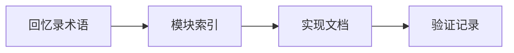

# TagMemo-浪潮RAG 回忆录创新点与实现索引

**版本**：VCP 6.4  
**生成时间**：2026-02-27  
**目标**：按回忆录中提到的创新点/算法分类，抽取完整实现代码、配置与依赖说明。  

---

## 目录索引

1. [创新点总览与对照表](file:///home/zh/projects/VCPToolBox/mydoc/tagmemo/overview.md)  
2. [中文时域解析器](file:///home/zh/projects/VCPToolBox/mydoc/tagmemo/time_expression_parser.md)  
3. [Group 词元组网系统](file:///home/zh/projects/VCPToolBox/mydoc/tagmemo/semantic_group_network.md)  
4. [语义分段与 Shotgun Query](file:///home/zh/projects/VCPToolBox/mydoc/tagmemo/context_vector_manager.md)  
5. [Tag 共现矩阵](file:///home/zh/projects/VCPToolBox/mydoc/tagmemo/tag_cooccurrence_matrix.md)  
6. [TagMemo V3.7 浪潮增强（applyTagBoostV3）](file:///home/zh/projects/VCPToolBox/mydoc/tagmemo/tagmemo_apply_boost_v3.md)  
7. [EPA-SVD 模块](file:///home/zh/projects/VCPToolBox/mydoc/tagmemo/epa_module.md)  
8. [残差金字塔](file:///home/zh/projects/VCPToolBox/mydoc/tagmemo/residual_pyramid.md)  
9. [结果去重（Phased Array / SVD去重）](file:///home/zh/projects/VCPToolBox/mydoc/tagmemo/result_deduplicator.md)  
10. [动态 Beta / K 震荡 / Tag 截断](file:///home/zh/projects/VCPToolBox/mydoc/tagmemo/dynamic_params.md)  
11. [向量索引匹配（VexusIndex / USearch HNSW）](file:///home/zh/projects/VCPToolBox/mydoc/tagmemo/vector_index_vexus.md)  
12. [TagMemo 参数配置（rag_params.json）](file:///home/zh/projects/VCPToolBox/mydoc/tagmemo/rag_params_config.md)  
13. [回忆录中提及但未实现的创新点](file:///home/zh/projects/VCPToolBox/mydoc/tagmemo/not_implemented.md)  

---

## 运行验证记录

以下验证命令用于确保抽取的代码可加载与运行：

- **JS 模块加载验证**  
  `node -e "require('./Plugin/RAGDiaryPlugin/TimeExpressionParser'); require('./Plugin/RAGDiaryPlugin/ContextVectorManager'); require('./Plugin/RAGDiaryPlugin/SemanticGroupManager'); require('./EPAModule'); require('./ResidualPyramid'); require('./ResultDeduplicator');"`  
  结果：成功加载

- **KnowledgeBaseManager 加载验证**  
  `node -e "require('./KnowledgeBaseManager');"`  
  结果：成功加载（Rust 引擎初始化日志正常）

- **VexusIndex 核心能力验证**  
  `node -e "const { VexusIndex } = require('./rust-vexus-lite'); const idx = new VexusIndex(8, 10); const v = new Float32Array(8).fill(0.1); idx.add(1, Buffer.from(v.buffer)); const res = idx.search(Buffer.from(v.buffer), 1); console.log(res);"`  
  结果：输出 `[ { id: 1, score: 1 } ]`

备注：`rust-vexus-lite/test.js` 使用了已移除的 `upsert` API，测试脚本失败，但核心 API 验证已通过。

---

## 追加章节：实现原理与核心作用

### 设计思路与实现机制

- 以索引文档统一关联算法与实现文件  
- 将“回忆录术语 → 代码模块”建立可追溯映射  
- 通过验证记录保证文档与实现一致性  

### 核心作用

- 提供入口文档，降低跨文件跳转成本  
- 保证 TagMemo 体系的术语一致与实现可验证  
- 作为后续扩展或补齐算法的导航基座  

### 流程图

