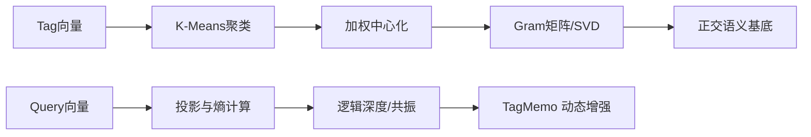

# EPA-SVD 的数学逻辑与在 TagMemo 中的作用

## 1. 数学逻辑：EPA-SVD 在做什么

### 1.1 数据建模

设标签向量集合为 \(V = \{v_1, v_2, \dots, v_n\}\)，每个向量维度为 \(d\)。  
EPA-SVD 首先对这些向量做“加权中心化”：

\[
\mu = \frac{\sum_{i=1}^n w_i v_i}{\sum_{i=1}^n w_i}
\]

\[
X_i = \sqrt{w_i}\,(v_i - \mu)
\]

其中 \(w_i\) 来自聚类权重（K-Means 簇大小），用于强化高频语义。

### 1.2 Gram 矩阵与主成分提取

构造 Gram 矩阵：

\[
G = X X^\top
\]

对 \(G\) 做特征分解或幂迭代，可得到前 \(k\) 个主成分方向。  
这相当于在原始空间中求得一组 **正交语义基底** \(U = \{u_1,\dots,u_k\}\)。

### 1.3 投影与熵

对任意查询向量 \(q\)：

\[
q' = q - \mu
\]

\[
p_i = \frac{\langle q', u_i \rangle^2}{\sum_j \langle q', u_j \rangle^2}
\]

\[
H(q) = -\sum_i p_i \log_2 p_i
\]

这里的熵衡量“语义能量分布是否集中”：  
- 熵低 → 语义集中、逻辑深度高  
- 熵高 → 语义分散、逻辑深度低  

---

## 2. 为什么它可以用于 TagMemo

TagMemo 需要的不仅是“相似度”，而是“结构信号”。  
EPA-SVD 提供了一个稳定的语义坐标系，使查询可以被分解到若干“语义主轴”上。

### 2.1 结构化语义定位

- 传统向量检索只看“距离”  
- EPA-SVD 将查询分解为“语义轴能量分布”  
- 这使得 TagMemo 可以感知“语义结构形态”  

### 2.2 逻辑深度与共振

通过熵与主轴组合，EPA-SVD 得到两个关键指标：

- **逻辑深度**：能量是否集中  
- **共振**：多个正交轴是否同时高激活  

这两个指标直接驱动 TagMemo 的动态增强强度。

---

## 3. 在 TagMemo 中的具体作用

### 3.1 核心作用

1. 提供“语义基底”，建立跨场景一致的结构坐标  
2. 输出逻辑深度，用于动态 Boost 与核心标签权重  
3. 输出共振信号，用于判断跨域召回的必要性  

### 3.2 工程价值

- 降低投影碰撞导致的“误召回”  
- 使 TagMemo 的增强具有可解释的数学依据  
- 为残差金字塔与共现矩阵提供结构前置信号  

---

## 4. 流程图

