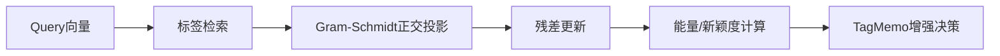

# 残差金字塔的数学逻辑与在 TagMemo 中的作用

## 1. 数学逻辑：残差金字塔在做什么

### 1.1 目标：分解“能量结构”

给定查询向量 \(q \in \mathbb{R}^d\)，残差金字塔希望回答两个问题：

1. 有多少语义能量可以被当前标签集合解释  
2. 未被解释的“残差能量”指向哪里  

这可视为将 \(q\) 逐层投影到多个标签子空间，形成分层解释。

### 1.2 正交投影与残差

假设当前层检索到的标签向量集合为 \(\{t_1,\dots,t_k\}\)。  
使用 Gram-Schmidt 正交化得到正交基 \(\{u_1,\dots,u_r\}\)。  
对 \(q\) 的投影为：

\[
P(q) = \sum_{i=1}^{r} \langle q, u_i \rangle u_i
\]

残差为：

\[
R(q) = q - P(q)
\]

能量（平方范数）满足：

\[
\|q\|^2 = \|P(q)\|^2 + \|R(q)\|^2
\]

### 1.3 多层迭代：金字塔结构

第 1 层使用 \(q\) 得到残差 \(R_1\)。  
第 2 层以 \(R_1\) 作为输入重复投影，得到 \(R_2\)。  
如此迭代构成残差金字塔：

\[
q \rightarrow R_1 \rightarrow R_2 \rightarrow \dots
\]

每一层都解释一部分能量，直到残差能量低于阈值。

---

## 2. 为什么它可以用于 TagMemo

TagMemo 关注“结构同构”而不仅是近邻点。  
残差金字塔提供了“可解释能量结构”的量化方式。

### 2.1 结构信息而非单点相似

- 传统检索只看 \(q\) 与标签的相似度  
- 残差金字塔衡量：哪些标签子空间可以解释查询  
- 未解释部分即“新颖方向”，提示需要扩张或补全  

### 2.2 对噪音与新颖的区分

通过残差能量与握手方向一致性，TagMemo 能区分：

- 语义一致但未覆盖 → 可扩张  
- 方向混乱的残差 → 可能是噪音  

这使增强策略更可控。

---

## 3. 在 TagMemo 中的具体作用

### 3.1 核心作用

1. **覆盖率**：已解释能量占比  
2. **新颖度**：残差能量与方向一致性  
3. **激活强度**：驱动 TagMemo 是否强增强  

### 3.2 工程价值

- 使增强强度具有“能量依据”而非经验阈值  
- 为共现矩阵拉回提供“扩张信号”  
- 与 EPA 逻辑深度共同构成动态增强闭环  

---

## 4. 流程图

