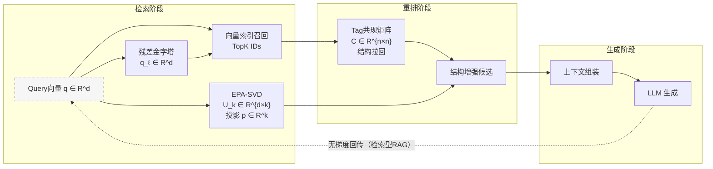

# Tag 共现矩阵、EPA-SVD 与残差金字塔：数学关系与 RAG 角色分工深度解析

## 0. 摘要与符号约定

设标签集合 \(T=\{t_1,\dots,t_n\}\)，文档集合 \(D=\{d_1,\dots,d_m\}\)，向量维度为 \(d\)。  
查询向量为 \(q\in\mathbb{R}^d\)，标签向量集合为 \(\{v_i\}_{i=1}^n\)。

三者定位：
- **Tag 共现矩阵**：离线结构统计图（稀疏、符号层）  
- **EPA-SVD**：语义坐标系构建与逻辑深度估计（谱层）  
- **残差金字塔**：多尺度能量分解与新颖性检测（多尺度层）

---

## 0.1 白话版总览（先给直觉）

把系统想成“去图书馆找书”：

- **共现矩阵**像“馆藏关系网”：哪些书经常一起被借走  
- **EPA-SVD**像“主题坐标系”：这本书更偏技术、历史还是情感  
- **残差金字塔**像“分层筛选”：先解释主要主题，再看剩下的“新东西”  

它们一起解决的问题是：  
**不只找“最像”的，还要找“结构上相通”的。**

---

## 1. 算法原理剖析

### 1.1 Tag 共现矩阵构建公式

定义文档-标签二值关联矩阵 \(A\in\{0,1\}^{m\times n}\)：

\[
A_{ij}= \begin{cases}
1 & d_i \text{ 含 } t_j \\
0 & \text{否则}
\end{cases}
\]

则共现矩阵 \(C\in\mathbb{R}^{n\times n}\) 为：

\[
C = A^\top A
\]

其中 \(C_{pq}\) 表示标签 \(t_p\) 与 \(t_q\) 在同一文档中共现次数。  
可选归一化：

\[
\widetilde{C}_{pq} = \frac{C_{pq}}{\sqrt{C_{pp} C_{qq}}}
\]

**白话解释**：  
统计“哪些标签经常同时出现”，共现越高，关系越近。

**比喻**：  
像“顾客也买了”推荐，标签共现就是标签版的“常被一起选择”。

---

### 1.2 EPA-SVD 的降维目标函数

EPA-SVD 用标签向量建“语义坐标系”。  
加权中心化：

\[
\mu = \frac{\sum_i w_i v_i}{\sum_i w_i}, \quad x_i = \sqrt{w_i}(v_i-\mu)
\]

目标：找正交基 \(U_k\) 最大化投影能量：

\[
\max_{U_k^\top U_k=I} \sum_{i=1}^n \|U_k^\top x_i\|^2
\]

等价于对加权协方差矩阵分解：

\[
\Sigma = \sum_i x_i x_i^\top
\]

取最大特征值的前 \(k\) 个特征向量。  
对查询向量 \(q\)：

\[
q' = q-\mu,\quad
p_j = \frac{\langle q', u_j \rangle^2}{\sum_\ell \langle q', u_\ell \rangle^2}
\]

熵：

\[
H(q) = -\sum_j p_j \log_2 p_j
\]

熵低 → 能量集中 → 逻辑深度高。  
熵高 → 能量分散 → 逻辑深度低。

**白话解释**：  
EPA-SVD 就是找出“主要主题方向”，然后看你的问题集中在哪些方向上。  

**比喻**：  
像给城市画地铁主线，你的问题是在某一条线附近，还是跨好几条线。

---

### 1.3 残差金字塔的多尺度分解推导

第 \(\ell\) 层检索到标签向量集合，通过 Gram-Schmidt 得到正交基。  
投影与残差：

\[
P_\ell(q) = \sum_j \langle q, u^{(\ell)}_j \rangle u^{(\ell)}_j
\]

\[
R_\ell(q) = q - P_\ell(q)
\]

能量分解：

\[
\|q\|^2 = \|P_\ell(q)\|^2 + \|R_\ell(q)\|^2
\]

递归：

\[
q_0=q,\quad q_{\ell+1}=R_\ell(q_\ell)
\]

直到残差能量低于阈值。

**白话解释**：  
先用最明显的标签解释问题，剩下没解释的部分再单独分析。  

**比喻**：  
像筛沙：先筛掉大颗粒，再看剩下的小颗粒里有什么新东西。

---

## 2. 交互关系图解：RAG 三阶段数据流

### 2.1 端到端数据流图（含张量形状与梯度路径）

**白话解释**：  
先用向量检索拿候选，再用共现矩阵补链条，最后组上下文喂给模型。

---

## 3. 设计理念对比

| 维度 | Tag 共现矩阵 | EPA-SVD | 残差金字塔 |
|---|---|---|---|
| 稀疏性 | 高（稀疏图） | 中（稠密基底） | 中（多层稠密投影） |
| 谱聚类 | 低（图统计） | 高（SVD/特征分解） | 中（正交投影） |
| 多尺度表示 | 低 | 中（多轴能量分布） | 高（层级残差分解） |
| 设计动机 | 结构拉回与扩张 | 构建语义坐标系 | 解释度/新颖度分解 |
| 适用场景 | 逻辑补全、拓扑星座 | 语义聚焦/跨域共振 | 新主题发现、噪音识别 |

**白话解释**：  
共现矩阵管“关系网”，EPA 管“方向感”，残差金字塔管“还剩下什么没解释”。

---

## 4. 三者数学关系与信息流转机制

### 4.1 数学关系（从符号层到谱层再到多尺度层）

1. **共现矩阵**建立标签图 \(C\)，提供结构邻域  
2. **EPA-SVD**在标签向量上建立谱基 \(U_k\)，提供语义坐标  
3. **残差金字塔**基于正交投影与能量分解，提供多尺度结构解释  

**白话解释**：  
先知道“谁和谁经常一起出现”，再知道“这问题主要偏向哪些主题轴”，最后看“剩下的东西是什么”。

---

### 4.2 信息流转（RAG 流程中的角色）

- 共现矩阵：在重排或扩张阶段拉回结构邻域  
- EPA-SVD：在检索前提供逻辑深度与共振指标  
- 残差金字塔：在检索阶段确定“已解释能量”与“需扩张能量”  

**白话解释**：  
EPA 决定“要不要放大/收紧”，残差金字塔决定“还有没有新方向”，共现矩阵负责“把逻辑链补齐”。

