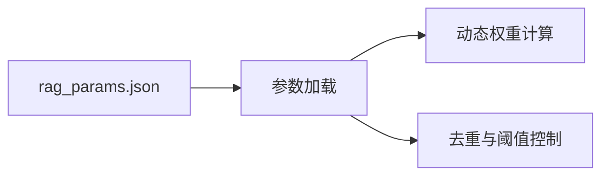

# TagMemo 参数配置（rag_params.json）

**创新摘要**  
用于控制 TagMemo 动态参数：动态 Beta、TagBoost、去重阈值与语言惩罚。

---

## 完整配置

```json
{
  "RAGDiaryPlugin": {
    "noise_penalty": 0.05,
    "tagWeightRange": [0.05, 0.45],
    "tagTruncationBase": 0.6,
    "tagTruncationRange": [0.5, 0.9]
  },
  "KnowledgeBaseManager": {
    "activationMultiplier": [0.5, 1.5],
    "dynamicBoostRange": [0.3, 2.0],
    "coreBoostRange": [1.20, 1.40],
    "deduplicationThreshold": 0.88,
    "techTagThreshold": 0.08,
    "normalTagThreshold": 0.015,
    "languageCompensator": {
      "penaltyUnknown": 0.05,
      "penaltyCrossDomain": 0.1
    }
  }
}
```

---

## 追加章节：实现原理与核心作用

### 设计思路与实现机制

- 将参数分为 RAGDiaryPlugin 与 KnowledgeBaseManager 两层  
- 以区间形式表达动态范围，便于在线调优  
- 支持热加载与自动生效，减少系统重启成本  

### 核心作用

- 统一控制 TagMemo 的增强力度与去重阈值  
- 为动态策略提供安全边界与默认值  
- 保障算法行为可解释、可复现、可回滚  

### 流程图


