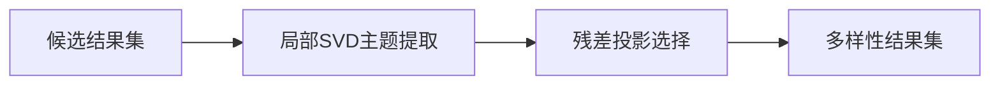

# 结果去重（Phased Array / SVD 去重）

**创新摘要**  
通过 SVD 提取主题向量，再用残差投影选择“信息增量最大”的候选结果，提升多样性并降低冗余。

**依赖环境**  
- EPAModule  
- ResidualPyramid  
- Node.js  

**运行说明**  
由 KnowledgeBaseManager `deduplicateResults()` 调用。

---

## 完整代码实现（ResultDeduplicator.js）

```javascript
/**
 * ResultDeduplicator.js
 * Tagmemo v4 核心组件：基于 SVD 和残差金字塔的结果智能去重器
 * 
 * 功能：
 * 1. 分析结果集中的潜在主题 (Latent Topics)
 * 2. 使用残差投影选择最具代表性的结果
 * 3. 确保弱语义关联 (Weak Links) 不被丢弃
 */

const EPAModule = require('./EPAModule');
const ResidualPyramid = require('./ResidualPyramid');

class ResultDeduplicator {
    constructor(db, config = {}) {
        this.db = db;
        this.config = {
            dimension: config.dimension || 3072,
            maxResults: config.maxResults || 20,
            topicCount: config.topicCount || 8,
            minEnergyRatio: 0.1,
            redundancyThreshold: 0.85,
            ...config
        };

        this.epa = new EPAModule(db, {
            dimension: this.config.dimension,
            maxBasisDim: this.config.topicCount,
            clusterCount: 16
        });

        this.residualCalculator = new ResidualPyramid(null, db, {
            dimension: this.config.dimension
        });
    }

    async deduplicate(candidates, queryVector) {
        if (!candidates || candidates.length === 0) return [];

        const validCandidates = candidates.filter(c => c.vector || c._vector);
        if (validCandidates.length <= 5) return candidates;

        console.log(`[ResultDeduplicator] Starting deduplication for ${validCandidates.length} candidates...`);

        const vectors = validCandidates.map(c => {
            const v = c.vector || c._vector;
            return v instanceof Float32Array ? v : new Float32Array(v);
        });

        const clusterData = {
            vectors: vectors,
            weights: vectors.map(v => 1),
            labels: validCandidates.map(c => 'candidate')
        };

        const svdResult = this.epa._computeWeightedPCA(clusterData);
        const { U: topics, S: energies } = svdResult;

        const significantTopics = [];
        const totalEnergy = energies.reduce((a, b) => a + b, 0);
        let cumEnergy = 0;
        for (let i = 0; i < topics.length; i++) {
            significantTopics.push(topics[i]);
            cumEnergy += energies[i];
            if (cumEnergy / totalEnergy > 0.95) break;
        }

        console.log(`[ResultDeduplicator] Identify ${significantTopics.length} significant latent topics.`);

        const selectedIndices = new Set();
        const selectedResults = [];

        let bestIdx = -1;
        let bestSim = -1;

        const nQuery = this._normalize(queryVector);

        for (let i = 0; i < vectors.length; i++) {
            const sim = this._dotProduct(this._normalize(vectors[i]), nQuery);
            if (sim > bestSim) {
                bestSim = sim;
                bestIdx = i;
            }
        }

        if (bestIdx !== -1) {
            selectedIndices.add(bestIdx);
            selectedResults.push(validCandidates[bestIdx]);
        }

        const maxRounds = this.config.maxResults - 1;
        const currentBasis = [vectors[bestIdx]];

        for (let round = 0; round < maxRounds; round++) {
            let maxProjectedEnergy = -1;
            let nextBestIdx = -1;

            for (let i = 0; i < vectors.length; i++) {
                if (selectedIndices.has(i)) continue;

                const vec = vectors[i];
                const { residual } = this.residualCalculator._computeOrthogonalProjection(vec, currentBasis.map(v => ({ vector: v })));
                const noveltyEnergy = this._magnitude(residual) ** 2;

                const originalScore = validCandidates[i].score || 0.5;
                const score = noveltyEnergy * (originalScore + 0.5);

                if (score > maxProjectedEnergy) {
                    maxProjectedEnergy = score;
                    nextBestIdx = i;
                }
            }

            if (nextBestIdx !== -1) {
                if (maxProjectedEnergy < 0.01) {
                    console.log(`[ResultDeduplicator] Remaining candidates provide negligible novelty. Stopping.`);
                    break;
                }

                selectedIndices.add(nextBestIdx);
                selectedResults.push(validCandidates[nextBestIdx]);
                currentBasis.push(vectors[nextBestIdx]);
            } else {
                break;
            }
        }

        console.log(`[ResultDeduplicator] Selected ${selectedResults.length} / ${validCandidates.length} diverse results.`);
        return selectedResults;
    }

    _normalize(vec) {
        const dim = vec.length;
        const res = new Float32Array(dim);
        let mag = 0;
        for (let i = 0; i < dim; i++) mag += vec[i] ** 2;
        mag = Math.sqrt(mag);
        if (mag > 1e-9) {
            for (let i = 0; i < dim; i++) res[i] = vec[i] / mag;
        }
        return res;
    }

    _dotProduct(v1, v2) {
        let sum = 0;
        for (let i = 0; i < v1.length; i++) sum += v1[i] * v2[i];
        return sum;
    }

    _magnitude(vec) {
        let sum = 0;
        for (let i = 0; i < vec.length; i++) sum += vec[i] ** 2;
        return Math.sqrt(sum);
    }
}

module.exports = ResultDeduplicator;
```

---

## 验证

```bash
node -e "require('./ResultDeduplicator');"
```

---

## 追加章节：实现原理与核心作用

### 设计思路与实现机制

- 对候选结果向量执行局部 SVD，识别潜在主题结构  
- 以残差投影选择“信息增量最大”的结果  
- 在相关性与多样性之间建立可控平衡  

### 核心作用

- 抑制同质化召回，提升语义覆盖面  
- 保护弱相关但关键信号的结果不被丢弃  
- 为 TagMemo 提供更高质量的结果集  

### 流程图


