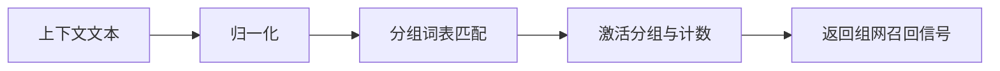

# Group 词元组网系统（Semantic Group Network）

**创新摘要**  
通过语义分组与自学习机制，将碎片化标签/词元组织成逻辑捕网，实现对关联日记的“组网召回”。

**依赖环境**  
- Node.js  
- 配置文件：semantic_groups.json 或 semantic_groups.json.example  

**运行说明**  
RAGDiaryPlugin 初始化时构建 `SemanticGroupManager`，对上下文进行 group 激活与学习。

---

## 完整代码实现

### 1) SemanticGroupManager.js

```javascript
const fs = require('fs');
const path = require('path');

class SemanticGroupManager {
    constructor(configPath = null, config) {
        this.groups = {};
        this.config = config;
        this.configPath = configPath || path.join(__dirname, 'semantic_groups.json');
        this.initialize();
    }

    initialize() {
        try {
            if (fs.existsSync(this.configPath)) {
                const data = fs.readFileSync(this.configPath, 'utf8');
                const parsed = JSON.parse(data);
                if (parsed && parsed.groups) {
                    this.groups = parsed.groups;
                    this.groupConfig = parsed.config || {};
                    console.log(`[SemanticGroupManager] Loaded ${Object.keys(this.groups).length} groups`);
                }
            }
        } catch (error) {
            console.error('[SemanticGroupManager] Error loading groups:', error);
        }
    }

    saveGroups() {
        try {
            const data = JSON.stringify({
                config: this.groupConfig,
                groups: this.groups
            }, null, 2);
            fs.writeFileSync(this.configPath, data, 'utf8');
            console.log(`[SemanticGroupManager] Saved ${Object.keys(this.groups).length} groups`);
        } catch (error) {
            console.error('[SemanticGroupManager] Error saving groups:', error);
        }
    }

    _normalizeText(text) {
        if (!text || typeof text !== 'string') return '';
        return text.toLowerCase().replace(/[^\w\u4e00-\u9fa5]/g, '');
    }

    activateGroups(context) {
        if (!context) return [];
        const normalizedContext = this._normalizeText(context);
        const activatedGroups = [];

        for (const [groupName, groupData] of Object.entries(this.groups)) {
            const words = groupData.words || [];
            let score = 0;
            let matchedWords = [];

            for (const word of words) {
                const normalizedWord = this._normalizeText(word);
                if (normalizedWord && normalizedContext.includes(normalizedWord)) {
                    score++;
                    matchedWords.push(word);
                }
            }

            if (score > 0) {
                groupData.last_activated = new Date().toISOString();
                groupData.activation_count = (groupData.activation_count || 0) + 1;
                activatedGroups.push({
                    name: groupName,
                    score,
                    matchedWords
                });
            }
        }

        activatedGroups.sort((a, b) => b.score - a.score);
        return activatedGroups;
    }

    learnGroupFromText(text, tags = []) {
        if (!text || text.length < 50) return null;

        const words = text.split(/\s+/).filter(w => w.length > 1);
        if (words.length < 5) return null;

        const groupName = this._generateGroupName(words, tags);
        if (!groupName) return null;

        if (!this.groups[groupName]) {
            this.groups[groupName] = {
                words: [...new Set(words)].slice(0, 20),
                auto_learned: [...new Set(words)].slice(0, 30),
                weight: 1.0,
                vector_id: null,
                last_activated: null,
                activation_count: 0
            };

            if (this.groupConfig?.auto_save_on_learn) {
                this.saveGroups();
            }

            return groupName;
        } else {
            const group = this.groups[groupName];
            const existingWords = new Set(group.words);
            const newWords = words.filter(w => !existingWords.has(w));
            if (newWords.length > 0) {
                group.words = [...group.words, ...newWords].slice(0, 30);
                group.auto_learned = [...group.auto_learned, ...newWords].slice(0, 40);
                if (this.groupConfig?.auto_save_on_learn) {
                    this.saveGroups();
                }
            }
            return groupName;
        }
    }

    _generateGroupName(words, tags) {
        if (tags && tags.length > 0) {
            return tags[0];
        }
        if (words.length > 0) {
            return words[0];
        }
        return null;
    }
}

module.exports = SemanticGroupManager;
```

### 2) semantic_groups.json.example

```json
{
  "config": {
    "min_cooccurrence_to_learn": 2,
    "min_cluster_size_for_new_group": 3,
    "auto_save_on_learn": true
  },
  "groups": {
    "编程学习": {
      "words": ["Python", "算法", "数据结构", "编程", "代码", "debug", "函数", "JavaScript", "Node.js"],
      "auto_learned": [],
      "weight": 1.0,
      "vector_id": null,
      "last_activated": null,
      "activation_count": 0
    },
    "克莱恩·莫雷蒂": {
      "words": ["愚者", "克莱恩", "世界", "格尔曼", "道恩", "侦探", "塔罗会", "源堡", "灰雾"],
      "auto_learned": [],
      "weight": 1.2,
      "vector_id": null,
      "last_activated": null,
      "activation_count": 0
    }
  }
}
```

---

## 验证

```bash
node -e "require('./Plugin/RAGDiaryPlugin/SemanticGroupManager');"
```

---

## 追加章节：实现原理与核心作用

### 设计思路与实现机制

- 将语义概念显式建模为“词元组网”，以词表激活匹配形成逻辑召回  
- 采用配置文件持久化分组结构，支持冷启动与渐进式自学习  
- 使用轻量规则化归一与激活计数，保证低成本在线维护  

### 核心作用

- 提供跨文档的逻辑共振入口，增强跨主题召回  
- 让记忆检索具备“逻辑捕网”能力而非单点相似度  
- 为后续 TagMemo 增强提供语义分组信号  

### 流程图


