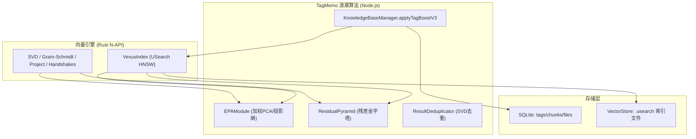
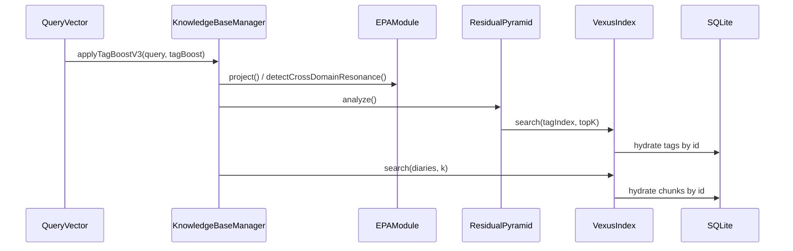

# VCPToolBox 向量索引匹配与 TagMemo“浪潮”算法技术报告

**版本**：VCP 6.4  
**生成时间**：2026-02-27  
**版本控制参考**：分支 xxbb / 提交 3d54cad  
**范围**：向量索引（VexusIndex/USearch HNSW）与 TagMemo“浪潮”算法（V3.7 实现，V4/V5 文档特性对照）  

---

## 目录

1. 报告综述  
2. 资料来源与阅读范围  
3. 系统架构图与数据流图  
4. 向量索引匹配算法（VexusIndex/USearch）  
5. TagMemo“浪潮”算法（V3.7 实现）  
6. 算法复杂度与资源模型  
7. 优化策略与性能瓶颈  
8. 两种算法对比与应用效果评估  
9. 应用案例（当前项目中的具体调用链路）  
10. 优化建议  
11. 性能测试数据（项目文档引用）  
12. 伪代码  
13. 参考文献与代码索引  

---

## 1. 报告综述

本报告从算法原理、实现细节、复杂度、优化策略与应用效果等维度，对 VCPToolBox 中的 **向量索引匹配算法** 与 **TagMemo“浪潮”算法** 做系统分析。  
核心结论：向量索引提供快速近似检索的底层能力，TagMemo 通过 EPA + ResidualPyramid + 语义去重等增强逻辑完成语义“重塑”，提升召回精度与多样性，但引入额外的计算与内存开销。

---

## 2. 资料来源与阅读范围

### 2.1 设计与算法文档

- [RUST_VECTOR_ENGINE.md](file:///home/zh/projects/VCPToolBox/docs/RUST_VECTOR_ENGINE.md)  
- [MEMORY_SYSTEM.md](file:///home/zh/projects/VCPToolBox/docs/MEMORY_SYSTEM.md)  
- [TagMemo_Wave_Algorithm_Deep_Dive.md](file:///home/zh/projects/VCPToolBox/TagMemo_Wave_Algorithm_Deep_Dive.md)  
- [TAGMEMO_TUNING_GUIDE.md](file:///home/zh/projects/VCPToolBox/TAGMEMO_TUNING_GUIDE.md)  

### 2.2 核心实现代码

- [rust-vexus-lite/src/lib.rs](file:///home/zh/projects/VCPToolBox/rust-vexus-lite/src/lib.rs)  
- [KnowledgeBaseManager.js](file:///home/zh/projects/VCPToolBox/KnowledgeBaseManager.js#L443-L731)  
- [EPAModule.js](file:///home/zh/projects/VCPToolBox/EPAModule.js#L1-L201)  
- [ResidualPyramid.js](file:///home/zh/projects/VCPToolBox/ResidualPyramid.js#L1-L210)  
- [ResultDeduplicator.js](file:///home/zh/projects/VCPToolBox/ResultDeduplicator.js#L1-L193)  

---

## 3. 系统架构图与数据流图

### 3.1 系统架构图



### 3.2 数据流图（检索路径）



---

## 4. 向量索引匹配算法（VexusIndex/USearch）

### 4.1 算法原理

向量检索基于 **USearch HNSW** 索引结构，配置为：

- Metric：L2sq（归一化向量时与余弦相似度等价）  
- Connectivity：16  
- ExpansionAdd：128  
- ExpansionSearch：64  

证据：
- [RUST_VECTOR_ENGINE.md:L178-L183](file:///home/zh/projects/VCPToolBox/docs/RUST_VECTOR_ENGINE.md#L178-L183)  
- [lib.rs:L62-L75](file:///home/zh/projects/VCPToolBox/rust-vexus-lite/src/lib.rs#L62-L75)

### 4.2 数据结构

索引结构封装为 `VexusIndex`：

- `Index` 使用读写锁保护（读多写少场景优化）  
- 搜索结果仅返回 `id + score`，正文由 SQLite hydration  

证据：
- [lib.rs:L55-L75](file:///home/zh/projects/VCPToolBox/rust-vexus-lite/src/lib.rs#L55-L75)  
- [lib.rs:L9-L15](file:///home/zh/projects/VCPToolBox/rust-vexus-lite/src/lib.rs#L9-L15)

### 4.3 核心 API

- `new(dim, capacity)`  
- `add(id, vector)` / `add_batch(ids, vectors)`  
- `search(query, k)`  
- `save(path)` / `load(path)`  

证据：
- [RUST_VECTOR_ENGINE.md:L166-L287](file:///home/zh/projects/VCPToolBox/docs/RUST_VECTOR_ENGINE.md#L166-L287)

---

## 5. TagMemo“浪潮”算法（V3.7 实现）

### 5.1 算法概述

TagMemo 通过“语义引力”与“向量重塑”将检索从“相似向量”升级为“语义结构同构”。  
当前实现版本为 V3.7（V4/V5 特性以文档形式存在）。  

证据：
- [MEMORY_SYSTEM.md:L173-L205](file:///home/zh/projects/VCPToolBox/docs/MEMORY_SYSTEM.md#L173-L205)

### 5.2 四阶段流程

1. **感应**：EPA 投影 → 逻辑深度 + 共振  
2. **分解**：残差金字塔 → 覆盖率 + 新颖度  
3. **扩张**：核心标签补全 + 共现矩阵拉回  
4. **重塑**：语义去重 + 向量融合  

证据：
- [MEMORY_SYSTEM.md:L183-L238](file:///home/zh/projects/VCPToolBox/docs/MEMORY_SYSTEM.md#L183-L238)  
- [KnowledgeBaseManager.js:L451-L697](file:///home/zh/projects/VCPToolBox/KnowledgeBaseManager.js#L451-L697)

### 5.3 EPA 语义投影

EPA 通过 K-Means + 加权 PCA 构建正交语义基，并计算投影熵：  

- LogicDepth = 1 - normalizedEntropy  
- Resonance = 多轴共振强度  

证据：
- [EPAModule.js:L28-L161](file:///home/zh/projects/VCPToolBox/EPAModule.js#L28-L161)  
- [MEMORY_SYSTEM.md:L271-L352](file:///home/zh/projects/VCPToolBox/docs/MEMORY_SYSTEM.md#L271-L352)

### 5.4 残差金字塔

ResidualPyramid 采用 Gram-Schmidt 正交投影迭代提取语义残差，直到残差能量低于阈值（默认 10%）。  

证据：
- [ResidualPyramid.js:L25-L113](file:///home/zh/projects/VCPToolBox/ResidualPyramid.js#L25-L113)

### 5.5 语义去重与多样性

ResultDeduplicator 使用 SVD 主题建模 + 残差选择保留信息增量较高的结果。  

证据：
- [ResultDeduplicator.js:L59-L167](file:///home/zh/projects/VCPToolBox/ResultDeduplicator.js#L59-L167)

---

## 6. 算法复杂度与资源模型

### 6.1 向量索引（HNSW）

- 搜索：平均近似 O(log N)，最坏 O(N)  
- 插入：平均近似 O(log N)  
- 内存：O(N * dim) + HNSW 邻接结构  

注：这是 HNSW 的通用理论估计；具体常数受参数与硬件影响。

### 6.2 TagMemo 浪潮算法

| 模块 | 主要计算 | 时间复杂度（估算） | 备注 |
|------|----------|---------------------|------|
| EPA 投影 | O(K*dim) | K 为主成分数（<=64） | 投影阶段 |
| 残差金字塔 | O(L * (T*dim + T^2*dim)) | L 层，T 为 topK | Gram-Schmidt |
| 标签去重 | O(M^2 * dim) | M 为候选标签数 | 余弦相似度 |
| 结果去重 | O(R^2 * dim) | R 为候选结果数 | SVD + 残差选择 |

空间复杂度主要由向量缓存与标签向量集合构成。

---

## 7. 优化策略与性能瓶颈

### 7.1 已实现优化

- Rust N-API 将关键计算下沉  
  - `project()` / `compute_orthogonal_projection()` / `compute_svd()`  
  - [RUST_VECTOR_ENGINE.md:L321-L371](file:///home/zh/projects/VCPToolBox/docs/RUST_VECTOR_ENGINE.md#L321-L371)

- TagMemo 动态参数热调控  
  - `rag_params.json` + watcher  
  - [TAGMEMO_TUNING_GUIDE.md](file:///home/zh/projects/VCPToolBox/TAGMEMO_TUNING_GUIDE.md)

### 7.2 主要瓶颈

- Gram-Schmidt 在高维向量上复杂度高  
- 标签去重步骤存在 O(M^2) 相似度计算  
- TagMemo 增强引入多次 DB 查询与向量融合  

---

## 8. 向量索引 vs TagMemo 对比与应用效果

| 维度 | 向量索引匹配 | TagMemo 浪潮 |
|------|-------------|--------------|
| 目标 | 快速检索相似向量 | 语义增强与结构同构 |
| 数据结构 | HNSW 图索引 | 向量 + 标签 + 共现矩阵 |
| 计算成本 | 低 | 中高 |
| 召回多样性 | 中 | 高 |
| 适用场景 | 大规模快速检索 | 复杂意图/语义发散场景 |

应用效果评估（基于现有实现）：

- 向量索引提供稳定、低延迟召回  
- TagMemo 增强能够提升“意图聚焦”和“多主题覆盖”  
- 复杂度增加但通过 Rust 下沉可控  

---

## 9. 应用案例（当前项目中的调用链路）

### 9.1 RAGDiaryPlugin 调用

`RAGDiaryPlugin` 通过 `vectorDBManager.search()` 调用向量索引，并在 TagMemo 启用时调用 `applyTagBoost()`。  

证据：
- [RAGDiaryPlugin.js:L1932-L2044](file:///home/zh/projects/VCPToolBox/Plugin/RAGDiaryPlugin/RAGDiaryPlugin.js#L1932-L2044)

### 9.2 KnowledgeBaseManager 增强

TagMemo 入口在 `KnowledgeBaseManager.applyTagBoostV3()`，输出增强后的 query 向量。  

证据：
- [KnowledgeBaseManager.js:L443-L727](file:///home/zh/projects/VCPToolBox/KnowledgeBaseManager.js#L443-L727)

---

## 10. 优化建议

1. 将标签去重相似度改为近似 ANN 或使用批量矩阵乘法优化  
2. 将 ResidualPyramid 的 Gram-Schmidt 关键循环 Rust 化  
3. 针对 TagMemo 结果集引入分页与增量缓存  
4. 在高维场景下探索 PCA 降维后再执行 residual 分解  

---

## 11. 性能测试数据（项目文档引用）

来自项目文档的预期性能基准：

| 操作 | 10K 向量 | 100K 向量 | 1M 向量 |
|------|----------|-----------|---------|
| 添加（单向量） | < 1ms | < 1ms | < 1ms |
| 搜索（k=10） | < 1ms | < 2ms | < 5ms |
| 批量添加（1000） | < 100ms | < 150ms | < 200ms |
| SQLite 恢复 | ~500ms | ~5s | ~50s |

证据：  
- [RUST_VECTOR_ENGINE.md:L642-L651](file:///home/zh/projects/VCPToolBox/docs/RUST_VECTOR_ENGINE.md#L642-L651)

---

## 12. 伪代码

### 12.1 向量索引检索

```text
function searchIndex(query, k):
  buffer = toBuffer(query)
  results = vexus.search(buffer, k)
  return hydrate(results, sqlite)
```

### 12.2 TagMemo 增强（V3.7）

```text
function applyTagBoostV3(query, baseTagBoost):
  epa = EPA.project(query)
  pyramid = ResidualPyramid.analyze(query)
  boost = dynamicBoost(epa, pyramid)

  tags = collectTags(pyramid)
  tags = expandByCooccurrence(tags)
  tags = supplementCoreTags(tags)
  tags = semanticDedup(tags)

  contextVec = weightedSum(tags)
  fused = (1-boost)*query + boost*contextVec
  return normalize(fused)
```

---

## 13. 参考文献与代码索引

### 13.1 文档

- [RUST_VECTOR_ENGINE.md](file:///home/zh/projects/VCPToolBox/docs/RUST_VECTOR_ENGINE.md)  
- [MEMORY_SYSTEM.md](file:///home/zh/projects/VCPToolBox/docs/MEMORY_SYSTEM.md)  
- [TagMemo_Wave_Algorithm_Deep_Dive.md](file:///home/zh/projects/VCPToolBox/TagMemo_Wave_Algorithm_Deep_Dive.md)  
- [TAGMEMO_TUNING_GUIDE.md](file:///home/zh/projects/VCPToolBox/TAGMEMO_TUNING_GUIDE.md)  

### 13.2 代码

- [lib.rs](file:///home/zh/projects/VCPToolBox/rust-vexus-lite/src/lib.rs#L55-L175)  
- [KnowledgeBaseManager.applyTagBoostV3](file:///home/zh/projects/VCPToolBox/KnowledgeBaseManager.js#L443-L727)  
- [EPAModule.project](file:///home/zh/projects/VCPToolBox/EPAModule.js#L67-L161)  
- [ResidualPyramid.analyze](file:///home/zh/projects/VCPToolBox/ResidualPyramid.js#L25-L119)  
- [ResultDeduplicator.deduplicate](file:///home/zh/projects/VCPToolBox/ResultDeduplicator.js#L44-L167)  
